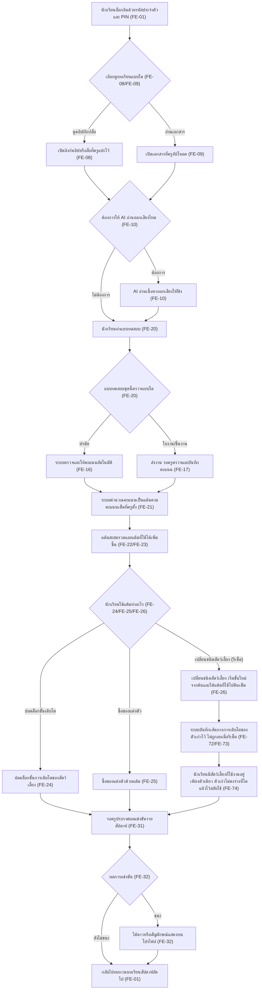
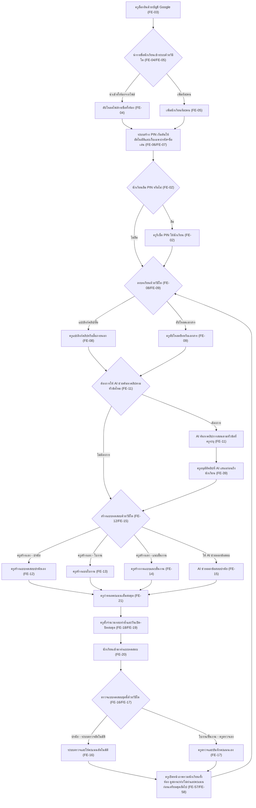
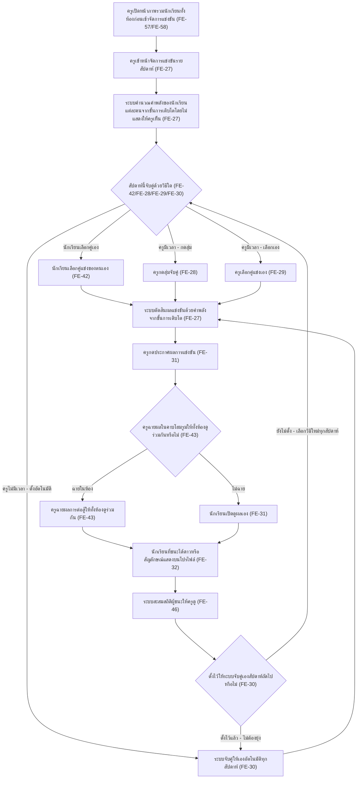
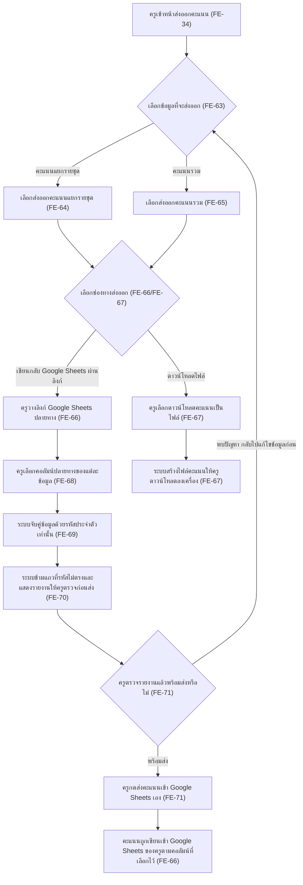

# User Journey — war-point

- **อัปเดตล่าสุด:** 2026-08-21
- **ที่มา:** [[feature-list|feature-list]] (รหัส `FE-XX`)
- **ส่งต่อไป:** [[../02-design/01-prototypes/index|02-design/01-prototypes]], [[../02-design/02-technical/index|02-design/02-technical]], [[../03-testing/01-test-plan/index|03-testing/01-test-plan]]

เอกสารนี้เขียนเส้นทางการใช้งาน (รหัส `UJ-XX`) ของผู้ใช้แต่ละบทบาท โดยแตกมาจาก [[feature-list|feature-list]] ทุกขั้นตอนในแผนภาพต้องกำกับรหัส `FE-XX` เพื่อ mapping กลับไปหา feature และ requirement ต้นทางได้เสมอ

รอบนี้ครอบคลุม 4 เส้นทาง:

- **UJ-01** — นักเรียนทบทวนบทเรียนและเลี้ยงสัตว์เลี้ยง
- **UJ-02** — ครูเตรียมบทเรียนและแบบทดสอบ
- **UJ-03** — ครูจัดการแข่งขันรายสัปดาห์
- **UJ-04** — ครูส่งคะแนนเข้าสมุดคะแนนของตนเอง

**หมายเหตุการอัปเดตรอบนี้ (2026-08-21):**
- **UJ-03 แก้กลไกการจับคู่** ให้ตรงกับ `20260821-02-pet-points-and-weekly-arena` ฉบับปรับปรุง — ครูไม่เห็นแต้มหรือขั้นสัตว์เลี้ยงของนักเรียนอีกต่อไป (ตาม `20260821-04-teacher-class-overview`) เส้นทางหลักของการจับคู่เปลี่ยนเป็น **นักเรียนเลือกคู่แข่งเอง** และเพิ่มโหมดฉายผลในห้องเรียน คงรหัส `UJ-03` ไว้ ไม่เปลี่ยนเป็นรหัสใหม่
- **UJ-02 เพิ่มขั้นตอนครูอนุมัติคลิปที่ AI เสนอ** ก่อนถึงนักเรียน ตาม `20260821-01-lesson-and-quiz-system` ฉบับปรับปรุง คงรหัส `UJ-02` ไว้
- **เพิ่มเส้นทางใหม่ UJ-04** ครอบ `20260821-05-score-export-and-gradebook` ทั้งฉบับ — ผู้ใช้เคยกำหนดขอบเขตไว้ 3 เส้นทางในรอบก่อน การเพิ่มเป็นเส้นที่ 4 ในรอบนี้เกิดจากมี requirement ใหม่ (spec 05) ที่ไม่มี journey ใดครอบอยู่เดิม จึงต้องเปิดเส้นทางใหม่ ไม่ใช่การเปลี่ยนรหัสหรือลบเส้นทางเดิม
- **เพิ่มการอ้างอิงหน้าภาพรวมของครู (spec 04)** เข้าไปใน UJ-02 (จุดวนกลับไปเตรียมชุดถัดไป) และ UJ-03 (จุดเริ่มก่อนจัดการแข่งขัน) เพราะเป็นจุดที่ครูเริ่มงานจริงในทางปฏิบัติ

**หมายเหตุการอัปเดตเพิ่มเติม (2026-08-21 รอบที่ 2):** `20260821-02-pet-points-and-weekly-arena` เพิ่มหัวข้อ "ค.๑ บันทึกเส้นทางการเติบโต" (FE-72/FE-73/FE-74) — **UJ-01 เพิ่มกิ่งเปลี่ยนชนิดสัตว์เลี้ยง/รีเซ็ตเข้าไปในจุดที่นักเรียนตัดสินใจใช้แต้ม** เพราะเป็นจุดที่กลไกรักษาความผูกพันนี้เกิดขึ้นจริงในเส้นทางของนักเรียน คงรหัส `UJ-01` ไว้ ไม่เปลี่ยนเป็นรหัสใหม่ — `UJ-02`, `UJ-03`, `UJ-04` ไม่มีการแก้ไขเพิ่มเติมในรอบนี้

---

## UJ-01 — นักเรียนทบทวนบทเรียนและเลี้ยงสัตว์เลี้ยง

### Persona

| หัวข้อ | รายละเอียด |
|---|---|
| ชื่อ (สมมติ) / บทบาท | "น้องมิว" นักเรียนประถมศึกษา (ป.4) |
| บริบทการใช้งาน | ใช้มือถือของผู้ปกครองที่บ้าน หรือแท็บเล็ต/คอมพิวเตอร์ของโรงเรียนช่วงพักหรือหลังเลิกเรียน ไม่มีอีเมลของตัวเอง |
| เป้าหมาย | ทบทวนบทเรียนและทำแบบทดสอบเพื่อสะสมแต้มมาเลี้ยงสัตว์เลี้ยงให้โต และอยากมีโอกาสชนะการแข่งขันรายสัปดาห์ |
| ความคุ้นเคยเทคโนโลยี | ใช้แอปพื้นฐาน (เกม/วิดีโอ) ได้คล่อง แต่บางคนอ่านตัวอักษรไม่คล่องเท่าผู้ใหญ่ พิมพ์ตัวเลขได้ |

### Journey Diagram

### ตาราง Mapping UJ-01 → FE

| Node | ขั้นตอน | FE |
|---|---|---|
| A | นักเรียนล็อกอินด้วยรหัสประจำตัวและ PIN | FE-01 |
| B, C | เปิดลิงก์คลิป/สื่อที่ครูแปะไว้ | FE-08 |
| B, D | เปิดเอกสารที่ครูอัปโหลด | FE-09 |
| E, F | AI อ่านเนื้อหาออกเสียงให้ฟัง | FE-10 |
| G, H | นักเรียนทำแบบทดสอบ | FE-20 |
| I | ระบบตรวจปรนัยและให้คะแนนอัตโนมัติ | FE-16 |
| J | ครูตรวจใบงาน/ชิ้นงานและบันทึกคะแนนเอง | FE-17 |
| K | ครูกำหนดคะแนนเต็มต่อชุดและระบบคำนวณคะแนน | FE-21 |
| L | ยอดแต้มสะสมรวม / แต้มที่ใช้ได้ | FE-22, FE-23 |
| M, N | ปลดล็อกขั้นการเติบโตด้วยแต้ม | FE-24 |
| M, O | ซื้อของแต่งตัวด้วยแต้ม | FE-25 |
| M, N2 | เปลี่ยนชนิดสัตว์เลี้ยง (รีเซ็ตตัวละคร) แล้วได้แต้มคืน | FE-26 |
| N3 | ระบบบันทึกเส้นทางการเติบโต / บันทึกไม่ถูกลบเมื่อรีเซ็ต | FE-72, FE-73 |
| N4 | นักเรียนมีสัตว์เลี้ยงที่ใช้งานอยู่ได้เพียงตัวเดียว | FE-74 |
| P | ครูกดประกาศผลการแข่งขัน | FE-31 |
| Q, R | ดาว/สัญลักษณ์แสดงผู้ชนะรายสัปดาห์ | FE-32 |
| S | วนกลับไปล็อกอินทบทวนสัปดาห์ถัดไป | FE-01 |

---

## UJ-02 — ครูเตรียมบทเรียนและแบบทดสอบ

### Persona

| หัวข้อ | รายละเอียด |
|---|---|
| ชื่อ (สมมติ) / บทบาท | "ครูอร" ครูประจำชั้นประถมศึกษา ดูแลนักเรียนคนเดียวประมาณ 30 คน |
| บริบทการใช้งาน | เวลาเตรียมการสอนจำกัดเพราะถูกดึงไปทำภาระงานที่ไม่ใช่การสอน ใช้คอมพิวเตอร์/แท็บเล็ตของโรงเรียนเป็นหลัก |
| เป้าหมาย | ลงบทเรียนและสร้างแบบทดสอบให้นักเรียนทำได้เร็ว โดยไม่เพิ่มเวลาทำงานของตนเองมากขึ้น |
| ความคุ้นเคยเทคโนโลยี | ใช้บัญชี Google และเอกสารดิจิทัลอยู่แล้วในงานประจำ คุ้นเคยกับการอัปโหลดไฟล์ |

### Journey Diagram

### ตาราง Mapping UJ-02 → FE

| Node | ขั้นตอน | FE |
|---|---|---|
| A | ครูล็อกอินด้วยบัญชี Google | FE-03 |
| B, C | นำเข้ารายชื่อทั้งห้องจากไฟล์ | FE-04 |
| B, D | เพิ่มนักเรียนทีละคน | FE-05 |
| E | ระบบสร้าง PIN เริ่มต้นอัตโนมัติ / เก็บข้อมูลแบบไม่มีชื่อจริง | FE-06, FE-07 |
| F, G | ครูรีเซ็ต PIN ให้นักเรียน | FE-02 |
| H, I | ครูแปะลิงก์คลิป/สื่อภายนอก | FE-08 |
| H, J | ครูอัปโหลดชีท/เอกสาร | FE-09 |
| K, L | AI ช่วยค้นหาคลิปการสอนตามหัวข้อ | FE-11 |
| L2 | ครูอนุมัติคลิปที่ AI เสนอก่อนถึงนักเรียน | FE-39 |
| M, N | ครูสร้างแบบทดสอบปรนัยเอง | FE-12 |
| M, O | ครูสร้างแบบใบงาน | FE-13 |
| M, P | ครูสร้างงานแบบแนบชิ้นงาน | FE-14 |
| M, Q | AI ช่วยออกข้อสอบแบบปรนัยล้วน | FE-15 |
| R | ครูกำหนดคะแนนเต็มต่อชุด | FE-21 |
| S | ครูตั้งจำนวนรอบทำซ้ำ / วันเปิด-ปิดต่อชุด | FE-18, FE-19 |
| T | นักเรียนทำแบบทดสอบ | FE-20 |
| U, V | ระบบตรวจปรนัยและให้คะแนนอัตโนมัติ | FE-16 |
| U, W | ครูตรวจใบงาน/ชิ้นงานและบันทึกคะแนนเอง | FE-17 |
| X | ครูเปิดหน้าภาพรวมนักเรียนทั้งห้องก่อนเตรียมชุดถัดไป (วนกลับไปที่ H) | FE-57, FE-58 |

---

## UJ-03 — ครูจัดการแข่งขันรายสัปดาห์

**[แก้ไขกลไกการจับคู่เมื่อ 2026-08-21]** เดิมเส้นทางนี้ให้ครูเป็นผู้จับคู่ทั้งหมด (สุ่ม/เลือกเอง/ระบบอัตโนมัติ) รอบนี้เปลี่ยนตาม `20260821-02-pet-points-and-weekly-arena` และ `20260821-04-teacher-class-overview` ที่ยืนยันว่า **ครูไม่เห็นแต้มหรือขั้นการเติบโตของสัตว์เลี้ยงนักเรียนเลย** เส้นทางหลักของการจับคู่จึงเปลี่ยนเป็น **นักเรียนเลือกคู่แข่งเอง** ส่วนวิธีที่ครูจับคู่เอง (สุ่ม/เลือกเอง/ระบบอัตโนมัติ) ยังคงอยู่เป็นทางเลือกเสริมสำหรับครูที่ต้องการนำการแข่งขันมาเป็นกิจกรรมของห้อง และเพิ่มโหมดฉายผลการต่อสู้ในห้องเรียน คงรหัส `UJ-03` ไว้ ไม่เปลี่ยนเป็นรหัสใหม่

### Persona

| หัวข้อ | รายละเอียด |
|---|---|
| ชื่อ (สมมติ) / บทบาท | "ครูอร" ครูประจำชั้นคนเดียวกับ UJ-02 ในบทบาทผู้ดูแลการแข่งขันรายสัปดาห์ |
| บริบทการใช้งาน | จัดการแข่งขันรายสัปดาห์ให้ทั้งห้องหลังจากนักเรียนทำแบบทดสอบและสะสมแต้มมาแล้ว โดยไม่ต้องรับรู้ว่านักเรียนแต่ละคนอยู่ขั้นไหน |
| เป้าหมาย | ปล่อยให้นักเรียนเลือกคู่แข่งกันเองเป็นหลัก และประกาศผลได้อย่างยืดหยุ่นตามเวลาที่มี โดยรักษาความเป็นธรรมและสร้างกำลังใจให้นักเรียน |
| ความคุ้นเคยเทคโนโลยี | คุ้นเคยกับหน้าจอจัดการของระบบอยู่แล้วจากงานประจำวันใน UJ-02 |

### Journey Diagram

### ตาราง Mapping UJ-03 → FE

| Node | ขั้นตอน | FE |
|---|---|---|
| A0 | ครูเปิดหน้าภาพรวมนักเรียนทั้งห้องก่อนเข้าจัดการแข่งขัน | FE-57, FE-58 |
| A, B, H | ระบบเข้าหน้าจัดการ / คำนวณและตัดสินผลด้วยค่าพลังจากขั้นการเติบโต | FE-27 |
| C, D | นักเรียนเลือกคู่แข่งของตนเอง | FE-42 |
| C, E | ครูกดสุ่มจับคู่ | FE-28 |
| C, F | ครูเลือกคู่แข่งเอง | FE-29 |
| C, G, O | ระบบจับคู่แข่งเองอัตโนมัติรายสัปดาห์ | FE-30 |
| I, L | ครูกดประกาศผลการแข่งขัน / นักเรียนเปิดดูผลเอง (กรณีไม่ฉายในห้อง) | FE-31 |
| J, K | โหมดฉายผลการต่อสู้ให้ทั้งห้องดูร่วมกัน | FE-43 |
| M | ดาว/สัญลักษณ์แสดงผู้ชนะรายสัปดาห์ | FE-32 |
| N | ระบบสะสมสถิติผู้ชนะให้ครูดู | FE-46 |

---

## UJ-04 — ครูส่งคะแนนเข้าสมุดคะแนนของตนเอง

**[เพิ่มใหม่เมื่อ 2026-08-21]** ผู้ใช้เคยกำหนดขอบเขตไว้ 3 เส้นทางในรอบก่อน การเพิ่มเป็นเส้นที่ 4 ในรอบนี้เกิดจากมี requirement ใหม่ (`20260821-05-score-export-and-gradebook`) ที่ไม่มี journey ใดครอบอยู่เดิม เส้นทางนี้ครอบคลุมทั้งฉบับของ spec 05: เลือกข้อมูล → เลือกช่องทาง → เลือกคอลัมน์ → ตรวจรายงานแถวที่ถูกข้าม → กดส่ง

### Persona

| หัวข้อ | รายละเอียด |
|---|---|
| ชื่อ (สมมติ) / บทบาท | "ครูอร" ครูประจำชั้นคนเดียวกับ UJ-02/UJ-03 ในบทบาทผู้ส่งออกคะแนน |
| บริบทการใช้งาน | ทำหลังจากนักเรียนทำแบบทดสอบและครูตรวจงานเสร็จแล้ว ต้องการรวมคะแนนจากระบบเข้าสมุดคะแนนประจำวิชาที่ตนใช้อยู่แล้ว (Google Sheets หรือไฟล์ Excel) |
| เป้าหมาย | ส่งคะแนนจากระบบเข้าสมุดคะแนนของตนเองโดยไม่ต้องพิมพ์คะแนนซ้ำด้วยมือ และไม่ให้ระบบเขียนทับข้อมูลที่ไม่แน่ใจ |
| ความคุ้นเคยเทคโนโลยี | ใช้บัญชี Google และ Google Sheets/Excel อยู่แล้วในงานประจำ เช่นเดียวกับ UJ-02 |

### Journey Diagram

### ตาราง Mapping UJ-04 → FE

| Node | ขั้นตอน | FE |
|---|---|---|
| A | ครูเข้าหน้าส่งออกคะแนน | FE-34 |
| B | ครูเลือกข้อมูลที่จะส่งออกเอง | FE-63 |
| C | ระบบส่งออกคะแนนแยกรายชุด | FE-64 |
| D | ระบบส่งออกคะแนนรวม | FE-65 |
| E, F, M | เขียนคะแนนกลับเข้า Google Sheets ผ่านลิงก์ | FE-66 |
| E, G, N | ดาวน์โหลดคะแนนเป็นไฟล์ | FE-67 |
| H | ครูเลือกคอลัมน์ปลายทางของข้อมูลส่งออก | FE-68 |
| I | ระบบจับคู่ข้อมูลด้วยรหัสประจำตัวเท่านั้น | FE-69 |
| J | ระบบข้ามแถวที่รหัสไม่ตรงและรายงานให้ครูเห็น | FE-70 |
| K, L | ครูกดส่งคะแนนเองเท่านั้น | FE-71 |

---

## ช่องว่างที่พบ (Gap)

- **หมายเหตุปิดแล้ว:** ช่องว่างเดิมที่เคยบันทึกว่า "ไม่มี requirement ครอบเรื่องครูดูภาพรวมความคืบหน้าของนักเรียนทั้งห้อง" — **ปิดแล้วเมื่อ 2026-08-21** ด้วย `20260821-04-teacher-class-overview` ตอนนี้ UJ-02 และ UJ-03 อ้างอิงหน้านี้แล้ว (ดู FE-57/FE-58 ใน node X ของ UJ-02 และ node A0 ของ UJ-03)
- **ความเป็นธรรมของการจับคู่ใน UJ-03 บรรเทาแล้วบางส่วน แต่ยังไม่มีกฎรองรับครบ** — การเพิ่ม "นักเรียนเลือกคู่แข่งเอง" (FE-42) เป็นเส้นทางหลักช่วยลดความเสี่ยงที่เด็กขั้นต่ำจะแพ้ทุกครั้งเมื่อถูกจับคู่แบบสุ่ม/อัตโนมัติ แต่เมื่อครูเลือกโหมด "ระบบจับคู่เองอัตโนมัติ" (FE-30, node G/O) ยังไม่มีกฎป้องกันคู่ที่ห่างชั้นมาก ต้องเฝ้าดูตอนทดสอบจริง
- **ยังไม่กำหนดเกณฑ์ผ่าน/ตัวเลขเป้าหมายของตัวชี้วัดความสำเร็จ** ของวงจรแรงจูงใจทั้งเส้น (เช่น เด็กเข้าใช้งานซ้ำกี่ครั้งต่อสัปดาห์จึงถือว่าสำเร็จ) — spec 00 ปิดแล้วว่าจะวัดทั้งด้านพฤติกรรมและคะแนน แต่ยังไม่ล็อกตัวเลข ต้องปิดประเด็นนี้ก่อนถึงขั้น `03-testing/01-test-plan/acceptance-criteria.md`
- **UJ-04 (node K "พบปัญหา กลับไปแก้ไข") ยังไม่ระบุว่าถ้าครูส่งคะแนนซ้ำรอบสองเข้า Google Sheets จะเขียนทับค่าเดิม เพิ่มคอลัมน์ใหม่ หรือถามครูก่อน** — กระทบว่า flow การส่งซ้ำ (node F/L/M) จะมีขั้นตอนเพิ่มเติมหรือไม่ในทางปฏิบัติ
- **UJ-04 (node F และ L) ยังไม่ระบุขอบเขตสิทธิ์ (scope) ที่ระบบขอจาก Google ตอนเขียนคะแนนกลับเข้าชีทของครู** — สิทธิ์เขียนอันตรายกว่าสิทธิ์อ่านที่ใช้ตอนนำเข้ารายชื่อใน UJ-02 ต้องระบุให้ชัดก่อนพัฒนา
- **UJ-04 (node H) ยังไม่ระบุว่าจะเกิดอะไรขึ้นถ้าครูเปลี่ยนโครงสร้างชีทหลังจากตั้งค่าคอลัมน์ปลายทางไว้แล้ว** (คอลัมน์เลื่อน แถวสลับ)
- **UJ-02 (node L2, FE-39) ยังไม่ระบุว่าครูเห็นตัวอย่างคลิปที่ AI เสนอกี่รายการต่อครั้ง และปฏิเสธทั้งหมดแล้วต้องทำอย่างไรต่อ** — ยังไม่มี spec ระบุรายละเอียดขั้นตอนหลังปฏิเสธ
