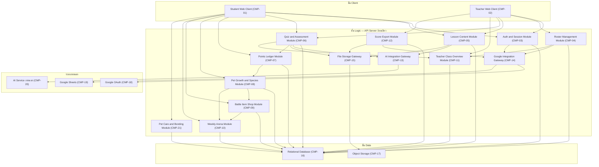
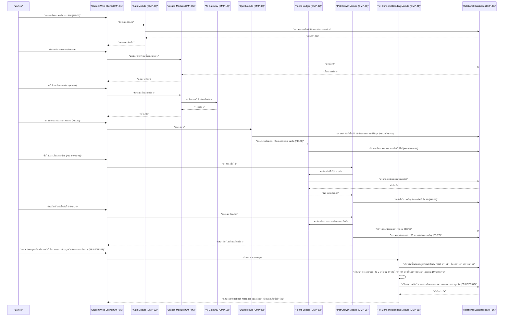
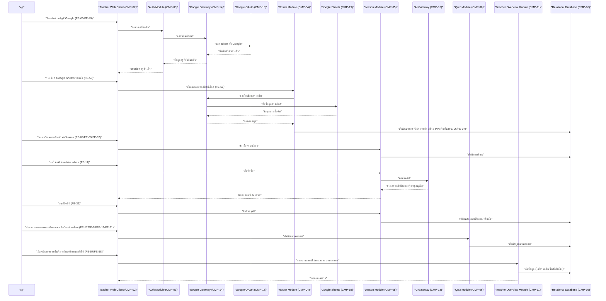
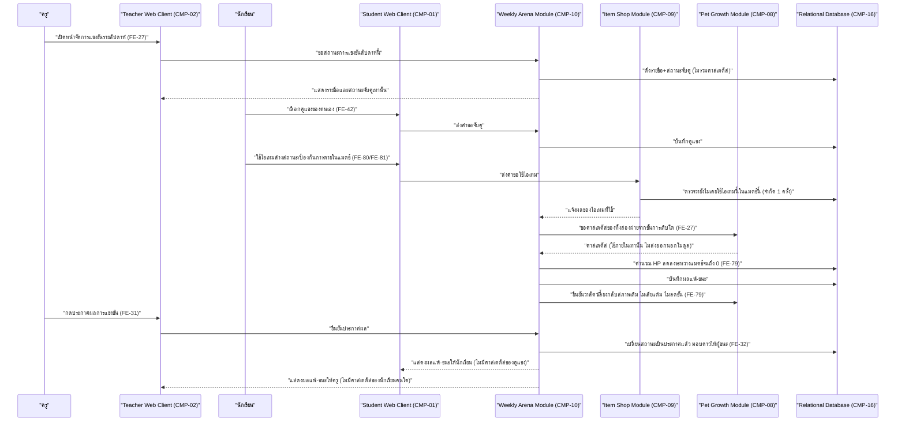
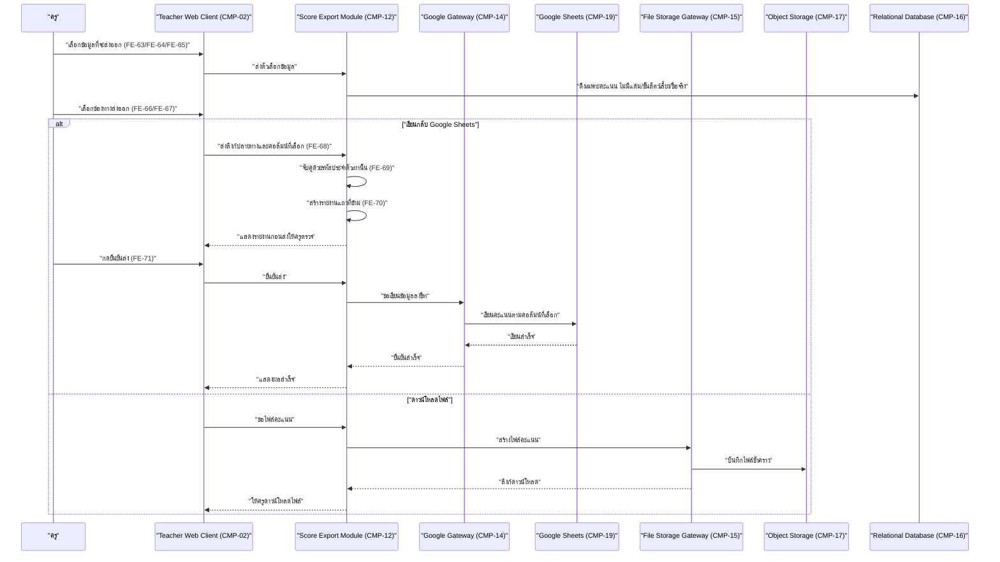

# High-Level Architecture — war-point

- **อัปเดตล่าสุด:** 2026-08-25
- **ระดับความละเอียด:** Conceptual (ยังไม่ผูกกับเทคโนโลยีใดๆ — ใช้ชื่อบทบาทกลาง เช่น "API Server", "Relational Database", "Object Storage" แทนชื่อภาษา/framework/ยี่ห้อจริง จะเติมชื่อเทคโนโลยีจริงเมื่อผู้ใช้เลือก stack)
- **ที่มา:** [[../../01-requirements/feature-list|feature-list]], [[../../01-requirements/user-journey|user-journey]], [[../../03-testing/01-test-plan/acceptance-criteria|acceptance-criteria]]
- **ส่งต่อไป:** [[database-schema|database-schema]], [[api-spec|api-spec]], [[detailed-design|detailed-design]]

---

## 1. ภาพรวมและเหตุผลของรูปแบบที่เลือก

**รูปแบบที่เลือก: 3-tier monolith** — Client (ฝั่งนักเรียน + ฝั่งครู) → API Server ก้อนเดียว (แบ่งเป็นโมดูลภายในตามโดเมนธุรกิจ) → Relational Database ก้อนเดียว

**เหตุผล (อ้างอิง constraint ที่ผู้ใช้ยืนยัน):**

- บริบทจริงคือ **1 ห้องเรียน ~30 คน** (`FE-36` ระบุชัดว่าไม่รองรับหลายห้อง/หลายโรงเรียนรอบนี้ และเป็นระดับ Won't) — ปริมาณข้อมูลและ concurrent user ต่ำมาก ไม่มีเหตุผลด้าน scale ที่ต้องแยกบริการ
- เป็น**โปรเจกต์การบ้าน** ไม่มีทีม DevOps ดูแลหลาย service, ไม่มีงบโครงสร้างพื้นฐานเพิ่มเติม — ความซับซ้อนในการ deploy/monitor หลายบริการจะเป็นต้นทุนที่ไม่คุ้มกับประโยชน์
- ผู้ใช้เลือก **Authentication แบบ Session-based (stateful)** ซึ่งเข้ากันได้ตรงไปตรงมากับ API Server ก้อนเดียวที่ถือ session state เอง (ไม่ต้องมี distributed session store แยกต่างหาก)
- ตรรกะที่ต้อง**ทำธุรกรรมเชิงความสอดคล้องสูง** เช่น การหักแต้มที่ใช้ได้ตอนซื้อไข่/ปลดล็อกขั้น/ซื้อไอเทม (`FE-23`, `FE-24`, `FE-75`, `FE-78`) ต้องกัน race condition ไม่ให้แต้มถูกใช้ซ้ำ — ทำได้ง่ายกว่ามากเมื่อ logic และฐานข้อมูลอยู่ในขอบเขตธุรกรรมเดียวกัน (single database transaction) เทียบกับต้องประสาน distributed transaction ข้ามบริการ

**ทางเลือกที่พิจารณาแล้วไม่เลือก:**

| ทางเลือก | เหตุผลที่ไม่เลือก |
|---|---|
| Microservices (แยกบริการตามโดเมน เช่น Auth service, Pet service, Arena service) | เพิ่มความซับซ้อนด้าน deployment/network/distributed transaction ที่ไม่จำเป็นสำหรับ 1 ห้องเรียน ~30 คน และขัดกับ constraint "ไม่มีงบ/ทีมโครงสร้างพื้นฐานเพิ่มเติม" ของโปรเจกต์การบ้าน — การหักแต้มแบบ atomic (FE-22/23/24) จะยากขึ้นมากถ้าข้อมูลแต้มกับข้อมูลสัตว์เลี้ยงอยู่คนละบริการ |
| Serverless (function-per-endpoint) | ขัดโดยตรงกับการเลือก Session-based (stateful) auth ของผู้ใช้ ซึ่งต้องมีที่เก็บ state ที่ทำงานต่อเนื่อง ไม่ใช่ stateless function ที่ scale เป็น 0 ได้ตลอดเวลา อีกทั้งงานเรียนต้องการความเรียบง่ายด้าน infra มากกว่าความสามารถ auto-scale ที่ไม่มี traffic สูงพอจะได้ใช้ประโยชน์ |

โครงสร้างภายในของ API Server ยังคง**แบ่งเป็นโมดูลตามโดเมน** (Auth, Roster, Lesson, Quiz, Points, Pet Growth, Item Shop, Weekly Arena, Teacher Overview, Score Export, และ Gateway ไปยังระบบภายนอก) เพื่อให้โค้ดดูแลง่ายและ trace กลับ FE ได้ชัด แม้จะ deploy เป็นก้อนเดียวก็ตาม

---

## 2. แผนภาพสถาปัตยกรรม

---

## 3. ตาราง Component

| ID | Component | ชั้น (Tier) | หน้าที่ | Feature ที่รองรับ | หมายเหตุ |
|---|---|---|---|---|---|
| CMP-01 | Student Web Client | Client | หน้าจอฝั่งนักเรียนทั้งหมด: ล็อกอิน, ดูบทเรียน, ทำแบบทดสอบ, จัดการสัตว์เลี้ยง, ร้านไอเทม, เลือกคู่แข่ง | FE-01, FE-07, FE-08, FE-09, FE-10, FE-20, FE-24, FE-33, FE-42, FE-44, FE-47, FE-53, FE-75, FE-76, FE-78, FE-80, FE-81 | ต้อง responsive ทั้งมือถือและจอใหญ่ (FE-33) ตามที่ผู้ใช้ยืนยัน |
| CMP-02 | Teacher Web Client | Client | หน้าจอฝั่งครูทั้งหมด: ล็อกอิน Google, จัดการรายชื่อ, สร้างบทเรียน/แบบทดสอบ, ภาพรวมชั้นเรียน, จัดการแข่งขัน, ส่งออกคะแนน | FE-02, FE-03, FE-04, FE-05, FE-11, FE-12, FE-13, FE-14, FE-15, FE-17, FE-18, FE-19, FE-28, FE-29, FE-30, FE-31, FE-33, FE-34, FE-39, FE-43, FE-49, FE-50, FE-55, FE-56, FE-57, FE-58, FE-59, FE-60, FE-61, FE-62, FE-63, FE-64, FE-65, FE-66, FE-67, FE-68, FE-69, FE-70, FE-71 | ต้อง responsive เช่นเดียวกับ CMP-01 (FE-33) — ห้ามแสดงแต้ม/ขั้นสัตว์เลี้ยงของนักเรียนตามข้อ 7 |
| CMP-03 | Auth and Session Module | Logic | ตรวจสอบตัวตนนักเรียน (รหัส+PIN) และครู (ส่งต่อไป Google OAuth), ออก/ตรวจ session, บังคับเปลี่ยน PIN ครั้งแรก, ล็อคชั่วคราวเมื่อกรอกผิดหลายครั้ง, ครูปลดล็อก/รีเซ็ต PIN | FE-01, FE-02, FE-03, FE-06, FE-47, FE-48, FE-49 | เป็นจุดเดียวที่ออก session token/cookie ให้ทั้งสองบทบาท |
| CMP-04 | Roster Management Module | Logic | นำเข้า/เพิ่มรายชื่อนักเรียน, เลือกคอลัมน์รหัสประจำตัวเอง, กรองชื่อเล่น, ปิดใช้งานนักเรียนที่ย้ายออก, เก็บเวลาเข้าใช้งานล่าสุด | FE-04, FE-05, FE-07, FE-50, FE-51, FE-52, FE-53, FE-54, FE-55, FE-56 | บังคับกฎ "ไม่เก็บชื่อจริง" ที่ระดับโมดูลนี้ ไม่ใช่แค่ระดับหน้าจอ |
| CMP-05 | Lesson Content Module | Logic | รับลิงก์/ไฟล์/ข้อความบทเรียน, เรียก AI อ่านออกเสียง/ค้นคลิปผ่าน Gateway, คิวรออนุมัติคลิปจาก AI | FE-08, FE-09, FE-10, FE-11, FE-37, FE-39, FE-40 | คลิปที่ AI เสนอต้องอยู่ในสถานะ "รอครูอนุมัติ" ในโมดูลนี้ก่อนจะปรากฏต่อ CMP-01 (ซ่อน ไม่ใช่แค่ปิดปุ่ม) |
| CMP-06 | Quiz and Assessment Module | Logic | สร้างแบบทดสอบ 3 รูปแบบ, เรียก AI ออกข้อสอบผ่าน Gateway, ตรวจปรนัยอัตโนมัติ, รับคะแนนที่ครูให้ด้วยมือ, ยึดคะแนนรอบที่ดีที่สุด, ควบคุมจำนวนรอบ/เดดไลน์ | FE-12, FE-13, FE-14, FE-15, FE-16, FE-17, FE-18, FE-19, FE-20, FE-38, FE-41 | ส่งคะแนนที่สรุปแล้วต่อให้ CMP-07 แปลงเป็นแต้ม ไม่คำนวณแต้มเอง |
| CMP-07 | Points Ledger Module | Logic | แปลงคะแนนเป็นแต้มตามคะแนนเต็มที่ครูตั้ง, ดูแลยอดแต้มสะสมรวม (ไม่ลดวันไหน) และยอดแต้มที่ใช้ได้ (หักออกได้) | FE-21, FE-22, FE-23 | เป็นแหล่งความจริงเดียว (single source of truth) ของแต้ม — ทุกโมดูลที่ต้องหักแต้ม (CMP-08, CMP-09) ต้องเรียกผ่านโมดูลนี้เท่านั้น เพื่อกัน race condition |
| CMP-08 | Pet Growth and Species Module | Logic | ซื้อไข่, เลือกสายพันธุ์, ปลดล็อกขั้นเติบโต, กระจายแต้มสเตตัส, เปลี่ยนชนิด/รีเซ็ตพร้อมคืนแต้ม, บันทึกเส้นทางการเติบโต, จำกัดสัตว์เลี้ยงใช้งานได้ตัวเดียว | FE-24, FE-25 (เลิกใช้), FE-26, FE-44, FE-72, FE-73, FE-74, FE-75, FE-76, FE-77 | ข้อมูลของโมดูลนี้**ห้ามส่งให้ CMP-02/CMP-09 ฝั่งที่ครูมองเห็น** ตามกฎ "ซ่อน ไม่ใช่ disable" (ดูข้อ 7) |
| CMP-09 | Battle Item Shop Module | Logic | ขายไอเทมช่วยในการต่อสู้ด้วยแต้มส่วนเกินจากยอดแต้มที่ใช้ได้ (ไม่เพิ่มค่าสเตตัส) | FE-78 | หักแต้มผ่าน CMP-07 เช่นเดียวกับ CMP-08 — เมื่อรีเซ็ต (CMP-08) คลังไอเทมของนักเรียนถูกเคลียร์ทิ้งพร้อมกัน ตามกฎที่ปิด Open Question ข้อ 6 ของ spec 06 แล้ว (2026-08-23) |
| CMP-10 | Weekly Arena Module | Logic | จับคู่แข่ง 4 วิธี, คำนวณผลจากค่าสเตตัส+HP+ไอเทมที่ใช้ (server-side เท่านั้น), ประกาศผลตามจังหวะที่ครูสั่ง, โหมดฉายในห้อง, มอบดาว/สถิติ | FE-27, FE-28, FE-29, FE-30, FE-31, FE-32, FE-42, FE-43, FE-45, FE-46, FE-79, FE-80, FE-81 | ต้องคำนวณผลที่ server เท่านั้น ห้ามให้ client คำนวณเอง เพราะต้องปิดกั้นไม่ให้ครูเห็นค่าสเตตัสของนักเรียนแม้ทางอ้อม (ผ่าน network payload) |
| CMP-11 | Teacher Class Overview Module | Logic | รวมสถานะทำ/ไม่ทำ, คะแนนรายคน, นักเรียนที่หายไปนาน, สัญลักษณ์เตือน, ทางลัดไปทำงานต่อ, การเรียง/กรอง | FE-57, FE-58, FE-59, FE-60, FE-61, FE-62 | Response ของโมดูลนี้ต้อง**ไม่มี field แต้ม/ขั้นสัตว์เลี้ยง** อยู่เลยตั้งแต่ชั้น server (ไม่ใช่กรองที่ client) |
| CMP-12 | Score Export Module | Logic | ให้ครูเลือกข้อมูล/ช่องทาง/คอลัมน์ปลายทาง, จับคู่ด้วยรหัสประจำตัว, รายงานแถวที่ข้าม, ส่งเมื่อครูกดยืนยันเท่านั้น | FE-34, FE-63, FE-64, FE-65, FE-66, FE-67, FE-68, FE-69, FE-70, FE-71 | ไม่ดึงข้อมูลแต้ม/ขั้นสัตว์เลี้ยงจาก CMP-07/CMP-08 มาส่งออกเด็ดขาด ตามที่ spec 05 ยืนยัน |
| CMP-13 | AI Integration Gateway | Logic | จุดเดียวที่เรียกบริการ AI ภายนอก (อ่านออกเสียง, ค้นคลิป, ออกข้อสอบ) กันไม่ให้แต่ละโมดูลผูกกับผู้ให้บริการ AI โดยตรง | FE-10, FE-11, FE-15 | รองรับกรณี AI service ล่ม/ช้า โดยไม่บล็อกวงจรหลัก (ดู DF-02 จุดพัง) |
| CMP-14 | Google Integration Gateway | Logic | จุดเดียวที่คุย Google OAuth (ล็อกอินครู) และ Google Sheets API (อ่านรายชื่อ/เขียนคะแนน) | FE-03, FE-49, FE-50, FE-66 | ขอบเขตสิทธิ์ (scope) ที่ขอจาก Google ยังไม่ล็อก — ดูข้อ 8 |
| CMP-15 | File Storage Gateway | Logic | จุดเดียวที่อ่าน/เขียนไฟล์ไปยัง Object Storage (เอกสารบทเรียน, ไฟล์ชิ้นงานที่นักเรียนแนบ, ไฟล์คะแนนที่ครูดาวน์โหลด) | FE-09, FE-14, FE-67 | ตรวจสอบว่าไฟล์ดึงข้อความได้หรือไม่ (FE-40) เกิดที่ชั้นนี้ก่อนส่งต่อให้ CMP-05 |
| CMP-16 | Relational Database | Data | เก็บข้อมูลถาวรเชิงโครงสร้างของทุกโมดูล (บัญชี, รายชื่อ, บทเรียน, แบบทดสอบ, คะแนน, แต้ม, สัตว์เลี้ยง, แมตช์, สถิติ) | รองรับทุกโมดูล CMP-03 ถึง CMP-12 โดยอ้อม | จะเติมรายละเอียดตารางจริงใน `database-schema.md` |
| CMP-17 | Object Storage | Data | เก็บไฟล์ที่ไม่ใช่ข้อมูลเชิงโครงสร้าง: เอกสารบทเรียน, ไฟล์แนบใบงาน/ชิ้นงาน, ไฟล์คะแนนที่สร้างให้ดาวน์โหลด | FE-09, FE-14, FE-67 | เข้าถึงผ่าน CMP-15 เท่านั้น ไม่มีโมดูลอื่นเข้าถึงตรง |
| CMP-18 | Google OAuth | External | ยืนยันตัวตนครูด้วยบัญชี Google (โรงเรียนหรือส่วนตัว) โดยระบบไม่เก็บรหัสผ่านครูเอง | FE-03, FE-49 | เข้าถึงผ่าน CMP-14 เท่านั้น |
| CMP-19 | Google Sheets | External | อ่านรายชื่อนักเรียนจากลิงก์ที่ครูวาง, เขียนคะแนนกลับเข้าชีทของครู | FE-50, FE-66 | เข้าถึงผ่าน CMP-14 เท่านั้น — ขอบเขตสิทธิ์อ่าน/เขียนยังไม่ล็อก (ข้อ 8) |
| CMP-20 | AI Service ภายนอก | External | ให้บริการแปลงข้อความเป็นเสียง, ค้นหาคลิปตามหัวข้อ, ช่วยออกข้อสอบปรนัย | FE-10, FE-11, FE-15 | เข้าถึงผ่าน CMP-13 เท่านั้น — ผู้ให้บริการจริงยังไม่เลือก (ดู `constraints`) |
| CMP-21 | Pet Care and Bonding Module | Logic | รับ action ดูแลสัตว์เลี้ยง 4 แบบจากนักเรียน (ให้อาหาร/อาบน้ำ/ลูบหัว/เล่น-ออกกำลังกาย), ควบคุมค่าซ่อน "ความหิว" (จำกัดให้อาหารสำเร็จสูงสุด 3 ครั้ง/วัน), คำนวณค่าความผูกพัน +1 หน่วย/action สำเร็จเท่ากันทุก action ภายใต้เพดานโควตารวม 10 หน่วย/วัน และเก็บยอดสะสมรวมที่ไม่รีเซ็ตรายวันแยกต่างหาก, ใช้ตรรกะเทียบวันที่ปัจจุบันกับวันที่บันทึกล่าสุดเพื่อรีเซ็ตความหิว+โควตารายวันแบบ lazy reset ทุกเที่ยงคืน (ไม่มี background job/cron) | FE-82, FE-83, FE-84 | **สร้างเป็น component แยกต่างหากจาก CMP-08 ไม่ขยาย CMP-08** เพราะ spec `20260825-07-pet-care-and-bonding` ระบุเองว่าระบบนี้ "แยกขาดโดยสิ้นเชิงจากวงจรแต้ม-เติบโต-ต่อสู้เดิม" — **ไม่มีเส้นเชื่อมข้อมูลใดๆ ไปยัง CMP-07 (Points Ledger) หรือ CMP-10 (ค่าสเตตัสต่อสู้) เรื่องแต้ม/ค่าต่อสู้เลยไม่ว่ากรณีใด** ทั้งค่าความหิวและค่าความผูกพันไม่มีผลต่อแต้มที่ใช้ได้หรือค่าสเตตัสต่อสู้ (FE-23, FE-77) ทั้งสิ้น; **รับรู้ (ไม่ใช่ตัดสินใจ) เหตุการณ์รีเซ็ตจาก CMP-08** — เมื่อ CMP-08 เกิดการเปลี่ยนสายพันธุ์/รีเซ็ตตัวละคร (FE-26) CMP-08 เป็นเจ้าของ event นี้ และส่งสัญญาณให้ CMP-21 รีเซ็ต "ยอดสะสมรวม" ของค่าความผูกพันกลับเป็น 0 พร้อมกัน; state ทั้งหมดเก็บฝั่ง server ผ่าน CMP-16 (ไม่ใช่เก็บที่ client เท่านั้นแบบ prototype) |

---

## 4. ผู้ใช้และบทบาท (Actor)

| บทบาท | เข้าถึง Component | เข้าถึงไม่ได้ / ถูกซ่อน |
|---|---|---|
| นักเรียน | CMP-01, CMP-03 (เฉพาะบัญชีตนเอง), CMP-05 (ดูเฉพาะบทเรียนที่เผยแพร่แล้ว), CMP-06 (ทำแบบทดสอบ/ดูคะแนนตนเอง), CMP-07 (ดูแต้มตนเอง), CMP-08 (จัดการสัตว์เลี้ยงตนเอง), CMP-09 (ซื้อ/ใช้ไอเทมตนเอง), CMP-10 (เลือกคู่แข่ง, ใช้ไอเทมในแมตช์ตนเอง, ดูผลแพ้-ชนะ), CMP-04 เฉพาะส่วนตั้งชื่อเล่นตนเอง (FE-53), CMP-21 (จัดการสัตว์เลี้ยงของตนเอง) | CMP-02, CMP-04 ส่วนจัดการรายชื่อทั้งห้อง, CMP-11, CMP-12, CMP-14 (ไม่มี Google login), แต้ม/ขั้นสัตว์เลี้ยงของเพื่อนคนอื่น (AC-FE-42-2) |
| ครู | CMP-02, CMP-03 (Google auth ของตนเอง + รีเซ็ต/ปลดล็อก PIN นักเรียน), CMP-04 (เต็มรูปแบบ), CMP-05 (สร้าง/อนุมัติ), CMP-06 (สร้าง/ตรวจ/ตั้งค่า), CMP-09/CMP-10 (จัดการการจับคู่และประกาศผลเท่านั้น ไม่เห็นค่าสเตตัส/HP/ไอเทมที่ใช้จริง), CMP-11, CMP-12, CMP-14 | CMP-01 มุมมองนักเรียน, ข้อมูลแต้ม/ขั้นการเติบโต/ค่าสเตตัสของนักเรียนทุกจุด (CMP-07, CMP-08 และข้อมูลย่อยของ CMP-10), **CMP-21 เข้าถึงไม่ได้เลย** (ยังไม่มีกลไก/หน้าจอให้ครูดูยอดสะสมรวมค่าความผูกพัน — เป็นแค่ทิศทางอนาคตที่ยังไม่ทำ ดู `20260825-07-pet-care-and-bonding`) — ยืนยันตาม `20260821-04-teacher-class-overview` |

---

## 5. ระบบภายนอกที่เชื่อมต่อ (External Dependency)

| ระบบ | ใช้ทำอะไร | Feature ต้นทาง | ถ้าระบบนี้ล่ม ระบบเราต้องทำอะไร |
|---|---|---|---|
| Google OAuth (CMP-18) | ยืนยันตัวตนครู (บัญชีโรงเรียนหรือส่วนตัว) แทนการเก็บรหัสผ่านเอง | FE-03, FE-49 | ครูล็อกอินไม่ได้ชั่วคราว — ต้องแสดงข้อความเป็นกลางว่าระบบยืนยันตัวตนขัดข้อง ไม่ใช่ error ทางเทคนิคดิบ; งานที่ครูเริ่มไว้ก่อนหน้า (บทเรียน/แบบทดสอบที่เผยแพร่แล้ว) ต้องไม่หายเพราะ session เดิมยังอยู่ในฐานข้อมูล |
| Google Sheets (CMP-19) | อ่านรายชื่อนักเรียนจากลิงก์ (FE-50), เขียนคะแนนกลับเข้าชีทของครู (FE-66) | FE-50, FE-66 | นำเข้ารายชื่อ: ครูใช้ทางเลือกอัปโหลดไฟล์แทนได้ (FE-04) — วงจรไม่หยุด; ส่งออกคะแนน: ครูใช้ทางเลือกดาวน์โหลดไฟล์แทนได้ (FE-67) — ต้องแจ้งครูชัดเจนว่าไม่ได้เขียนอะไรลงชีทเลย ไม่ใช่เขียนไปครึ่งเดียว |
| AI Service ภายนอก (CMP-20) | อ่านออกเสียงบทเรียน (FE-10), ค้นคลิปตามหัวข้อ (FE-11), ช่วยออกข้อสอบปรนัย (FE-15) | FE-10, FE-11, FE-15 | ทั้ง 3 ฟีเจอร์เป็นระดับ Could/Should ที่ไม่ใช่แกนวงจรแรงจูงใจหลัก — ถ้า AI ล่ม นักเรียนยังอ่านบทเรียนเป็นข้อความได้ปกติ (ไม่มีเสียง) และครูยังสร้างแบบทดสอบเองได้ (FE-12/FE-13/FE-14) โดยไม่ต้องรอ AI |

---

## 6. Data Flow ของ flow สำคัญ

### DF-01 — นักเรียนทบทวนบทเรียนและเลี้ยงสัตว์เลี้ยง (อ้างอิง UJ-01)

| ขั้น | ผู้ส่ง → ผู้รับ | ข้อมูลที่ส่ง | ถ้าพลาดตรงนี้ |
|---|---|---|---|
| ล็อกอิน | S → AUTH | รหัสประจำตัว + PIN | กรอกผิดหลายครั้งต้องล็อคชั่วคราว (FE-48) — ถ้าไม่ล็อกจะเปิดช่องให้เดา PIN เพื่อนแล้วสวมรอย กระทบความเป็นธรรมของแต้มทั้งระบบ |
| อ่านออกเสียง | LES → AIGW → AI Service | ข้อความบทเรียน | AI Service ช้า/ล่ม ต้อง**ไม่บล็อก**การอ่านบทเรียนแบบข้อความ (FE-10 เป็น Could) — ต้อง timeout แล้ว fallback เป็นไม่มีเสียง ไม่ใช่ค้างทั้งหน้าจอ |
| ส่งคำตอบแบบทดสอบ | C → QUIZ | คำตอบทั้งชุด | เครือข่ายหลุดกลางทาง ต้องกันการส่งซ้ำ (idempotent) ไม่ให้ QUIZ บันทึกคะแนนซ้ำหรือ PTS บวกแต้มซ้ำจากการ retry เดียวกัน |
| หักแต้มซื้อไข่/ปลดล็อกขั้น/ซื้อไอเทม | PET/CMP-09 → PTS → DB | จำนวนแต้มที่จะหัก | ถ้านักเรียนกดพร้อมกันจากหลายอุปกรณ์ (เช่น มือถือค้างเซสชันที่บ้านกับที่โรงเรียน) ต้องใช้ database transaction ล็อกยอดแต้มไม่ให้หักเกินยอดที่มีจริง (double-spend) |
| กระจายแต้มสเตตัส | PET → DB | แต้มสเตตัส +50 ต่อสัดส่วนสายพันธุ์ | ถ้าสูตรสัดส่วนยังไม่ล็อก (ดู Gap ข้อ 9) ต้องมี fallback ที่ไม่ทำให้ค่าสเตตัสรวมเกิน 250 ตามที่ล็อกไว้แล้วในหัวข้อ ซ. ของ spec 02 |
| ดูแลสัตว์เลี้ยง (ให้อาหาร/อาบน้ำ/ลูบหัว/เล่น-ออกกำลังกาย) | C → CARE → DB | action ที่กด + วันที่บันทึกล่าสุด | ต้องเช็ค lazy reset (เทียบวันที่ปัจจุบันกับวันที่บันทึกล่าสุด) ก่อนเช็คเพดานทุกครั้ง มิฉะนั้นความหิว/โควตารายวันของเมื่อวานจะค้างข้ามวันผิดเจตนา — **ขั้นตอนนี้ทั้งหมดไม่ผ่าน CMP-07 หรือ CMP-08 เรื่องแต้ม/ค่าสเตตัสเลย** เป็นเส้นทางข้อมูลที่แยกขาดจากวงจรแต้ม-เติบโต-ต่อสู้เดิมโดยสมบูรณ์ (ตามที่ spec `20260825-07-pet-care-and-bonding` ยืนยัน) ถ้ามีการเชื่อมข้อมูลข้ามไปยัง CMP-07/CMP-08/CMP-10 โดยไม่ตั้งใจ ถือว่าผิดกฎการออกแบบของโมดูลนี้ |

---

### DF-02 — ครูเตรียมบทเรียนและแบบทดสอบ (อ้างอิง UJ-02)

| ขั้น | ผู้ส่ง → ผู้รับ | ข้อมูลที่ส่ง | ถ้าพลาดตรงนี้ |
|---|---|---|---|
| ล็อกอินครู | GGW → GOA | คำขอแลก token | ถ้า Google OAuth ล่ม/token หมดอายุ ครูต้องเห็นข้อความชัดว่าต้องล็อกอินใหม่ ไม่ใช่ error ดิบ และข้อมูลที่ทำค้างไว้ต้องไม่หาย |
| นำเข้ารายชื่อจากชีท | ROS → GGW → GSH | ลิงก์ชีท + คอลัมน์ที่ครูเลือก | ถ้าครูเปลี่ยนสิทธิ์แชร์ชีทภายหลังหรือลิงก์ผิด ต้องรายงานว่านำเข้าไม่สำเร็จ ไม่ใช่บันทึกข้อมูลค้างครึ่งเดียว |
| ค้นคลิปด้วย AI | LES → AIGW | หัวข้อที่ครูระบุ | ถ้า AI ค้นไม่เจอ/ล่ม ครูต้องยังลงบทเรียนด้วยลิงก์/ไฟล์ได้ตามปกติ (FE-11 เป็น Could ไม่บล็อกวงจร) |
| อนุมัติคลิป | T → LES | คำสั่งอนุมัติ | คลิปที่ยังไม่อนุมัติต้อง**ไม่อยู่ใน response ที่ส่งให้ CMP-01 เลย** ไม่ใช่แค่ซ่อนด้วย CSS |
| เปิดภาพรวมชั้นเรียน | OV → DB | คำขอดึงสถานะ/คะแนน | Response ต้องกรอง field แต้ม/ขั้นสัตว์เลี้ยงออกตั้งแต่ query ชั้น DB/service ไม่ใช่กรองที่ client (กฎ "ซ่อน ไม่ใช่ disable") |

---

### DF-03 — ครูจัดการแข่งขันรายสัปดาห์ รวม HP/ไอเทม (อ้างอิง UJ-03)

| ขั้น | ผู้ส่ง → ผู้รับ | ข้อมูลที่ส่ง | ถ้าพลาดตรงนี้ |
|---|---|---|---|
| ครูเปิดหน้าจัดการแข่งขัน | ARENA → TC | สถานะจับคู่ | Response ต้องไม่มี field ค่าสเตตัส/ขั้นการเติบโต/แต้มเลยแม้แต่ค่าเดียว (AC-FE-27-3) — ถ้าหลุดมาแม้ใน field ที่ UI ไม่แสดง ก็ถือว่าละเมิดกฎ "ซ่อน ไม่ใช่ disable" |
| ใช้ไอเทมในแมตช์ | SC → ITEM | คำขอใช้ไอเทม | ต้องกันกดซ้ำ (double-click/retry) ไม่ให้ใช้ไอเทมเดียวเกิน 1 ครั้งต่อแมตช์ตามกฎ FE-80/FE-81 — ต้องตรวจที่ server ไม่ใช่แค่ disable ปุ่มที่ client |
| คำนวณผลแมตช์ | ARENA → PET, ARENA → DB | ค่าสเตตัส + HP + ผลไอเทม | สูตรตัดสินแพ้-ชนะและสูตรคำนวณ HP **ยังไม่ล็อกในเอกสาร** (ดู Gap ข้อ 9) — ต้องคำนวณที่ server เท่านั้นเพื่อไม่ให้ client เดาค่าสเตตัสของคู่แข่งจาก logic ฝั่งตัวเอง |
| จบแมตช์ | ARENA → PET | ยืนยันคืนสภาพ | ต้องยืนยันว่าไม่มีการเขียนแก้แต้ม/ขั้นการเติบโตจริงระหว่างแมตช์ (กฎ "การแพ้ไม่มีผลเสียใดๆ" ของ spec 02 ข้อ ค. ต้องคงอยู่เต็มรูปแบบ) |
| ครูประกาศผล | T → ARENA | คำสั่งประกาศ | ระบบต้องไม่ประกาศผลเองก่อนครูกดสั่ง (FE-31) แม้ว่าแมตช์จะคำนวณเสร็จแล้วก็ตาม — ต้องมีสถานะ "คำนวณแล้วรอประกาศ" แยกจาก "ประกาศแล้ว" |

---

### DF-04 — ครูส่งคะแนนเข้าสมุดคะแนนของตนเอง (อ้างอิง UJ-04)

| ขั้น | ผู้ส่ง → ผู้รับ | ข้อมูลที่ส่ง | ถ้าพลาดตรงนี้ |
|---|---|---|---|
| เลือกข้อมูลส่งออก | EXP → DB | ชนิดข้อมูล (แยกชุด/รวม) | ต้องกรองไม่ให้ field แต้ม/ขั้นสัตว์เลี้ยง/ชื่อจริงหลุดออกมาแม้ในโหมด debug/log |
| จับคู่ด้วยรหัสประจำตัว | EXP (internal) | รหัสประจำตัวในชีทเทียบกับในระบบ | ถ้ารหัสไม่ตรง ต้อง**ข้ามแถวนั้น ไม่เขียนทับ**และใส่ในรายงาน (FE-70) — ห้ามเดาว่าเป็นนักเรียนคนไหนจากชื่อ/ลำดับแถว |
| เขียนกลับ Google Sheets | GGW → GSH | คะแนนตามคอลัมน์ที่เลือก | ถ้าเขียนสำเร็จบางแถวแล้วหลุดกลางทาง (เครือข่ายขาด) ต้องรายงานให้ครูรู้ว่าแถวไหนเขียนสำเร็จแล้วบ้าง ป้องกันเขียนซ้ำโดยไม่ตั้งใจตอนกดส่งใหม่ (นโยบายส่งซ้ำยังไม่ล็อก — ดู Gap ข้อ 9) |
| ครูกดยืนยันส่ง | T → EXP | คำสั่งยืนยัน | ระบบต้อง**ไม่เขียนอะไรเลยจนกว่าจะกดยืนยัน** (FE-71) — ต้องมีสถานะ "ตรวจแล้ว รอยืนยัน" แยกจาก "ส่งแล้ว" อย่างชัดเจนในโมดูล |

---

## 7. Authentication & Authorization

**Authentication:**

- **นักเรียน:** ล็อกอินด้วย **รหัสประจำตัว + PIN ตัวเลข** ผ่าน CMP-03 — เหตุผล: นักเรียนประถมส่วนใหญ่ไม่มีอีเมลของตนเอง (ยืนยันใน spec 03) บังคับเปลี่ยน PIN ในการล็อกอินครั้งแรก (FE-47) และล็อคชั่วคราวเมื่อกรอกผิดหลายครั้งติดต่อกัน (FE-48) โดยครูเป็นผู้ปลดล็อก/รีเซ็ตให้ (FE-02)
- **ครู:** ล็อกอินด้วย **Google OAuth** ผ่าน CMP-14 → CMP-18 (บัญชีโรงเรียนหรือบัญชีส่วนตัว ตาม FE-03/FE-49) — เหตุผล: ครูไม่ต้องจำรหัสผ่านเพิ่ม และระบบไม่ต้องเก็บรหัสผ่านครูเอง (ยืนยันใน spec 03)
- **กลไกระดับสถาปัตยกรรม: Session-based (stateful)** ตามที่ผู้ใช้เลือก — CMP-03 ออก session token/cookie เดียวหลังยืนยันตัวตนสำเร็จไม่ว่าจะเป็นบทบาทใด แล้วเก็บสถานะ session (role, ตัวตน, เวลาหมดอายุ) ไว้ที่ CMP-16 หรือหน่วยความจำของ API Server ก้อนเดียว — ไม่ต้องมี distributed session store เพราะ deploy เป็นก้อนเดียว (สอดคล้องกับเหตุผลข้อ 1)

**Authorization:**

- ใช้ **RBAC (Role-Based Access Control)** มี 2 บทบาทหลัก: **นักเรียน** และ **ครู** — ทุก endpoint ของ CMP-03 ถึง CMP-15 ต้องตรวจ role จาก session ก่อนประมวลผล และปฏิเสธคำขอที่ role ไม่ตรงด้วยสถานะปฏิเสธที่ชัดเจน (ไม่ใช่ error ทั่วไปที่รั่วรายละเอียดภายใน)

| Role | CMP ที่เข้าถึงได้ | สิทธิ์ |
|---|---|---|
| นักเรียน | CMP-01, CMP-03 (ตนเอง), CMP-04 (เฉพาะตั้งชื่อเล่นตนเอง), CMP-05 (อ่านที่เผยแพร่แล้ว), CMP-06 (ทำ/ดูของตนเอง), CMP-07 (ดูของตนเอง), CMP-08 (จัดการของตนเอง), CMP-09 (ซื้อ/ใช้ของตนเอง), CMP-10 (เลือกคู่/ใช้ไอเทม/ดูผลของตนเอง) | อ่าน-เขียนเฉพาะข้อมูลของตนเองเท่านั้น ไม่เห็นข้อมูลแต้ม/สถานะทำงานของเพื่อนคนอื่น (AC-FE-42-2) |
| ครู | CMP-02, CMP-03 (ตนเอง + รีเซ็ต/ปลดล็อก PIN นักเรียน), CMP-04, CMP-05 (สร้าง/อนุมัติ), CMP-06 (สร้าง/ตรวจ/ตั้งค่า), CMP-09/CMP-10 (จัดการจับคู่/ประกาศผลเท่านั้น), CMP-11, CMP-12, CMP-14 | เขียนได้เฉพาะข้อมูลเชิงจัดการชั้นเรียน **ห้ามอ่านแต้ม ค่าสเตตัส ขั้นการเติบโต หรือ HP/ไอเทมของนักเรียนคนใดเลย ไม่ว่าจากหน้าจอใด** |

**ข้อมูลที่ "ต้องซ่อน ไม่ใช่แค่ disable" (ตาม `20260821-04-teacher-class-overview` และ DESIGN.md ข้อ 4.5):**

- แต้มสะสมรวม/แต้มที่ใช้ได้ (CMP-07), ขั้นการเติบโตและค่าสเตตัสของสัตว์เลี้ยง (CMP-08), รายละเอียด HP/ไอเทมที่ใช้ระหว่างแมตช์ (CMP-10) — **ห้ามปรากฏใน response ที่ส่งให้ CMP-02 (ฝั่งครู) เลยแม้แต่ field เดียว** ต้องกรองที่ชั้น service/serializer ฝั่ง server ก่อนส่ง ไม่ใช่กรองด้วย CSS/JS ที่ client ตามที่ AC-FE-27-3, AC-FE-58-2, AC-FE-63-2 ยืนยันตรงกัน
- ชื่อ-นามสกุลจริงของนักเรียน — **ไม่ถูกเก็บในระบบตั้งแต่ชั้น CMP-04/CMP-16 เลย** (ไม่ใช่แค่ไม่แสดง) ตาม FE-07
- คะแนน/สถานะทำงานของเพื่อนนักเรียนคนอื่น — ไม่ปรากฏในหน้าจอเลือกคู่แข่งของนักเรียน (AC-FE-42-2)

---

## 8. ขอบเขตที่ยังไม่ตัดสินใจ (Open Decision)

- **จำนวนหลักของ PIN และเกณฑ์ล็อคชั่วคราว** (จำนวนครั้งที่กรอกผิดได้ + ระยะเวลาล็อค) — spec 03 ยืนยันแล้วว่ายังไม่ล็อก CMP-03 ออกแบบ mechanism (ตัวนับความพยายาม + ระยะเวลาล็อคที่ตั้งค่าได้) ไว้รองรับ แต่ตัวเลขจริงต้องรอ user ตัดสินใจก่อนเข้า `detailed-design.md`
- **ขอบเขตสิทธิ์ (OAuth scope) ที่ CMP-14 ขอจาก Google** ทั้งฝั่งอ่าน (นำเข้ารายชื่อ) และฝั่งเขียน (ส่งออกคะแนน) — สิทธิ์เขียนมีความเสี่ยงสูงกว่าสิทธิ์อ่านมาก ต้องเลือกระหว่าง (ก) ขอสิทธิ์แคบสุดเท่าที่ทำได้ต่อไฟล์ (per-file scope) หรือ (ข) ขอสิทธิ์กว้างระดับบัญชี — เอกสาร spec 03/05 ทิ้งเป็น Open Question ไว้ทั้งคู่ ผู้ช่วยไม่ตัดสินใจแทน
- **จังหวะดึงข้อมูลรายชื่อซ้ำจากลิงก์ Google Sheets** (CMP-04/CMP-14) — ดึงครั้งเดียวตอนนำเข้า หรือ sync ซ้ำเป็นระยะ ยังไม่มีคำตอบใน spec 03
- **นโยบายส่งคะแนนซ้ำรอบสอง** (CMP-12) — เขียนทับ / เพิ่มคอลัมน์ใหม่ / ถามครูก่อน ยังไม่มีคำตอบใน spec 05 กระทบการออกแบบ endpoint เขียนกลับ Google Sheets โดยตรง
- **AI Integration (CMP-13) เรียกแบบ synchronous หรือ background job** — งาน TTS/ค้นคลิป/ออกข้อสอบอาจใช้เวลานานกว่าคำขอ HTTP ทั่วไป ต้องเลือกว่าจะให้ client รอผลตรงๆ (synchronous) หรือใช้คิวงานเบื้องหลังแล้วแจ้งผลทีหลัง — ยังไม่มีข้อมูลจาก user ว่าจำเป็นต้องเป็นแบบไหน (ไม่กระทบวงจรหลักเพราะทั้ง 3 ฟีเจอร์เป็น Could/Should)
- **โหมดฉายผลการต่อสู้ในห้องเรียน (FE-43, CMP-10)** — ต้องเป็นการอัปเดตแบบทันที (เช่น push/real-time) หรือครูกดรีเฟรชเองพอ ยังไม่มีข้อมูลจาก user กระทบว่าต้องมี component เพิ่ม (เช่น real-time channel) หรือไม่
- **สูตรตัดสินแพ้-ชนะและสูตรคำนวณ HP ใน CMP-10** — spec 02 และ spec 06 ยืนยันตรงกันว่ายังไม่มีสูตร สถาปัตยกรรมเตรียมไว้ว่าโมดูลนี้เป็นจุดคำนวณฝั่ง server จุดเดียว แต่ตัวสูตรจริงต้องรอ user ตัดสินใจก่อนเขียน `detailed-design.md`
- **ช่องทางให้ครูดูยอดสะสมรวมของค่าความผูกพัน (CMP-21)** — spec `20260825-07-pet-care-and-bonding` บันทึกไว้เป็นเพียง "ทิศทางในอนาคต/แรงจูงใจประกอบ" (เช่น ใช้ตัดสินรางวัลท้ายเทอม) ไม่ใช่ acceptance criteria ของรอบนี้ — ยังไม่มีคำตอบว่าจะเปิดให้ครูดูผ่านหน้าจอไหน (เพิ่มใน CMP-11 Teacher Class Overview หรือเปิดโมดูล/หน้าจอใหม่แยกต่างหาก) รอ user เปิด requirement ใหม่ก่อนตัดสินใจ ปัจจุบัน CMP-21 ยังคงเป็นข้อมูลที่ครูเข้าถึงไม่ได้ทั้งหมดตามข้อ 4

---

## 9. ช่องว่างที่พบ (Gap)

- **`acceptance-criteria.md` ยังไม่ครอบคลุม FE-79 ถึง FE-81 (HP และไอเทมในแมตช์)** — เอกสาร AC ปิดเมื่อ 2026-08-22 ก่อนที่ `20260823-06-battle-support-items` จะถูกเพิ่มเข้ามาในวันถัดมา สถาปัตยกรรมฉบับนี้ออกแบบ CMP-09/CMP-10 ตาม feature-list และ user-journey ที่มีอยู่แล้ว แต่ยังไม่มี AC เป็นแหล่งความจริงของตัวเลข/กติกาละเอียด (เช่น จำนวนไอเทมที่ถือครองได้, ราคาไอเทม) — ต้องเปิด/ขยาย acceptance-criteria.md ให้ครอบคลุมก่อนเข้าสู่ `detailed-design.md`
- ~~ช่องโหว่ "รีเซ็ตแล้วได้แต้มค่าไอเทมคืนวนซ้ำ" ที่ spec 06 ระบุไว้ว่ายังไม่ปิด (Open Question ข้อ 6) — กระทบการออกแบบ transaction ของ CMP-08/CMP-09/CMP-07 ร่วมกันโดยตรง ต้องปิดที่ระดับ requirement ก่อนว่าการรีเซ็ตคืนเฉพาะแต้มที่ใช้ปลดล็อกขั้นเติบโต หรือคืนรวมแต้มที่ใช้ซื้อไอเทมด้วย~~ **ปิดแล้ว (2026-08-25):** spec 06 Open Question ข้อ 6 ถูกปิดเมื่อ 2026-08-23 ด้วยกฎที่ยืนยันแล้วว่า เมื่อนักเรียนรีเซ็ต ระบบคืนแต้มทั้งหมดเต็มจำนวน**รวมแต้มที่เคยใช้ซื้อไอเทมด้วย** (`available_points` กลับมาเท่ากับ `total_earned_points` พอดี) แต่ในธุรกรรมเดียวกันนั้น ระบบเคลียร์คลังไอเทม (`STUDENT_ITEM_INVENTORY`) ของนักเรียนคนนั้นทั้งหมดทิ้งพร้อมกัน (`quantity=0`, soft-delete) เพื่อปิดช่องไม่ให้ได้ทั้งไอเทมและแต้มคืนพร้อมกันวนซ้ำ — ตรงกับ `database-schema.md` ENT-15/ENT-18 และ `detailed-design.md` BR-09
- **กฎการถือครองไอเทม** (ใช้ได้กี่ชิ้นต่อแมตช์, ซื้อซ้ำได้ไหม, เก็บข้ามสัปดาห์ได้ไหม) ยังไม่มีใน spec 06 — กระทบ schema ของ CMP-09 โดยตรงว่าต้องเก็บ inventory แบบมีจำนวนหรือแบบ flag ใช้แล้ว/ยังไม่ใช้
- **เกณฑ์ "ไม่เข้าใช้งานนาน" (จำนวนวัน) ของ CMP-11 (FE-59)** ยังไม่ล็อกใน spec 04 — ไม่กระทบโครงสร้าง component แต่กระทบพารามิเตอร์ของ query ที่ต้องรอ user ตัดสินใจ
- ไม่มีช่องว่างอื่นที่กระทบโครงสร้าง component ระดับ high-level นอกเหนือจากที่ระบุข้างต้น — ประเด็นตัวเลข/สูตรที่เหลือ (จำนวนค่าสเตตัส, สัดส่วนสายพันธุ์, ราคาไอเทม ฯลฯ) เป็น Open Question ของ requirement ที่บันทึกไว้แล้วในข้อ 8 ไม่ใช่ Gap เชิงสถาปัตยกรรม
