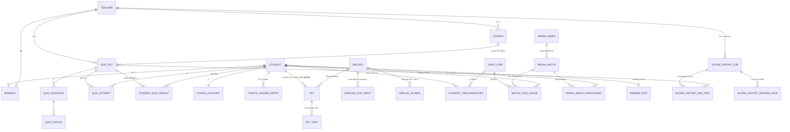

# Database Schema — war-point

- **อัปเดตล่าสุด:** 2026-08-23
- **ชนิดฐานข้อมูล:** Relational — สืบทอดจาก [[architecture#3-ตาราง-component|architecture.md CMP-16]] เหตุผลหลักคือต้องมี atomic transaction กันการหักแต้มซ้ำ/แต้มติดลบตอนซื้อไข่ ปลดล็อกขั้น และซื้อไอเทม ซึ่งเป็นจุดที่นักเรียนอาจกดพร้อมกันจากหลายอุปกรณ์ (ดู DF-01 ของ architecture.md)
- **ระดับความละเอียด:** Conceptual + Logical (ยังไม่ผูกกับเทคโนโลยี — ชนิดข้อมูลใช้ชื่อกลาง เช่น "ข้อความสั้น", "จำนวนเต็ม"; Physical จะระบุเมื่อผู้ใช้เลือก stack แล้ว)
- **นโยบายลบข้อมูล:** **soft delete เป็นค่าเริ่มต้นของทุกตาราง** — ทุกตารางมีคอลัมน์ `is_active` (บูลีน) และ `disabled_at` (วันที่-เวลา, null ได้) แทนการลบแถวจริง ยกเว้นระบุไว้เป็นอย่างอื่นชัดเจนในตารางนั้น (ไม่มีข้อยกเว้นในเอกสารนี้ — ทุก ENT ใช้ pattern เดียวกัน)
- **ที่มา:** [[architecture|architecture]], [[../../01-requirements/feature-list|feature-list]], [[../../03-testing/01-test-plan/acceptance-criteria|acceptance-criteria]]
- **ส่งต่อไป:** [[api-spec|api-spec]], [[detailed-design|detailed-design]]

---

## 0. หลักการออกแบบที่ยึดตลอดเอกสาร

1. **Soft delete ทุกตาราง** — `is_active` (บูลีน, ค่าเริ่มต้น `true`) + `disabled_at` (วันที่-เวลา, null ได้) ทุกตาราง แถวที่ `is_active = false` ยังคงอยู่ในฐานข้อมูลเสมอ ไม่มีการ `DELETE` จริงในระบบนี้
2. **FE-56 (ปิดใช้งานนักเรียนที่ย้ายออก):** ใช้ pattern เดียวกับข้อ 1 บน `STUDENT` โดยตรง ไม่ต้องมี field พิเศษเพิ่ม
3. **FE-72/FE-73 (บันทึกเส้นทางการเติบโตต้องไม่ถูกลบเมื่อรีเซ็ต):** ใช้ pattern เดียวกับข้อ 1 บน `PET` — เมื่อนักเรียนรีเซ็ต/เปลี่ยนสายพันธุ์ (API-38) แถว `PET` ตัวเก่าจะถูกตั้ง `is_active = false, disabled_at = now()` (ไม่ลบ) เท่านั้น **การรีเซ็ตไม่ insert แถว `PET` ใหม่ในจังหวะเดียวกัน** — นักเรียนต้องเรียกซื้อไข่แยกต่างหากอีกครั้ง (API-36) เพื่อสร้างแถว `PET` ใหม่ เลือกสายพันธุ์ใหม่ และจ่าย 1 แต้ม "อัลบั้มบันทึกเส้นทางการเติบโต" ที่ FE-72 ต้องแสดง คือ query `PET` ทั้งหมด (ทั้ง active และ inactive) ของนักเรียนคนนั้น เรียงตาม `created_at` — **ไม่ต้องมี entity แยกสำหรับบันทึกเส้นทางการเติบโต** เพราะ soft-delete history ของ `PET` ทำหน้าที่นี้ได้ครบถ้วนอยู่แล้ว และตอบโจทย์ AC-FE-73-2 ("จำนวนรายการในอัลบั้มไม่ลดลงไม่ว่าจะรีเซ็ตกี่ครั้ง") โดยตรง
4. **FE-74 (สัตว์เลี้ยงที่ใช้งานอยู่ได้เพียงตัวเดียว):** บังคับด้วย unique index แบบ partial บน `PET(student_id)` โดยกรองเฉพาะแถวที่ `is_active = true`
5. **ไม่เก็บชื่อ-นามสกุลจริงของนักเรียนที่ใดในฐานข้อมูล** ตาม FE-07 — ไม่มี field `full_name` หรือเทียบเท่าอยู่ใน schema นี้เลยแม้แต่ตารางเดียว (ไม่ใช่แค่ไม่แสดง)
6. **ห้ามมีคอลัมน์แต้ม/ขั้นการเติบโต/ค่าสเตตัส/HP ปรากฏในตารางที่ query สำหรับหน้าจอฝั่งครูใช้โดยตรง** (`ARENA_MATCH`, `ARENA_MATCH_PARTICIPANT` ฯลฯ) — การซ่อนต้องเกิดที่ชั้น service/serializer ตอนสร้าง response ให้ CMP-02 (ดู [[api-spec|api-spec]] และ architecture.md ข้อ 7) ไม่ใช่ query คนละชุดแบบ ad-hoc
7. **ชนิดข้อมูลกลางที่ใช้ในเอกสารนี้:** `ข้อความสั้น` (≈ short text/label), `ข้อความยาว` (≈ long text/content), `จำนวนเต็ม`, `ทศนิยม`, `วันที่-เวลา`, `บูลีน`, `รหัสอ้างอิง` (Foreign Key ไปยัง ENT อื่น) — ไม่ใช้ VARCHAR(n)/BIGINT/ชื่อ storage engine ใดๆ

---

## 1. ER Diagram

---

## 2. สรุป Entity

| ID | Entity / ตาราง | เก็บอะไร | Feature ต้นทาง | ปริมาณข้อมูลที่คาด |
|---|---|---|---|---|
| ENT-01 | STUDENT | บัญชีนักเรียน (รหัส+PIN, ชื่อเล่น, สถานะใช้งาน) | FE-01, 06, 07, 47, 48, 52, 53, 54, 55, 56 | ~30 แถวต่อห้อง |
| ENT-02 | TEACHER | บัญชีครูที่ผูกกับ Google OAuth | FE-02, 03, 49 | 1–3 แถว (อาจมีครูร่วมสอน) |
| ENT-03 | SESSION | session token ของทั้งสองบทบาท (auth แบบ stateful) | FE-01, 03, 47, 48, 49 | ใช้งานพร้อมกันไม่เกินจำนวนผู้ใช้จริง (~30) |
| ENT-04 | LESSON | บทเรียนทุกช่องทาง (ลิงก์/ไฟล์/พิมพ์เอง/AI เสนอ) พร้อมสถานะอนุมัติ | FE-08, 09, 10, 11, 37, 39, 40 | หลักสิบแถวต่อเทอม |
| ENT-05 | QUIZ_SET | ชุดแบบทดสอบ/ใบงาน/งานแนบไฟล์ | FE-12, 13, 14, 15, 18, 19, 21, 38 | หลักสิบแถวต่อเทอม |
| ENT-06 | QUIZ_QUESTION | ข้อคำถามปรนัยของแต่ละชุด | FE-12, 15, 16 | ~5–10 แถวต่อชุดปรนัย |
| ENT-07 | QUIZ_CHOICE | ตัวเลือกคำตอบของแต่ละข้อ | FE-12, 15, 16 | ~4 แถวต่อข้อ |
| ENT-08 | QUIZ_ATTEMPT | การทำแบบทดสอบ/ส่งงานแต่ละรอบของนักเรียน | FE-16, 17, 18, 20, 41 | ~30 นักเรียน × หลายรอบ × หลักสิบชุด |
| ENT-09 | STUDENT_QUIZ_RESULT | คะแนนรอบที่ดีที่สุดต่อ (นักเรียน, ชุด) + แต้มที่จ่ายให้แล้ว | FE-21, 41 | ~30 นักเรียน × จำนวนชุด |
| ENT-10 | POINTS_ACCOUNT | ยอดแต้มสะสมรวม/แต้มที่ใช้ได้ปัจจุบันของนักเรียน (1:1) | FE-22, 23 | 1 แถวต่อนักเรียน |
| ENT-11 | POINTS_LEDGER_ENTRY | ประวัติการได้/หักแต้มทุกรายการ (audit log, immutable) | FE-21, 22, 23, 24, 26, 75, 78 | หลักร้อยแถวต่อเทอมต่อห้อง |
| ENT-12 | SPECIES | สายพันธุ์สัตว์เลี้ยง 3 สาย | FE-44, 75, 76, 77 | 3 แถว |
| ENT-13 | SPECIES_STAT_SPLIT | สัดส่วนแต้มสเตตัสต่อขั้นของแต่ละสายพันธุ์ | FE-77 | 3 สาย × จำนวนค่าสเตตัส (placeholder 3) = ~9 แถว |
| ENT-14 | SPECIAL_POWER | พลังพิเศษประจำสายพันธุ์ | FE-45 | หลักสิบแถว (ยังไม่ล็อกจำนวน) |
| ENT-15 | PET | สัตว์เลี้ยงของนักเรียน (แถว active = ตัวที่ใช้งานอยู่, แถว inactive = ประวัติ) | FE-24, 26, 44, 72, 73, 74, 75, 76 | ~30 นักเรียน × (1 active + N ประวัติจากการรีเซ็ต) |
| ENT-16 | PET_STAT | ค่าสเตตัสรายตัวของ PET แต่ละแถว | FE-77 | ~3 แถวต่อ PET (ตาม placeholder) |
| ENT-17 | SHOP_ITEM | รายการไอเทมช่วยในการต่อสู้ที่ขาย | FE-78, 80, 81 | หลักสิบแถว (ตัวอย่างล็อกแล้ว 2 รายการ) |
| ENT-18 | STUDENT_ITEM_INVENTORY | ไอเทมที่นักเรียนถือครองอยู่ | FE-78 | ~30 นักเรียน × จำนวนไอเทมที่ถือ |
| ENT-19 | ARENA_WEEK | รอบการแข่งขันรายสัปดาห์ + ค่าตั้งค่าจับคู่อัตโนมัติ | FE-27, 28, 29, 30 | ~14 แถวต่อเทอม (1 ต่อสัปดาห์) |
| ENT-20 | ARENA_MATCH | คู่แข่งขันแต่ละคู่ในแต่ละสัปดาห์ | FE-27, 28, 29, 30, 31, 42 | ~15 แถวต่อสัปดาห์ (30 คน/2) |
| ENT-21 | ARENA_MATCH_PARTICIPANT | ผลของแต่ละฝ่ายในแมตช์ (HP เริ่ม/จบ, แพ้-ชนะ) — ห้าม join เข้า query ฝั่งครู | FE-27, 32, 79 | 2 แถวต่อแมตช์ |
| ENT-22 | MATCH_ITEM_USAGE | การใช้ไอเทมช่วยในแต่ละแมตช์ (จำกัด 1 ครั้ง/ไอเทม/แมตช์) | FE-80, 81 | ≤2 แถวต่อแมตช์ต่อฝ่าย |
| ENT-23 | WINNER_STAT | สถิติจำนวนครั้งที่ชนะสะสมของนักเรียนแต่ละคน | FE-32, 46 | 1 แถวต่อนักเรียน |
| ENT-24 | SCORE_EXPORT_JOB | งานส่งออกคะแนน 1 ครั้ง (ตั้งแต่เลือกข้อมูลจนยืนยันส่ง) | FE-34, 63, 65, 66, 67, 69, 70, 71 | หลักสิบแถวต่อเทอม |
| ENT-25 | SCORE_EXPORT_JOB_ITEM | ชุดแบบทดสอบที่เลือกส่งออก + คอลัมน์ปลายทางที่จับคู่ | FE-63, 64, 68 | ~1–10 แถวต่องาน |
| ENT-26 | SCORE_EXPORT_SKIPPED_ROW | รายงานแถวที่ข้ามเพราะรหัสประจำตัวไม่ตรง | FE-70 | 0–หลักสิบแถวต่องาน |

---

## 3. รายละเอียดแต่ละ Entity

### ENT-01 — STUDENT
- **หน้าที่:** เก็บบัญชีนักเรียน ยืนยันตัวตนด้วยรหัสประจำตัว+PIN ไม่มีชื่อจริง
- **Feature ต้นทาง:** FE-01, FE-06, FE-07, FE-47, FE-48, FE-52, FE-53, FE-54, FE-55, FE-56

| Field | ชนิดข้อมูล | Key | Null ได้ | ค่าเริ่มต้น | คำอธิบาย / กฎ |
|---|---|---|---|---|---|
| id | รหัสอ้างอิง | PK | ไม่ | - | รหัสภายในระบบ |
| student_code | ข้อความสั้น | Unique | ไม่ | - | รหัสประจำตัวของโรงเรียน ครูเป็นผู้กรอก ระบบไม่สร้างขึ้นเอง (FE-51) |
| pin_hash | ข้อความสั้น | - | ไม่ | - | PIN ที่ผ่านการ hash แล้วเท่านั้น ห้ามเก็บ plaintext |
| must_change_pin | บูลีน | - | ไม่ | true | บังคับเปลี่ยน PIN ครั้งแรก (FE-47) ตั้ง false หลังเปลี่ยนสำเร็จ |
| nickname | ข้อความสั้น | - | ได้ | null | null = แสดงผลเป็น "ยังไม่ตั้งชื่อเล่น" (FE-53/55) |
| failed_pin_attempts | จำนวนเต็ม | - | ไม่ | 0 | นับจำนวนครั้งกรอก PIN ผิดติดต่อกัน (FE-48) รีเซ็ตเป็น 0 เมื่อล็อกอินสำเร็จ |
| locked_until | วันที่-เวลา | - | ได้ | null | null = ไม่ถูกล็อค; ค่าจริงเมื่อกรอกผิดครบเกณฑ์ (จำนวนครั้ง/ระยะเวลายังไม่ล็อก — ดู Gap) |
| last_active_at | วันที่-เวลา | - | ได้ | null | อัปเดตทุกครั้งที่ล็อกอินสำเร็จ เก็บค่าล่าสุดค่าเดียว ไม่เก็บประวัติ (FE-52) |
| is_active | บูลีน | - | ไม่ | true | false = ปิดใช้งาน (นักเรียนย้ายออก, FE-56) ข้อมูลไม่ถูกลบ |
| disabled_at | วันที่-เวลา | - | ได้ | null | เวลาที่ครูกดปิดใช้งาน |
| created_at | วันที่-เวลา | - | ไม่ | now() | เวลาเพิ่มเข้าระบบ |

- **ความสัมพันธ์:** 1 STUDENT มีได้ 1 SESSION ที่ยัง valid ในเวลาเดียว, 1 POINTS_ACCOUNT, หลาย QUIZ_ATTEMPT/PET(ประวัติ)/POINTS_LEDGER_ENTRY/STUDENT_ITEM_INVENTORY
- **Index ที่ควรมี:** unique บน `student_code` (ใช้ล็อกอินทุกครั้ง), บน `is_active` (รายการที่ครูใช้ประจำวันกรองเฉพาะ active), บน `last_active_at` (query "ไม่เข้าใช้งานนาน" ของ FE-59)
- **กฎความถูกต้องระดับข้อมูล:** `student_code` unique เฉพาะในกลุ่ม active หรือ unique ทั้งตารางแล้วแต่การตัดสินใจตอน implement (ต้องกันรหัสซ้ำตาม AC-FE-05-3); ไม่มี field ชื่อจริงในตารางนี้เลยตาม FE-07

### ENT-02 — TEACHER
- **หน้าที่:** เก็บบัญชีครูที่ผูกกับ Google OAuth ไม่เก็บรหัสผ่านเอง
- **Feature ต้นทาง:** FE-02, FE-03, FE-49

| Field | ชนิดข้อมูล | Key | Null ได้ | ค่าเริ่มต้น | คำอธิบาย / กฎ |
|---|---|---|---|---|---|
| id | รหัสอ้างอิง | PK | ไม่ | - | - |
| google_subject_id | ข้อความสั้น | Unique | ไม่ | - | ค่า `sub` จาก Google OAuth ใช้ยืนยันตัวตนแทนรหัสผ่าน รองรับทั้งบัญชีโรงเรียนและส่วนตัว (FE-49) |
| email | ข้อความสั้น | - | ได้ | null | อีเมลจาก Google เพื่อการติดต่อ ไม่ใช้ตรวจโดเมน (AC-FE-49-2) |
| display_label | ข้อความสั้น | - | ได้ | null | ชื่อแสดงผลของครู (ครูเป็นผู้ใหญ่ ไม่ติดกฎ "ไม่เก็บชื่อจริง" ที่ใช้กับนักเรียนเท่านั้น) |
| last_login_at | วันที่-เวลา | - | ได้ | null | - |
| is_active | บูลีน | - | ไม่ | true | - |
| disabled_at | วันที่-เวลา | - | ได้ | null | - |
| created_at | วันที่-เวลา | - | ไม่ | now() | - |

- **ความสัมพันธ์:** 1 TEACHER สร้างได้หลาย LESSON, QUIZ_SET, SCORE_EXPORT_JOB และเป็นผู้ทำ reset-pin/unlock ให้ STUDENT (บันทึกที่ log ระดับ audit นอกขอบเขต schema นี้)
- **Index ที่ควรมี:** unique บน `google_subject_id`
- **กฎความถูกต้องระดับข้อมูล:** ไม่มี field รหัสผ่าน

### ENT-03 — SESSION
- **หน้าที่:** เก็บ session token ของทั้งนักเรียนและครู (auth แบบ stateful ตาม architecture.md ข้อ 7)
- **Feature ต้นทาง:** FE-01, FE-03, FE-47, FE-48, FE-49

| Field | ชนิดข้อมูล | Key | Null ได้ | ค่าเริ่มต้น | คำอธิบาย / กฎ |
|---|---|---|---|---|---|
| id | รหัสอ้างอิง | PK | ไม่ | - | - |
| token_hash | ข้อความสั้น | Unique | ไม่ | - | ค่า hash ของ session token ที่ส่งเป็น cookie ห้ามเก็บ token ดิบ |
| role | ข้อความสั้น (enum) | - | ไม่ | - | ค่า: `student`, `teacher` |
| student_id | รหัสอ้างอิง | FK → STUDENT | ได้ | null | ใช้เมื่อ role = student |
| teacher_id | รหัสอ้างอิง | FK → TEACHER | ได้ | null | ใช้เมื่อ role = teacher |
| expires_at | วันที่-เวลา | - | ไม่ | - | หมดอายุตามนโยบายความปลอดภัย (ยังไม่ล็อกระยะเวลา) |
| created_at | วันที่-เวลา | - | ไม่ | now() | - |
| is_active | บูลีน | - | ไม่ | true | false = ถูก revoke (เช่น กด logout, ครูรีเซ็ต PIN บังคับ logout เซสชันเดิม) |
| disabled_at | วันที่-เวลา | - | ได้ | null | - |

- **ความสัมพันธ์:** exactly 1 ใน `student_id`/`teacher_id` ต้องมีค่า อีกฝั่ง null (exclusive)
- **Index ที่ควรมี:** unique บน `token_hash` (ตรวจทุก request), บน `(role, student_id)`/`(role, teacher_id)` (revoke ทุก session ของ user เดียว), บน `expires_at` (ลบ/เก็บกวาด session หมดอายุ — เป็น scheduled job ไม่ใช่ user-facing delete)
- **กฎความถูกต้องระดับข้อมูล:** CHECK ว่า `student_id` กับ `teacher_id` ไม่ตั้งค่าพร้อมกันทั้งคู่

### ENT-04 — LESSON
- **หน้าที่:** เก็บบทเรียนทุกช่องทาง และคุมสถานะอนุมัติของคลิปที่ AI เสนอ (คิวรออนุมัติต้องไม่ถึงนักเรียนจนกว่าครูอนุมัติ)
- **Feature ต้นทาง:** FE-08, FE-09, FE-10, FE-11, FE-37, FE-39, FE-40

| Field | ชนิดข้อมูล | Key | Null ได้ | ค่าเริ่มต้น | คำอธิบาย / กฎ |
|---|---|---|---|---|---|
| id | รหัสอ้างอิง | PK | ไม่ | - | - |
| teacher_id | รหัสอ้างอิง | FK → TEACHER | ไม่ | - | ผู้สร้าง/ผู้รับผิดชอบอนุมัติ |
| title | ข้อความสั้น | - | ไม่ | - | - |
| source_type | ข้อความสั้น (enum) | - | ไม่ | - | ค่า: `link`(FE-08), `file`(FE-09), `text`(FE-37), `ai_clip`(FE-11) |
| external_url | ข้อความยาว | - | ได้ | null | ใช้เมื่อ source_type = link หรือ ai_clip |
| file_storage_ref | ข้อความสั้น | - | ได้ | null | รหัสอ้างอิงไฟล์ใน Object Storage (CMP-17) ใช้เมื่อ source_type = file |
| text_content | ข้อความยาว | - | ได้ | null | ใช้เมื่อ source_type = text |
| ai_search_topic | ข้อความสั้น | - | ได้ | null | หัวข้อที่ครูระบุให้ AI ค้น (FE-11) เก็บเฉพาะ source_type = ai_clip |
| tts_supported | บูลีน | - | ได้ | null | null = ยังไม่ตรวจ; ระบุว่าดึงข้อความอ่านออกเสียงได้หรือไม่ (FE-40) |
| approval_status | ข้อความสั้น (enum) | - | ไม่ | `published` | ค่า: `published`, `pending_approval`, `rejected` — ค่าเริ่มต้นของ link/file/text คือ `published` ทันที; ai_clip เริ่มที่ `pending_approval` เสมอ (FE-39) |
| published_at | วันที่-เวลา | - | ได้ | null | เวลาที่เปลี่ยนเป็น published |
| is_active | บูลีน | - | ไม่ | true | ai_clip ที่ครูกด "ไม่อนุมัติ" ตั้ง false ทันที (เทียบเท่าลบถาวรจากมุมนักเรียนตาม AC-FE-39-3 แต่ยังคง record ไว้เพื่อ audit) |
| disabled_at | วันที่-เวลา | - | ได้ | null | - |
| created_at | วันที่-เวลา | - | ไม่ | now() | - |

- **ความสัมพันธ์:** 1 LESSON ผูกกับ QUIZ_SET ได้ไม่บังคับ (FE-38 อนุญาตให้ QUIZ_SET ไม่ผูกบทเรียน)
- **Index ที่ควรมี:** `(approval_status, is_active)` (query บทเรียนที่นักเรียนเห็นได้ ต้อง `approval_status='published' AND is_active=true`), `teacher_id`
- **กฎความถูกต้องระดับข้อมูล:** query ฝั่งนักเรียน (API ของ CMP-01) ต้อง filter `approval_status='published'` เสมอที่ชั้น service ไม่ใช่กรองที่ client (ตาม AC-FE-39-2)

### ENT-05 — QUIZ_SET
- **หน้าที่:** เก็บชุดแบบทดสอบ/ใบงาน/งานแนบไฟล์ พร้อมกติกาการทำซ้ำ/เดดไลน์/คะแนนเต็ม
- **Feature ต้นทาง:** FE-12, FE-13, FE-14, FE-15, FE-18, FE-19, FE-21, FE-38

| Field | ชนิดข้อมูล | Key | Null ได้ | ค่าเริ่มต้น | คำอธิบาย / กฎ |
|---|---|---|---|---|---|
| id | รหัสอ้างอิง | PK | ไม่ | - | - |
| teacher_id | รหัสอ้างอิง | FK → TEACHER | ไม่ | - | - |
| lesson_id | รหัสอ้างอิง | FK → LESSON | ได้ | null | null = ไม่ผูกกับบทเรียนใด (FE-38) |
| title | ข้อความสั้น | - | ไม่ | - | - |
| format | ข้อความสั้น (enum) | - | ไม่ | - | ค่า: `mcq`(ปรนัย), `worksheet`(ใบงาน), `attachment`(แนบชิ้นงาน) |
| creation_source | ข้อความสั้น (enum) | - | ไม่ | `teacher` | ค่า: `teacher`, `ai` — `ai` ต้องคู่กับ format=`mcq` เท่านั้น (FE-15 ต้องปรนัยล้วน) |
| grading_method | ข้อความสั้น (enum) | - | ไม่ | - | ค่า: `auto`(format=mcq), `manual`(format=worksheet/attachment) — derive จาก format ตอนสร้าง |
| full_score | จำนวนเต็ม | - | ไม่ | - | คะแนนเต็มที่ครูตั้ง (FE-21) ต้อง > 0 (AC-FE-13-2) |
| max_attempts | จำนวนเต็ม | - | ไม่ | 1 | จำนวนรอบที่ทำซ้ำได้ ต้อง ≥ 1 (AC-FE-18-2) |
| open_at | วันที่-เวลา | - | ไม่ | - | วันเปิด (FE-19) |
| close_at | วันที่-เวลา | - | ไม่ | - | วันปิด (FE-19) |
| is_active | บูลีน | - | ไม่ | true | - |
| disabled_at | วันที่-เวลา | - | ได้ | null | - |
| created_at | วันที่-เวลา | - | ไม่ | now() | - |

- **ความสัมพันธ์:** 1 QUIZ_SET มีหลาย QUIZ_QUESTION (เมื่อ format=mcq), หลาย QUIZ_ATTEMPT, หลาย STUDENT_QUIZ_RESULT (1 ต่อนักเรียนที่เคยทำ)
- **Index ที่ควรมี:** `(open_at, close_at)` (รายการชุดที่เปิดอยู่), `lesson_id`, `teacher_id`
- **กฎความถูกต้องระดับข้อมูล:** CHECK `full_score > 0`, CHECK `max_attempts >= 1`, CHECK `close_at > open_at`

### ENT-06 — QUIZ_QUESTION
- **หน้าที่:** เก็บข้อคำถามปรนัยของชุด (format=mcq เท่านั้น)
- **Feature ต้นทาง:** FE-12, FE-15, FE-16

| Field | ชนิดข้อมูล | Key | Null ได้ | ค่าเริ่มต้น | คำอธิบาย / กฎ |
|---|---|---|---|---|---|
| id | รหัสอ้างอิง | PK | ไม่ | - | - |
| quiz_set_id | รหัสอ้างอิง | FK → QUIZ_SET | ไม่ | - | - |
| question_text | ข้อความยาว | - | ไม่ | - | - |
| order_index | จำนวนเต็ม | - | ไม่ | - | ลำดับการแสดงข้อ |
| is_active | บูลีน | - | ไม่ | true | - |
| disabled_at | วันที่-เวลา | - | ได้ | null | - |
| created_at | วันที่-เวลา | - | ไม่ | now() | - |

- **ความสัมพันธ์:** 1 QUIZ_QUESTION มีหลาย QUIZ_CHOICE
- **Index ที่ควรมี:** `quiz_set_id`
- **กฎความถูกต้องระดับข้อมูล:** ต้องมี QUIZ_CHOICE ที่ `is_correct = true` อย่างน้อย 1 รายการต่อข้อ (บังคับระดับ application/transaction)

### ENT-07 — QUIZ_CHOICE
- **หน้าที่:** ตัวเลือกคำตอบของแต่ละข้อ
- **Feature ต้นทาง:** FE-12, FE-15, FE-16

| Field | ชนิดข้อมูล | Key | Null ได้ | ค่าเริ่มต้น | คำอธิบาย / กฎ |
|---|---|---|---|---|---|
| id | รหัสอ้างอิง | PK | ไม่ | - | - |
| question_id | รหัสอ้างอิง | FK → QUIZ_QUESTION | ไม่ | - | - |
| choice_text | ข้อความสั้น | - | ไม่ | - | - |
| is_correct | บูลีน | - | ไม่ | false | - |
| order_index | จำนวนเต็ม | - | ไม่ | - | - |

- **ความสัมพันธ์:** many-to-1 กับ QUIZ_QUESTION
- **Index ที่ควรมี:** `question_id`
- **กฎความถูกต้องระดับข้อมูล:** ไม่ soft-delete แยก (ผูกวงจรกับ QUIZ_QUESTION โดยตรง — ปิดใช้งานทั้งข้อไปพร้อมกัน)

### ENT-08 — QUIZ_ATTEMPT
- **หน้าที่:** บันทึกการทำ/ส่งงานแต่ละรอบของนักเรียนต่อชุด รวมคะแนนที่ได้และสถานะการตรวจ
- **Feature ต้นทาง:** FE-16, FE-17, FE-18, FE-20, FE-41

| Field | ชนิดข้อมูล | Key | Null ได้ | ค่าเริ่มต้น | คำอธิบาย / กฎ |
|---|---|---|---|---|---|
| id | รหัสอ้างอิง | PK | ไม่ | - | - |
| quiz_set_id | รหัสอ้างอิง | FK → QUIZ_SET | ไม่ | - | - |
| student_id | รหัสอ้างอิง | FK → STUDENT | ไม่ | - | - |
| attempt_number | จำนวนเต็ม | - | ไม่ | - | ลำดับรอบของนักเรียนคนนี้ต่อชุดนี้ ≤ `QUIZ_SET.max_attempts` |
| client_request_id | ข้อความสั้น | Unique ร่วมกับ (quiz_set_id, student_id) | ได้ | null | กัน retry ซ้ำจากเครือข่ายหลุด (idempotency ตาม DF-01 ของ architecture.md) |
| status | ข้อความสั้น (enum) | - | ไม่ | `submitted` | ค่า: `submitted`, `pending_review`(worksheet/attachment รอครูตรวจ), `graded` |
| score_awarded | ทศนิยม | - | ได้ | null | คะแนนของรอบนี้ (auto สำหรับ mcq ตรวจทันที, manual รอครูกรอก) |
| work_attachment_ref | ข้อความสั้น | - | ได้ | null | รหัสอ้างอิงไฟล์งานที่นักเรียนแนบ (format=attachment) ผ่าน Object Storage |
| graded_by_teacher_id | รหัสอ้างอิง | FK → TEACHER | ได้ | null | ใช้เมื่อ grading_method=manual |
| graded_at | วันที่-เวลา | - | ได้ | null | - |
| submitted_at | วันที่-เวลา | - | ไม่ | now() | - |
| is_active | บูลีน | - | ไม่ | true | - |
| disabled_at | วันที่-เวลา | - | ได้ | null | - |

- **ความสัมพันธ์:** many-to-1 กับ QUIZ_SET และ STUDENT
- **Index ที่ควรมี:** unique `(quiz_set_id, student_id, client_request_id)` (idempotency), `(quiz_set_id, student_id, attempt_number)` (นับจำนวนรอบ), `status` (รายการรอครูตรวจของ FE-17)
- **กฎความถูกต้องระดับข้อมูล:** CHECK `score_awarded BETWEEN 0 AND (QUIZ_SET.full_score)` (AC-FE-17-2), CHECK `attempt_number <= QUIZ_SET.max_attempts` ที่ระดับ transaction ตอน insert

### ENT-09 — STUDENT_QUIZ_RESULT
- **หน้าที่:** cache คะแนนรอบที่ดีที่สุดต่อ (นักเรียน, ชุด) และแต้มที่เคยจ่ายให้แล้วจากชุดนี้ เพื่อคำนวณ delta แต้มถูกต้องเมื่อทำซ้ำได้คะแนนดีขึ้น
- **Feature ต้นทาง:** FE-21, FE-41 (ธุรกิจกฎ: "ยึดคะแนนรอบที่ดีที่สุด" ต้องแปลว่าแต้มที่ได้ต้องคำนวณจาก best score ไม่ใช่ผลรวมทุกรอบ — ดู AC-FE-41-1/2)

| Field | ชนิดข้อมูล | Key | Null ได้ | ค่าเริ่มต้น | คำอธิบาย / กฎ |
|---|---|---|---|---|---|
| id | รหัสอ้างอิง | PK | ไม่ | - | - |
| student_id | รหัสอ้างอิง | FK → STUDENT | ไม่ | - | - |
| quiz_set_id | รหัสอ้างอิง | FK → QUIZ_SET | ไม่ | - | - |
| best_attempt_id | รหัสอ้างอิง | FK → QUIZ_ATTEMPT | ไม่ | - | รอบที่มีคะแนนสูงสุด (เท่ากันให้ยึดรอบแรกที่ทำได้คะแนนนั้น) |
| best_score | ทศนิยม | - | ไม่ | 0 | คะแนนของ best_attempt_id |
| points_awarded_total | จำนวนเต็ม | - | ไม่ | 0 | ผลรวมแต้มที่เคยส่งให้ POINTS_LEDGER_ENTRY จากชุดนี้แล้ว ใช้คำนวณ delta รอบถัดไป |
| attempts_used | จำนวนเต็ม | - | ไม่ | 0 | จำนวนรอบที่ทำไปแล้ว |
| updated_at | วันที่-เวลา | - | ไม่ | now() | - |

- **ความสัมพันธ์:** unique ต่อ (student_id, quiz_set_id)
- **Index ที่ควรมี:** unique `(student_id, quiz_set_id)`
- **กฎความถูกต้องระดับข้อมูล:** เมื่อ attempt ใหม่มี `score_awarded` > `best_score` เดิม ให้อัปเดตแถวนี้และสร้าง `POINTS_LEDGER_ENTRY` เฉพาะส่วน delta เท่านั้น (AC-FE-41-1); ถ้าน้อยกว่าหรือเท่ากับเดิม **ห้ามแก้ `best_score`/`points_awarded_total`** (AC-FE-41-2) — ทั้งหมดต้องอยู่ใน database transaction เดียวกับการ insert QUIZ_ATTEMPT

### ENT-10 — POINTS_ACCOUNT
- **หน้าที่:** เก็บยอดแต้ม 2 ยอดของนักเรียนแต่ละคน เป็น single source of truth ตาม CMP-07
- **Feature ต้นทาง:** FE-22, FE-23

| Field | ชนิดข้อมูล | Key | Null ได้ | ค่าเริ่มต้น | คำอธิบาย / กฎ |
|---|---|---|---|---|---|
| id | รหัสอ้างอิง | PK | ไม่ | - | - |
| student_id | รหัสอ้างอิง | FK → STUDENT, Unique | ไม่ | - | 1:1 กับ STUDENT |
| total_earned_points | จำนวนเต็ม | - | ไม่ | 0 | ยอดสะสมรวม **ไม่ลดวันไหน** (FE-22) เพิ่มขึ้นอย่างเดียว |
| available_points | จำนวนเต็ม | - | ไม่ | 0 | ยอดใช้ได้ หักออกได้เมื่อซื้อไข่/ปลดล็อกขั้น/ซื้อไอเทม (FE-23) |
| updated_at | วันที่-เวลา | - | ไม่ | now() | - |

- **ความสัมพันธ์:** 1:1 กับ STUDENT, ทุกการเปลี่ยนแปลงต้องมี `POINTS_LEDGER_ENTRY` คู่กันเสมอ (audit trail)
- **Index ที่ควรมี:** unique `student_id`
- **กฎความถูกต้องระดับข้อมูล:** CHECK `available_points >= 0`, CHECK `total_earned_points >= 0`, CHECK `total_earned_points >= available_points` (จะเท่ากันพอดีตอนรีเซ็ต ตาม FE-26/AC ข้อ ข.3 ของ spec 02) — ทุก UPDATE ต้องอยู่ใน transaction เดียวกับ INSERT ของ `POINTS_LEDGER_ENTRY` ที่สอดคล้องกัน เพื่อกัน race condition ตาม DF-01

### ENT-11 — POINTS_LEDGER_ENTRY
- **หน้าที่:** ประวัติทุกรายการที่กระทบแต้ม (immutable, ไม่มีการแก้ไขย้อนหลัง) ใช้ตรวจสอบ/กันการหักซ้ำ
- **Feature ต้นทาง:** FE-21, FE-22, FE-23, FE-24, FE-26, FE-75, FE-78

| Field | ชนิดข้อมูล | Key | Null ได้ | ค่าเริ่มต้น | คำอธิบาย / กฎ |
|---|---|---|---|---|---|
| id | รหัสอ้างอิง | PK | ไม่ | - | - |
| student_id | รหัสอ้างอิง | FK → STUDENT | ไม่ | - | - |
| entry_type | ข้อความสั้น (enum) | - | ไม่ | - | ค่า: `quiz_score_conversion`(FE-21), `egg_purchase`(FE-75), `stage_unlock`(FE-24), `item_purchase`(FE-78), `pet_reset_refund`(FE-26) |
| points_delta_available | จำนวนเต็ม | - | ไม่ | - | ค่าบวก/ลบที่กระทบ `available_points` |
| points_delta_total | จำนวนเต็ม | - | ไม่ | 0 | ค่าที่กระทบ `total_earned_points` (มีค่า > 0 เฉพาะ `quiz_score_conversion`, เป็น 0 เสมอสำหรับรายการอื่นตามกฎ "สะสมรวมไม่ลด") |
| related_entity_type | ข้อความสั้น (enum) | - | ได้ | null | ค่า: `quiz_set`, `pet`, `shop_item` — ใช้คู่กับ related_entity_id |
| related_entity_id | รหัสอ้างอิง | - | ได้ | null | อ้างอิงแบบยืดหยุ่นไปยัง entity ที่เกี่ยวข้อง |
| created_at | วันที่-เวลา | - | ไม่ | now() | - |

- **ความสัมพันธ์:** many-to-1 กับ STUDENT, เป็น log อ้างอิงประกอบการคำนวณ `POINTS_ACCOUNT`
- **Index ที่ควรมี:** `(student_id, created_at)` (ประวัติ/statement), `(related_entity_type, related_entity_id)` (ตรวจสอบว่าเคยหักแต้มให้ธุรกรรมนี้ไปแล้วหรือยัง — กัน double-spend ตาม DF-01)
- **กฎความถูกต้องระดับข้อมูล:** ตารางนี้ **append-only** ไม่มี UPDATE/DELETE จริงแม้จะมี `is_active` ตาม pattern มาตรฐาน — ในทางปฏิบัติแถวในตารางนี้จะไม่ถูกปิดใช้งานเลยตลอดอายุระบบ เพราะเป็นหลักฐานทางบัญชี ไม่ใช่ข้อมูลที่ต้อง disable

### ENT-12 — SPECIES
- **หน้าที่:** สายพันธุ์สัตว์เลี้ยง 3 สายที่ล็อกแล้ว
- **Feature ต้นทาง:** FE-44, FE-75, FE-76, FE-77

| Field | ชนิดข้อมูล | Key | Null ได้ | ค่าเริ่มต้น | คำอธิบาย / กฎ |
|---|---|---|---|---|---|
| id | รหัสอ้างอิง | PK | ไม่ | - | - |
| code | ข้อความสั้น (enum) | Unique | ไม่ | - | ค่า: `winged_egg`(ไข่มีปีก), `legged_egg`(ไข่มีขา), `tailed_egg`(ไข่มีหาง) — ชื่อทางการยังไม่ล็อก (ดู Gap) ใช้ลักษณะไข่แทนไปก่อน |
| display_label | ข้อความสั้น | - | ไม่ | - | ข้อความที่แสดงผลจริง เช่น "ไข่มีปีก" |
| is_active | บูลีน | - | ไม่ | true | - |
| disabled_at | วันที่-เวลา | - | ได้ | null | - |

- **ความสัมพันธ์:** 1 SPECIES มีหลาย SPECIES_STAT_SPLIT, หลาย SPECIAL_POWER, หลาย PET
- **Index ที่ควรมี:** unique `code`
- **กฎความถูกต้องระดับข้อมูล:** seed data คงที่ 3 แถวตามที่ spec ล็อก — การเพิ่มสายพันธุ์ใหม่ต้องมาจาก requirement ใหม่เท่านั้น (ห้ามแต่งเอง)

### ENT-13 — SPECIES_STAT_SPLIT
- **หน้าที่:** สัดส่วนแต้มสเตตัสที่แต่ละสายพันธุ์ได้รับต่อการปลดล็อก 1 ขั้น (ผลรวมต้องเท่ากับ 50 ต่อสายพันธุ์เสมอ)
- **Feature ต้นทาง:** FE-77

| Field | ชนิดข้อมูล | Key | Null ได้ | ค่าเริ่มต้น | คำอธิบาย / กฎ |
|---|---|---|---|---|---|
| id | รหัสอ้างอิง | PK | ไม่ | - | - |
| species_id | รหัสอ้างอิง | FK → SPECIES | ไม่ | - | - |
| stat_key | ข้อความสั้น (enum) | - | ไม่ | - | ค่า placeholder ปัจจุบัน: `speed`(ความเร็ว), `power`(พละกำลัง), `accuracy`(ความแม่นยำ) — **จำนวนค่าสเตตัสยังไม่ล็อก (Gap)** |
| points_per_stage | จำนวนเต็ม | - | ไม่ | - | จำนวนแต้มสเตตัสที่ได้ในค่านี้ทุกครั้งที่ปลดล็อก 1 ขั้น |

- **ความสัมพันธ์:** many-to-1 กับ SPECIES
- **Index ที่ควรมี:** unique `(species_id, stat_key)`
- **กฎความถูกต้องระดับข้อมูล:** CHECK เชิง business (ระดับ application, ไม่ใช่ DB constraint ตรงๆ): ผลรวม `points_per_stage` ของทุกแถวที่ `species_id` เดียวกันต้อง = 50 พอดี (AC-FE-77-2) — **ตัวเลขสัดส่วนจริงของแต่ละสายยังไม่ล็อก ดู Gap**

### ENT-14 — SPECIAL_POWER
- **หน้าที่:** พลังพิเศษประจำสายพันธุ์ (ตัวอย่างที่ล็อกแล้ว: ไฟไหม้/ติดพิษ/มึนงง)
- **Feature ต้นทาง:** FE-45

| Field | ชนิดข้อมูล | Key | Null ได้ | ค่าเริ่มต้น | คำอธิบาย / กฎ |
|---|---|---|---|---|---|
| id | รหัสอ้างอิง | PK | ไม่ | - | - |
| species_id | รหัสอ้างอิง | FK → SPECIES | ได้ | null | null ชั่วคราวจนกว่าจะล็อกว่าสายพันธุ์ไหนได้พลังอะไร (Gap) |
| name | ข้อความสั้น | - | ไม่ | - | เช่น "ไฟไหม้", "ติดพิษ", "มึนงง" |
| description | ข้อความยาว | - | ได้ | null | - |
| is_active | บูลีน | - | ไม่ | true | - |
| disabled_at | วันที่-เวลา | - | ได้ | null | - |

- **ความสัมพันธ์:** many-to-1 กับ SPECIES (ไม่บังคับจนกว่าจะล็อก mapping)
- **Index ที่ควรมี:** `species_id`
- **กฎความถูกต้องระดับข้อมูล:** ห้ามแต่งชื่อพลังพิเศษเพิ่มเองโดยไม่มีต้นทางจากผู้ใช้ (ตาม spec 02 ข้อ ช.) — seed data เริ่มต้นมีเพียง 3 รายการที่ล็อกแล้ว โดยยังไม่ผูก `species_id`

### ENT-15 — PET
- **หน้าที่:** สัตว์เลี้ยงของนักเรียน แถว active หนึ่งแถวคือตัวที่ใช้งาน/ต่อสู้ได้จริง แถว inactive คือประวัติที่เกิดจากการรีเซ็ต (ทำหน้าที่เป็น "อัลบั้มบันทึกเส้นทางการเติบโต" ของ FE-72/73 ในตัว)
- **Feature ต้นทาง:** FE-24, FE-26, FE-44, FE-72, FE-73, FE-74, FE-75, FE-76

| Field | ชนิดข้อมูล | Key | Null ได้ | ค่าเริ่มต้น | คำอธิบาย / กฎ |
|---|---|---|---|---|---|
| id | รหัสอ้างอิง | PK | ไม่ | - | - |
| student_id | รหัสอ้างอิง | FK → STUDENT | ไม่ | - | - |
| species_id | รหัสอ้างอิง | FK → SPECIES | ไม่ | - | เลือกตอนซื้อไข่ (FE-44) เปลี่ยนไม่ได้หลังจากนั้นตราบใดที่แถวนี้ยัง active — การเปลี่ยนสายพันธุ์ทำโดยรีเซ็ตปิดใช้งานแถวนี้ก่อน (API-38) แล้วนักเรียนต้องเรียกซื้อไข่ใหม่แยกต่างหากอีกครั้ง (API-36) เพื่อสร้างแถว `PET` ใหม่และเลือกสายพันธุ์ใหม่ — **ไม่ได้ insert แถวใหม่ในจังหวะเดียวกับการรีเซ็ต** |
| stage | ข้อความสั้น (enum) | - | ไม่ | `egg` | ค่า: `egg`, `stage1`, `stage2`, `stage3`, `stage4` (FE-75/24) |
| stat_total | จำนวนเต็ม | - | ไม่ | 50 | แต้มสเตตัสรวม เพิ่มทีละ 50 ทุกขั้น (สูงสุด 250 ที่ stage4, AC-FE-77-5) |
| is_active | บูลีน | - | ไม่ | true | false = ถูกปิดใช้งานจากการรีเซ็ต (FE-26, API-38) — คือรายการในอัลบั้มประวัติ ณ จังหวะรีเซ็ตยังไม่มีแถว `PET` ใหม่เกิดขึ้นทันที นักเรียนต้องเรียกซื้อไข่ใหม่แยกต่างหาก (API-36) จึงจะมีแถว active ตัวถัดไป |
| disabled_at | วันที่-เวลา | - | ได้ | null | เวลาที่ถูกรีเซ็ตทิ้ง |
| created_at | วันที่-เวลา | - | ไม่ | now() | เวลาที่ซื้อไข่ตัวนี้ |
| updated_at | วันที่-เวลา | - | ไม่ | now() | เวลาปลดล็อกขั้นล่าสุด |

- **ความสัมพันธ์:** many-to-1 กับ STUDENT และ SPECIES, 1 PET มีหลาย PET_STAT
- **Index ที่ควรมี:** **unique partial index** บน `student_id` โดยกรองเฉพาะ `is_active = true` (บังคับ FE-74 — มีสัตว์เลี้ยงที่ใช้งานอยู่ได้เพียงตัวเดียว), `(student_id, created_at)` (query อัลบั้มบันทึกเส้นทางการเติบโตเรียงตามเวลา — FE-72)
- **กฎความถูกต้องระดับข้อมูล:** CHECK `stat_total IN (50,100,150,200,250)`; การรีเซ็ต (FE-26, API-38) เป็น transaction เดียวที่ทำแค่: (1) UPDATE แถว `PET` ปัจจุบัน `is_active=false, disabled_at=now()`, (2) INSERT `POINTS_LEDGER_ENTRY` ชนิด `pet_reset_refund` ให้ `available_points` กลับมาเท่ากับ `total_earned_points` พอดี — คืนแต้มเต็มจำนวน **รวมแต้มที่เคยใช้ซื้อไอเทมด้วย** (ปิด Open Question ข้อ 6 ของ spec 06 แล้วเมื่อ 2026-08-23 ตาม spec 02 ข้อ ซ.6), และ (3) เคลียร์ `STUDENT_ITEM_INVENTORY` ของนักเรียนคนนั้นทั้งหมด — ตั้ง `quantity=0` ทุกแถว (ไม่ลบแถวจริง ดู ENT-18 และหัวข้อ 5) เพื่อปิดช่องโหว่ไม่ให้ได้ทั้งไอเทมและแต้มคืนพร้อมกัน — **transaction นี้ไม่ insert แถว `PET` ใหม่** นักเรียนต้องเรียก API-36 (ซื้อไข่) แยกต่างหากอีกครั้งเพื่อสร้าง `PET` ใหม่ เลือกสายพันธุ์ใหม่ และจ่าย 1 แต้ม

### ENT-16 — PET_STAT
- **หน้าที่:** ค่าสเตตัสรายตัวของ PET แต่ละแถว (เช่น ความเร็ว/พละกำลัง/ความแม่นยำ) สะสมตามสัดส่วนสายพันธุ์ทุกครั้งที่ปลดล็อกขั้น
- **Feature ต้นทาง:** FE-77

| Field | ชนิดข้อมูล | Key | Null ได้ | ค่าเริ่มต้น | คำอธิบาย / กฎ |
|---|---|---|---|---|---|
| id | รหัสอ้างอิง | PK | ไม่ | - | - |
| pet_id | รหัสอ้างอิง | FK → PET | ไม่ | - | - |
| stat_key | ข้อความสั้น (enum) | - | ไม่ | - | ค่าเดียวกับ `SPECIES_STAT_SPLIT.stat_key` |
| value | จำนวนเต็ม | - | ไม่ | 0 | ค่าปัจจุบันของสเตตัสนี้ |

- **ความสัมพันธ์:** many-to-1 กับ PET
- **Index ที่ควรมี:** unique `(pet_id, stat_key)`
- **กฎความถูกต้องระดับข้อมูล:** ผลรวม `value` ของทุกแถวที่ `pet_id` เดียวกันต้องเท่ากับ `PET.stat_total` เสมอ (ตรวจระดับ application ทุกครั้งที่ปลดล็อกขั้น)

### ENT-17 — SHOP_ITEM
- **หน้าที่:** รายการไอเทมช่วยในการต่อสู้ที่ขายในร้าน (แทนของแต่งตัวเดิมทั้งหมด)
- **Feature ต้นทาง:** FE-78, FE-80, FE-81

| Field | ชนิดข้อมูล | Key | Null ได้ | ค่าเริ่มต้น | คำอธิบาย / กฎ |
|---|---|---|---|---|---|
| id | รหัสอ้างอิง | PK | ไม่ | - | - |
| code | ข้อความสั้น (enum) | Unique | ไม่ | - | ค่าที่ล็อกแล้ว: `cleanse_status`(ล้างสถานะ, FE-80), `prevent_death`(ป้องกันการโจมตีถึงตาย, FE-81) |
| name | ข้อความสั้น | - | ไม่ | - | - |
| description | ข้อความยาว | - | ได้ | null | - |
| price_points | จำนวนเต็ม | - | ไม่ | - | **ราคายังไม่ล็อก (Gap) — ห้ามใช้ตัวเลขจาก prototype เป็นค่าจริง** |
| is_active | บูลีน | - | ไม่ | true | - |
| disabled_at | วันที่-เวลา | - | ได้ | null | - |

- **ความสัมพันธ์:** 1 SHOP_ITEM ถูกซื้อเป็นหลาย STUDENT_ITEM_INVENTORY และถูกใช้เป็นหลาย MATCH_ITEM_USAGE
- **Index ที่ควรมี:** unique `code`
- **กฎความถูกต้องระดับข้อมูล:** ห้ามเพิ่มรายการไอเทมใหม่โดยไม่มีต้นทางจากผู้ใช้ (spec 06 ข้อ ก.) — seed data เริ่มต้นมีเพียง 2 รายการที่ล็อกแล้ว, ไอเทมไม่มีคอลัมน์ใดที่กระทบ `PET_STAT`/`PET.stat_total` เพื่อยืนยันกฎ "ไม่เพิ่มค่าสเตตัส"

### ENT-18 — STUDENT_ITEM_INVENTORY
- **หน้าที่:** ไอเทมที่นักเรียนถือครองอยู่ (จำนวนคงเหลือ)
- **Feature ต้นทาง:** FE-78

| Field | ชนิดข้อมูล | Key | Null ได้ | ค่าเริ่มต้น | คำอธิบาย / กฎ |
|---|---|---|---|---|---|
| id | รหัสอ้างอิง | PK | ไม่ | - | - |
| student_id | รหัสอ้างอิง | FK → STUDENT | ไม่ | - | - |
| shop_item_id | รหัสอ้างอิง | FK → SHOP_ITEM | ไม่ | - | - |
| quantity | จำนวนเต็ม | - | ไม่ | 0 | จำนวนที่ถือครอง — **กฎว่าการใช้ในแมตช์หักจำนวนนี้หรือไม่ยังไม่ล็อก (Gap: กฎการถือครองไอเทม)** |
| updated_at | วันที่-เวลา | - | ไม่ | now() | - |

- **ความสัมพันธ์:** many-to-1 กับ STUDENT และ SHOP_ITEM
- **Index ที่ควรมี:** unique `(student_id, shop_item_id)`
- **กฎความถูกต้องระดับข้อมูล:** CHECK `quantity >= 0`; การซื้อต้องอยู่ใน transaction เดียวกับการหัก `POINTS_ACCOUNT.available_points` และ insert `POINTS_LEDGER_ENTRY(entry_type='item_purchase')`; **การรีเซ็ต `PET` (FE-26, API-38) ต้องเคลียร์ทุกแถวของนักเรียนคนนั้นในทรานแซกชันเดียวกัน** โดยตั้ง `quantity=0` (ไม่ลบแถวจริง — ใช้ pattern soft delete เดียวกับทั้งเอกสาร) เพื่อปิดช่องโหว่ "รีเซ็ตแล้วได้ทั้งไอเทมและแต้มคืนพร้อมกัน" (ปิด Open Question ข้อ 6 ของ spec 06 แล้วเมื่อ 2026-08-23)

### ENT-19 — ARENA_WEEK
- **หน้าที่:** รอบการแข่งขันของแต่ละสัปดาห์ + การตั้งค่าจับคู่อัตโนมัติที่คงอยู่ข้ามสัปดาห์
- **Feature ต้นทาง:** FE-27, FE-28, FE-29, FE-30

| Field | ชนิดข้อมูล | Key | Null ได้ | ค่าเริ่มต้น | คำอธิบาย / กฎ |
|---|---|---|---|---|---|
| id | รหัสอ้างอิง | PK | ไม่ | - | - |
| start_date | วันที่-เวลา | - | ไม่ | - | จุดเริ่มของสัปดาห์นั้น |
| end_date | วันที่-เวลา | - | ไม่ | - | - |
| status | ข้อความสั้น (enum) | - | ไม่ | `open` | ค่า: `open`(รอจับคู่/รอผล), `computed`(คำนวณผลแล้วรอประกาศ), `announced`(ประกาศแล้ว) |
| auto_pairing_enabled | บูลีน | - | ไม่ | false | ค่าที่ครูตั้งไว้ครั้งเดียวแล้วมีผลต่อเนื่องทุกสัปดาห์ (FE-30) — เก็บไว้ที่แถวล่าสุดหรือ config ระดับห้อง (ระบบเดียว 1 ห้อง) |
| is_active | บูลีน | - | ไม่ | true | - |
| disabled_at | วันที่-เวลา | - | ได้ | null | - |
| created_at | วันที่-เวลา | - | ไม่ | now() | - |

- **ความสัมพันธ์:** 1 ARENA_WEEK มีหลาย ARENA_MATCH
- **Index ที่ควรมี:** `start_date`, `status`
- **กฎความถูกต้องระดับข้อมูล:** มีได้เพียง 1 แถวที่ `status IN ('open','computed')` ในเวลาเดียว (สัปดาห์ปัจจุบัน)

### ENT-20 — ARENA_MATCH
- **หน้าที่:** คู่แข่งขันแต่ละคู่ในแต่ละสัปดาห์ — **ต้องไม่ join field ค่าสเตตัส/ขั้น/แต้มเข้ามาใน query ที่ใช้ตอบ CMP-02 (ฝั่งครู)**
- **Feature ต้นทาง:** FE-27, FE-28, FE-29, FE-30, FE-31, FE-42

| Field | ชนิดข้อมูล | Key | Null ได้ | ค่าเริ่มต้น | คำอธิบาย / กฎ |
|---|---|---|---|---|---|
| id | รหัสอ้างอิง | PK | ไม่ | - | - |
| arena_week_id | รหัสอ้างอิง | FK → ARENA_WEEK | ไม่ | - | - |
| pairing_method | ข้อความสั้น (enum) | - | ไม่ | - | ค่า: `student_choice`(FE-42), `teacher_random`(FE-28), `teacher_manual`(FE-29), `system_auto`(FE-30) |
| status | ข้อความสั้น (enum) | - | ไม่ | `pending` | ค่า: `pending`, `computed`, `announced` |
| winner_student_id | รหัสอ้างอิง | FK → STUDENT | ได้ | null | null จนกว่าจะคำนวณผล — ไม่ส่ง field นี้ให้ CMP-02 |
| computed_at | วันที่-เวลา | - | ได้ | null | - |
| announced_at | วันที่-เวลา | - | ได้ | null | - |
| is_active | บูลีน | - | ไม่ | true | false เมื่อครูสุ่มจับคู่ใหม่ทับคู่เดิมก่อนประกาศผล (AC-FE-28-2) |
| disabled_at | วันที่-เวลา | - | ได้ | null | - |
| created_at | วันที่-เวลา | - | ไม่ | now() | - |

- **ความสัมพันธ์:** many-to-1 กับ ARENA_WEEK, 1 ARENA_MATCH มี 2 ARENA_MATCH_PARTICIPANT (ฝั่ง A และ B)
- **Index ที่ควรมี:** `arena_week_id`, `status`
- **กฎความถูกต้องระดับข้อมูล:** ห้ามมี field ค่าสเตตัส/ขั้น/แต้มในตารางนี้เด็ดขาด (ตาม architecture.md ข้อ 7 และ AC-FE-27-3) — ข้อมูลเหล่านั้นอยู่ที่ `PET`/`PET_STAT` เท่านั้นซึ่งไม่ถูก join เข้า query ฝั่งครู

### ENT-21 — ARENA_MATCH_PARTICIPANT
- **หน้าที่:** ผลของแต่ละฝ่ายในหนึ่งแมตช์ (HP เริ่ม/จบ, ตายหรือไม่, แพ้-ชนะ) — ข้อมูลนี้คำนวณที่ server เท่านั้น (CMP-10) และห้ามรั่วไปหน้าจอครู
- **Feature ต้นทาง:** FE-27, FE-32, FE-79

| Field | ชนิดข้อมูล | Key | Null ได้ | ค่าเริ่มต้น | คำอธิบาย / กฎ |
|---|---|---|---|---|---|
| id | รหัสอ้างอิง | PK | ไม่ | - | - |
| arena_match_id | รหัสอ้างอิง | FK → ARENA_MATCH | ไม่ | - | - |
| student_id | รหัสอ้างอิง | FK → STUDENT | ไม่ | - | - |
| hp_start | จำนวนเต็ม | - | ได้ | null | ค่าตั้งต้นของ HP ในแมตช์นี้ (สูตรยังไม่ล็อก — ดู Gap) |
| hp_end | จำนวนเต็ม | - | ได้ | null | ค่า HP ตอนจบแมตช์ (0 = ตาย) |
| died | บูลีน | - | ไม่ | false | true เมื่อ `hp_end = 0` ก่อนแมตช์จบตามปกติ (FE-79) |
| is_winner | บูลีน | - | ได้ | null | null จนกว่าจะคำนวณผล |

- **ความสัมพันธ์:** many-to-1 กับ ARENA_MATCH และ STUDENT
- **Index ที่ควรมี:** unique `(arena_match_id, student_id)`
- **กฎความถูกต้องระดับข้อมูล:** ตารางนี้**ห้ามถูก join เข้า query ใดๆ ที่ตอบสนอง CMP-02**; หลังแมตช์จบ สถานะ "ตาย"/HP ในตารางนี้ไม่ถูกนำไปกระทบ `PET`/`POINTS_ACCOUNT` ของนักเรียนเลย (การแพ้ไม่มีผลเสียใดๆ ตาม AC-FE-27-2 และ spec 06 ข้อ ข.) — เป็นสภาพภายในแมตช์เท่านั้น

### ENT-22 — MATCH_ITEM_USAGE
- **หน้าที่:** บันทึกการใช้ไอเทมช่วยในแต่ละแมตช์ จำกัด 1 ครั้งต่อไอเทมต่อแมตช์ต่อฝ่าย
- **Feature ต้นทาง:** FE-80, FE-81

| Field | ชนิดข้อมูล | Key | Null ได้ | ค่าเริ่มต้น | คำอธิบาย / กฎ |
|---|---|---|---|---|---|
| id | รหัสอ้างอิง | PK | ไม่ | - | - |
| arena_match_id | รหัสอ้างอิง | FK → ARENA_MATCH | ไม่ | - | - |
| student_id | รหัสอ้างอิง | FK → STUDENT | ไม่ | - | ฝ่ายที่ใช้ไอเทม |
| shop_item_id | รหัสอ้างอิง | FK → SHOP_ITEM | ไม่ | - | - |
| used_at | วันที่-เวลา | - | ไม่ | now() | - |

- **ความสัมพันธ์:** many-to-1 กับ ARENA_MATCH, STUDENT, SHOP_ITEM
- **Index ที่ควรมี:** **unique** `(arena_match_id, student_id, shop_item_id)` — บังคับกฎ "ใช้ได้ 1 ครั้งต่อแมตช์" ที่ระดับฐานข้อมูลโดยตรง (ไม่ใช่แค่ disable ปุ่มที่ client ตาม DF-03)
- **กฎความถูกต้องระดับข้อมูล:** การ insert แถวนี้ต้องอยู่ใน transaction เดียวกับการตรวจสิทธิ์ว่าแมตช์ยังไม่จบและนักเรียนยังไม่เคยใช้ไอเทมนี้ในแมตช์นี้

### ENT-23 — WINNER_STAT
- **หน้าที่:** สถิติจำนวนครั้งที่ชนะสะสมของนักเรียนแต่ละคน ให้ครูดูได้ ไม่ผูกกับของรางวัลจริง
- **Feature ต้นทาง:** FE-32, FE-46

| Field | ชนิดข้อมูล | Key | Null ได้ | ค่าเริ่มต้น | คำอธิบาย / กฎ |
|---|---|---|---|---|---|
| id | รหัสอ้างอิง | PK | ไม่ | - | - |
| student_id | รหัสอ้างอิง | FK → STUDENT, Unique | ไม่ | - | - |
| win_count | จำนวนเต็ม | - | ไม่ | 0 | เพิ่มขึ้นทุกครั้งที่ครูประกาศผลแล้วนักเรียนคนนี้ชนะ |
| updated_at | วันที่-เวลา | - | ไม่ | now() | - |

- **ความสัมพันธ์:** 1:1 กับ STUDENT
- **Index ที่ควรมี:** unique `student_id`
- **กฎความถูกต้องระดับข้อมูล:** ไม่มี field ใดเกี่ยวข้องกับของรางวัลจริง/การจ่ายเงิน (AC-FE-46-2) — อัปเดตพร้อมกับการตั้ง `ARENA_MATCH.status='announced'` ในทรานแซกชันเดียวกัน

### ENT-24 — SCORE_EXPORT_JOB
- **หน้าที่:** เก็บงานส่งออกคะแนนหนึ่งครั้ง ตั้งแต่เลือกข้อมูลจนยืนยันส่ง ครูต้องกดยืนยันเองเท่านั้นระบบจึงเขียนจริง
- **Feature ต้นทาง:** FE-34, FE-63, FE-65, FE-66, FE-67, FE-69, FE-70, FE-71

| Field | ชนิดข้อมูล | Key | Null ได้ | ค่าเริ่มต้น | คำอธิบาย / กฎ |
|---|---|---|---|---|---|
| id | รหัสอ้างอิง | PK | ไม่ | - | - |
| teacher_id | รหัสอ้างอิง | FK → TEACHER | ไม่ | - | - |
| data_scope | ข้อความสั้น (enum) | - | ไม่ | - | ค่า: `per_quiz`(FE-64), `aggregate`(FE-65) — เลือกได้ทีละแบบต่องาน (AC-FE-65-2) |
| channel | ข้อความสั้น (enum) | - | ได้ | null | ค่า: `google_sheets`(FE-66), `file_download`(FE-67) — null ก่อนเลือกช่องทาง |
| destination_sheet_link | ข้อความยาว | - | ได้ | null | ใช้เมื่อ channel = google_sheets |
| file_format | ข้อความสั้น (enum) | - | ได้ | null | ใช้เมื่อ channel = file_download — **รูปแบบไฟล์ยังไม่ล็อก (Gap)** |
| status | ข้อความสั้น (enum) | - | ไม่ | `draft` | ค่า: `draft`, `validated`, `confirmed`, `completed`, `failed` |
| matched_student_count | จำนวนเต็ม | - | ได้ | null | ผลจากขั้นตรวจสอบก่อนส่ง (FE-69) |
| created_at | วันที่-เวลา | - | ไม่ | now() | - |
| validated_at | วันที่-เวลา | - | ได้ | null | - |
| confirmed_at | วันที่-เวลา | - | ได้ | null | เวลาที่ครูกด "ยืนยันส่ง" (FE-71) — ก่อนหน้านี้ห้ามมีการเขียนจริงเกิดขึ้น |
| completed_at | วันที่-เวลา | - | ได้ | null | - |
| is_active | บูลีน | - | ไม่ | true | - |
| disabled_at | วันที่-เวลา | - | ได้ | null | - |

- **ความสัมพันธ์:** 1 SCORE_EXPORT_JOB มีหลาย SCORE_EXPORT_JOB_ITEM และหลาย SCORE_EXPORT_SKIPPED_ROW
- **Index ที่ควรมี:** `teacher_id`, `(status, created_at)`
- **กฎความถูกต้องระดับข้อมูล:** ต้องไม่มีการเขียนไปยัง Google Sheets/สร้างไฟล์จริงจนกว่า `status='confirmed'` (AC-FE-71-2); ไม่มี field ใดที่ดึงแต้ม/ขั้นการเติบโต/ชื่อจริงมาเก็บในงานส่งออก

### ENT-25 — SCORE_EXPORT_JOB_ITEM
- **หน้าที่:** ชุดแบบทดสอบที่ครูเลือกส่งออก และคอลัมน์ปลายทางที่จับคู่ไว้ (เมื่อ channel=google_sheets)
- **Feature ต้นทาง:** FE-63, FE-64, FE-68

| Field | ชนิดข้อมูล | Key | Null ได้ | ค่าเริ่มต้น | คำอธิบาย / กฎ |
|---|---|---|---|---|---|
| id | รหัสอ้างอิง | PK | ไม่ | - | - |
| score_export_job_id | รหัสอ้างอิง | FK → SCORE_EXPORT_JOB | ไม่ | - | - |
| quiz_set_id | รหัสอ้างอิง | FK → QUIZ_SET | ได้ | null | null เมื่อ `data_scope='aggregate'` (ไม่แยกรายชุด) |
| destination_column | ข้อความสั้น | - | ได้ | null | คอลัมน์ปลายทางที่ครูเลือก (FE-68) — ห้ามซ้ำกันภายในงานเดียวกัน (AC-FE-68-2) |

- **ความสัมพันธ์:** many-to-1 กับ SCORE_EXPORT_JOB และ QUIZ_SET
- **Index ที่ควรมี:** `score_export_job_id`
- **กฎความถูกต้องระดับข้อมูล:** unique `(score_export_job_id, destination_column)` เมื่อ `destination_column` ไม่ null

### ENT-26 — SCORE_EXPORT_SKIPPED_ROW
- **หน้าที่:** รายงานแถวที่ข้ามเพราะรหัสประจำตัวไม่ตรง (ให้ครูเห็นก่อนยืนยันส่ง)
- **Feature ต้นทาง:** FE-70

| Field | ชนิดข้อมูล | Key | Null ได้ | ค่าเริ่มต้น | คำอธิบาย / กฎ |
|---|---|---|---|---|---|
| id | รหัสอ้างอิง | PK | ไม่ | - | - |
| score_export_job_id | รหัสอ้างอิง | FK → SCORE_EXPORT_JOB | ไม่ | - | - |
| source_row_reference | ข้อความสั้น | - | ไม่ | - | ค่ารหัสประจำตัวที่พบในชีทต้นทางแต่ไม่ตรงกับระบบ |
| reason | ข้อความสั้น | - | ไม่ | `ไม่พบรหัสนี้ในระบบ` | - |

- **ความสัมพันธ์:** many-to-1 กับ SCORE_EXPORT_JOB
- **Index ที่ควรมี:** `score_export_job_id`
- **กฎความถูกต้องระดับข้อมูล:** แถวที่ปรากฏในตารางนี้ต้องไม่ถูกเขียนทับข้อมูลใดๆ ในปลายทางจริง (AC-FE-70-2)

---

## 4. ตารางค่าคงที่และ Enum

| Enum | ค่าที่เป็นไปได้ | ใช้ที่ | ล็อกแล้วหรือยัง |
|---|---|---|---|
| `SESSION.role` | `student`, `teacher` | ENT-03 | ล็อก |
| `LESSON.source_type` | `link`, `file`, `text`, `ai_clip` | ENT-04 | ล็อก |
| `LESSON.approval_status` | `published`, `pending_approval`, `rejected` | ENT-04 | ล็อก |
| `QUIZ_SET.format` | `mcq`, `worksheet`, `attachment` | ENT-05 | ล็อก |
| `QUIZ_SET.creation_source` | `teacher`, `ai` | ENT-05 | ล็อก |
| `QUIZ_SET.grading_method` | `auto`, `manual` | ENT-05 | ล็อก (derive จาก format) |
| `QUIZ_ATTEMPT.status` | `submitted`, `pending_review`, `graded` | ENT-08 | ล็อก |
| `POINTS_LEDGER_ENTRY.entry_type` | `quiz_score_conversion`, `egg_purchase`, `stage_unlock`, `item_purchase`, `pet_reset_refund` | ENT-11 | ล็อก |
| `SPECIES.code` | `winged_egg`, `legged_egg`, `tailed_egg` | ENT-12 | ล็อกจำนวน (3 สาย) — ชื่อทางการยังไม่ล็อก |
| `PET.stage` | `egg`, `stage1`, `stage2`, `stage3`, `stage4` | ENT-15 | ล็อก (ตารางต้นทุน 1/5/10/15/20 สะสม 51 แต้ม, สเตตัสรวม 50/100/150/200/250) |
| `SPECIES_STAT_SPLIT.stat_key` | `speed`, `power`, `accuracy` | ENT-13, ENT-16 | **placeholder ยังไม่ล็อก** (จำนวนค่าสเตตัสอาจเปลี่ยน) |
| `SHOP_ITEM.code` | `cleanse_status`, `prevent_death` | ENT-17 | ล็อกเฉพาะ 2 ตัวอย่างนี้ — ราคายังไม่ล็อก |
| `ARENA_WEEK.status` | `open`, `computed`, `announced` | ENT-19 | ล็อก |
| `ARENA_MATCH.pairing_method` | `student_choice`, `teacher_random`, `teacher_manual`, `system_auto` | ENT-20 | ล็อก |
| `ARENA_MATCH.status` | `pending`, `computed`, `announced` | ENT-20 | ล็อก |
| `SCORE_EXPORT_JOB.data_scope` | `per_quiz`, `aggregate` | ENT-24 | ล็อก |
| `SCORE_EXPORT_JOB.channel` | `google_sheets`, `file_download` | ENT-24 | ล็อก |
| `SCORE_EXPORT_JOB.status` | `draft`, `validated`, `confirmed`, `completed`, `failed` | ENT-24 | ล็อก |
| `SCORE_EXPORT_JOB.file_format` | ยังไม่กำหนดค่า | ENT-24 | **ยังไม่ล็อก (Gap)** |

**ค่าตัวเลขที่ล็อกแล้วและต้องตรงกันทุกที่ (อ้างอิง AC-FE-24-4~10, AC-FE-75-*, AC-FE-77-*):**

| ขั้น | แต้มที่จ่ายเพิ่ม | จ่ายสะสม | แต้มสเตตัสที่ได้ | แต้มสเตตัสรวม |
|---|---|---|---|---|
| ซื้อไข่ (`egg`) | 1 | 1 | +50 | 50 |
| ร่างที่ 1 (`stage1`) | 5 | 6 | +50 | 100 |
| ร่างที่ 2 (`stage2`) | 10 | 16 | +50 | 150 |
| ร่างที่ 3 (`stage3`) | 15 | 31 | +50 | 200 |
| ร่างที่ 4 (`stage4`) | 20 | 51 | +50 | 250 |

---

## 5. การเก็บข้อมูลส่วนบุคคลและการลบ

- **ไม่เก็บชื่อ-นามสกุลจริงของนักเรียนเลย** ตั้งแต่ชั้นนำเข้าข้อมูล — `STUDENT` มีเพียง `student_code` (รหัสของโรงเรียน) และ `nickname` (ตั้งเอง/ครูล้างได้) ไม่มี field ชื่อจริงในทุกตาราง (FE-07)
- **PIN เก็บเป็น hash เท่านั้น** (`STUDENT.pin_hash`) ไม่เก็บ plaintext ไม่ว่าจะเป็น log หรือ backup
- **ครูไม่เก็บรหัสผ่านของตัวเอง** — ยืนยันตัวตนผ่าน `google_subject_id` เท่านั้น (`TEACHER`)
- **Soft delete เป็นค่าเริ่มต้นทุกตาราง** (ดูข้อ 0) — การ "ลบ" ในระบบนี้ทั้งหมดคือการตั้ง `is_active=false` เท่านั้น ไม่มีคำสั่งลบถาวรที่ผู้ใช้เข้าถึงได้
  - `STUDENT`: ปิดใช้งานเมื่อย้ายออก (FE-56) — ไม่ปรากฏในรายการที่ครูใช้ประจำวัน แต่ query ประวัติ/ตรวจสอบยังเห็นได้
  - `PET`: ปิดใช้งานเมื่อรีเซ็ต/เปลี่ยนสายพันธุ์ (FE-26, API-38) — แถวเก่ากลายเป็นรายการในอัลบั้มบันทึกเส้นทางการเติบโตโดยอัตโนมัติ (FE-72/FE-73) **ไม่มีทางลบแถว PET ได้เลยในระบบนี้** — การรีเซ็ตเองไม่ insert แถว `PET` ใหม่ในจังหวะเดียวกัน นักเรียนต้องเรียกซื้อไข่แยกต่างหากอีกครั้ง (API-36) เพื่อสร้าง `PET` ใหม่ เลือกสายพันธุ์ใหม่ และจ่าย 1 แต้ม
  - `STUDENT_ITEM_INVENTORY` (ENT-18): เคลียร์ทั้งหมดในจังหวะเดียวกับที่รีเซ็ต `PET` (API-38) — ตั้ง `quantity=0` ทุกแถวของนักเรียนคนนั้น (ไม่ลบแถวจริง ใช้ pattern soft delete เดียวกับทั้งเอกสาร) **กฎใหม่ (ปิด Open Question ข้อ 6 ของ spec 06 แล้วเมื่อ 2026-08-23):** การรีเซ็ตคืนแต้มทั้งหมดที่เคยใช้ไปกับสัตว์เลี้ยงตัวนั้นเต็มจำนวน รวมแต้มค่าไอเทมด้วย (`available_points` กลับมาเท่ากับ `total_earned_points` พอดี) แต่ต้องเคลียร์ไอเทมในคลังพร้อมกันเสมอ เพื่อปิดช่องโหว่ไม่ให้ได้ทั้งไอเทมและแต้มคืนพร้อมกัน
  - `LESSON` (ai_clip ที่ไม่อนุมัติ): ปิดใช้งานทันที เทียบเท่า "ไม่มีทางเห็นได้อีก" จากมุมนักเรียน (AC-FE-39-3) แต่ยังอยู่ในฐานข้อมูลเพื่อ audit
  - `POINTS_LEDGER_ENTRY`: เป็นข้อยกเว้นในทางปฏิบัติ — เป็น append-only log ที่ไม่ถูกปิดใช้งานเลยตลอดอายุระบบ เพราะเป็นหลักฐานทางบัญชี ไม่ใช่ข้อมูลที่มีสถานะ "ใช้งาน/ไม่ใช้งาน"
- **ข้อมูลที่ครูห้ามเข้าถึงไม่ว่ากรณีใด** (ต้องกรองที่ query/service layer ก่อนส่ง response ให้ CMP-02 ไม่ใช่กรองที่ client): `POINTS_ACCOUNT`, `POINTS_LEDGER_ENTRY`, `PET`, `PET_STAT`, `STUDENT_ITEM_INVENTORY`, `ARENA_MATCH_PARTICIPANT`, `MATCH_ITEM_USAGE` ของนักเรียนทุกคน — รายละเอียดการบังคับใช้อยู่ที่ [[api-spec|api-spec]]

---

## 6. ช่องว่างที่พบ (Gap)

- **G-DB-01 (สืบทอดจาก AC G-01):** จำนวนครั้งกรอก PIN ผิดก่อนล็อค และระยะเวลาล็อค ยังไม่ล็อก — `STUDENT.locked_until` และ `failed_pin_attempts` มี field รองรับแล้วแต่ตัวเลขเกณฑ์ต้องรอ requirement ใหม่
- **G-DB-02 (สืบทอดจาก spec 02 ช./ซ.5):** จำนวนค่าสเตตัส (ปัจจุบัน placeholder 3: ความเร็ว/พละกำลัง/ความแม่นยำ) และสัดส่วนการกระจายแต้มสเตตัสต่อสายพันธุ์จริง ยังไม่ล็อก — กระทบ seed data ของ `SPECIES_STAT_SPLIT` โดยตรง ถ้าจำนวนค่าสเตตัสเปลี่ยน ต้องแก้ enum `stat_key` ทั้งใน `SPECIES_STAT_SPLIT` และ `PET_STAT`
- **G-DB-03 (สืบทอดจาก spec 02 ช.):** ยังไม่กำหนดว่าสายพันธุ์ไหนได้พลังพิเศษอะไร และได้กี่อย่าง — `SPECIAL_POWER.species_id` จึงเป็น null ได้ชั่วคราว รอ mapping จริง
- **G-DB-04 (สืบทอดจาก spec 02/06):** ยังไม่มีสูตรตัดสินแพ้-ชนะและสูตรคำนวณ HP — `ARENA_MATCH_PARTICIPANT.hp_start`/`hp_end` มี field รองรับแล้วแต่ค่าที่คำนวณจริงต้องรอสูตรจาก requirement ใหม่ (การคำนวณต้องเกิดที่ server/CMP-10 เท่านั้นตามที่ architecture.md ระบุ)
- **G-DB-05 (สืบทอดจาก spec 06 Open Question ข้อ 1):** ราคาไอเทมช่วย (`SHOP_ITEM.price_points`) และรายการไอเทมครบชุดยังไม่ล็อก — ปัจจุบันมีเพียง 2 ตัวอย่างที่ล็อกชื่อ/กติกา (`cleanse_status`, `prevent_death`) แต่ยังไม่มีราคาให้ seed จริง
- **G-DB-06 (สืบทอดจาก spec 06 Open Question ข้อ 5):** กฎการถือครองไอเทม (ใช้ได้กี่ชิ้นต่อแมตช์, ซื้อซ้ำได้ไหม, เก็บข้ามสัปดาห์ได้ไหม, การใช้ในแมตช์หัก `quantity` ใน `STUDENT_ITEM_INVENTORY` หรือไม่) ยังไม่ล็อก — schema ปัจจุบันรองรับทั้งสองแบบ (แบบใช้แล้วหมดไปและแบบใช้ได้ทุกแมตช์) แต่ business logic ต้องรอการตัดสินใจก่อน implement จริง
- **G-DB-07 — ปิดแล้ว (2026-08-23, สืบทอดจาก spec 06 Open Question ข้อ 6 / architecture.md ข้อ 9):** ช่องโหว่ "รีเซ็ตแล้วได้แต้มค่าไอเทมคืนวนซ้ำ" ปิดแล้ว — ผู้ใช้ยืนยันว่าการรีเซ็ต (API-38) คืนแต้มเต็มจำนวน รวมแต้มค่าไอเทมด้วย (`available_points = total_earned_points` พอดี) **และ** ต้องเคลียร์ `STUDENT_ITEM_INVENTORY` ของนักเรียนคนนั้นทั้งหมด (ตั้ง `quantity=0`) ในทรานแซกชันเดียวกัน เพื่อปิดช่องโหว่ไม่ให้ได้ทั้งไอเทมและแต้มคืนพร้อมกัน — ดูรายละเอียดที่ ENT-15, ENT-18 และหัวข้อ 5
- **G-DB-08 (สืบทอดจาก AC G-04):** เกณฑ์ "ไม่เข้าใช้งานนาน" (จำนวนวัน) ของ FE-59 ยังไม่ล็อก — ไม่กระทบ schema (ใช้ `STUDENT.last_active_at` เทียบกับค่าคงที่ที่ config ไว้ระดับ application) แต่ตัวเลขเกณฑ์ต้องรอ requirement ใหม่
- **G-DB-09 (สืบทอดจาก AC G-05 ข้อ 1):** นโยบายส่งคะแนนซ้ำรอบสองเข้า Google Sheets (เขียนทับ/เพิ่มคอลัมน์ใหม่/ถามครูก่อน) ยังไม่ล็อก — `SCORE_EXPORT_JOB` ปัจจุบันออกแบบเป็น "งานใหม่ทุกครั้ง" (ไม่มี versioning/ผูกกับงานก่อนหน้า) ต้องทบทวน schema เพิ่มถ้าตัดสินใจว่าต้องอ้างอิงงานเดิม
- **G-DB-10 (สืบทอดจาก AC G-05 ข้อ 3):** รูปแบบไฟล์ดาวน์โหลดคะแนน (`SCORE_EXPORT_JOB.file_format`) ยังไม่ล็อกค่า enum ที่แน่นอน (prototype ใช้ CSV/XLSX เป็นตัวอย่าง ไม่ใช่ข้อกำหนด)
- **G-DB-11 (พบใหม่ในรอบนี้):** ยังไม่มี requirement ที่นิยามว่าคะแนนที่ส่งออก (`SCORE_EXPORT_JOB_ITEM` อ้างถึง `QUIZ_SET`) ใช้คะแนนดิบ (`score_awarded`) หรือคะแนนที่ปรับสัดส่วนแล้ว และยังไม่ตัดสินว่าจะรวมคะแนนจากงานที่ครูตรวจเอง (worksheet/attachment) เข้าไปด้วยหรือไม่ — ตรงกับ Gap ที่บันทึกไว้แล้วใน feature-list.md (กระทบ FE-64/FE-65)
- **ไม่มีช่องว่างเชิงโครงสร้างอื่นนอกเหนือจากที่ระบุข้างต้น** — ทุก entity ใน schema นี้ trace กลับไปหา FE ได้ครบ ไม่มีตารางใดที่ไม่มีต้นทาง
