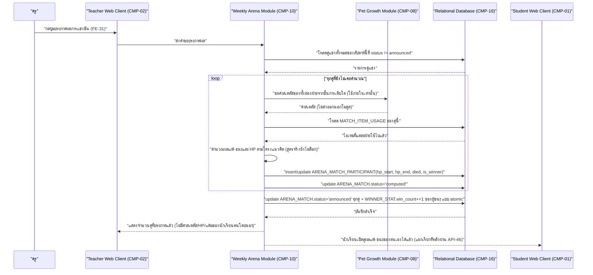

# DD-07 — ประกาศผลการแข่งขันรายสัปดาห์ (รวม HP)

- **Feature:** FE-27, FE-31, FE-32, FE-79 | **Journey:** UJ-03 node I | **Endpoint:** API-51 (`POST /api/v1/teacher/arena/current/announce`)
- **Acceptance Criteria ที่ต้องทำให้ผ่าน:** AC-FE-27-1, AC-FE-27-2, AC-FE-27-3, AC-FE-27-4, AC-FE-31-1, AC-FE-31-2, AC-FE-32-1, AC-FE-32-2 — FE-79 (HP) **ไม่มีรหัส AC อย่างเป็นทางการ** ในรอบนี้ อ้างอิงตรงจาก [[../../../01-requirements/01-spec/20260823-06-battle-support-items|spec 06]] Acceptance Criteria checklist แทน

> **คำเตือนสำคัญ:** สูตรตัดสินแพ้-ชนะและสูตรคำนวณ HP **ยังไม่มีในเอกสารต้นทางใดๆ** (spec 02, spec 06, architecture.md ข้อ 8/9, database-schema.md G-DB-04, api-spec.md G-API-04 ยืนยันตรงกัน) — pseudo code ในหัวข้อ 3 จึงเขียนเฉพาะ**โครงเชิงแนวคิด** ไม่มีตัวเลขหรือสูตรคณิตศาสตร์ที่แต่งขึ้นเอง ห้ามนำไปพัฒนาโค้ดจริงจนกว่า user จะยืนยันสูตรจริง

## 1. Sequence Diagram



## 2. เงื่อนไขก่อนเริ่ม (Precondition)

- มี session ครูที่ valid
- มี `ARENA_MATCH` อย่างน้อย 1 คู่ของ `ARENA_WEEK` ปัจจุบันที่ยังไม่ `announced`

## 3. ขั้นตอนการทำงาน (Pseudo Code)

```
1. ตรวจสอบสิทธิ์: role ต้องเป็น teacher -> ไม่ใช่ คืน ERR-02

2. โหลดคู่แข่งทั้งหมดของ ARENA_WEEK ปัจจุบัน
   ถ้าไม่มีคู่แข่งเลย -> คืน ERR-13 (NO_MATCHES "ยังไม่มีคู่แข่งของสัปดาห์นี้ให้ประกาศผล")

3. เริ่ม transaction เดียว ครอบทุกคู่และทุกขั้นตอนที่เหลือ — พลาดข้อใดให้ rollback ทั้งหมด
   (กันกรณีประกาศสำเร็จไปครึ่งห้องแล้วพังกลางทาง ซึ่งจะทำให้บางคู่เห็นผลก่อนคู่อื่นในสัปดาห์เดียวกัน):

   สำหรับแต่ละ ARENA_MATCH ที่ status != 'announced':

   a. ถ้า status == 'pending' (ยังไม่เคยคำนวณผล):
      - โหลดค่าสเตตัสรวมและ PET_STAT ปัจจุบันของทั้งสองฝ่ายจาก PET/PET_STAT (เฉพาะ PET ที่ is_active=true ของแต่ละฝ่าย)
        [ตาม BR-01/BR-02: ไข่ก็มีค่าสเตตัสรวม 50 แข่งได้ปกติ ไม่ถูกกันออก]
      - โหลด MATCH_ITEM_USAGE ทั้งหมดของแมตช์นี้ (ผลจาก DD-06)
      - [โครงแนวคิด — สูตรจริงยังไม่ล็อก ดู Gap G-DD-03]:
          ตั้ง hp_start ของแต่ละฝ่ายจากค่าสเตตัสรวม (วิธีแปลงค่าสเตตัสเป็น HP ยังไม่ล็อก)
          เปรียบเทียบค่าสเตตัสของทั้งสองฝ่าย ปรับผลด้วยไอเทมที่แต่ละฝ่ายใช้ไปแล้ว
            (cleanse_status = ล้างผลของพลังพิเศษที่ควรเกิดกับฝ่ายตน,
             prevent_death = กันไม่ให้ hp ของฝ่ายตนถึง 0 ได้ 1 ครั้งตลอดแมตช์นี้)
          ลด HP ของฝ่ายที่เสียเปรียบทีละรอบ (จำนวนรอบ/อัตราลดยังไม่ล็อก) จนฝ่ายใดฝ่ายหนึ่งถึง 0
          ฝ่ายที่ hp_end=0 -> died=true, is_winner=false (BR-13); อีกฝ่าย is_winner=true
      - insert/update ARENA_MATCH_PARTICIPANT ของทั้งสองฝ่าย (hp_start, hp_end, died, is_winner)
      - update ARENA_MATCH: winner_student_id, status='computed', computed_at=now (BR-14 — ยังไม่ announced)

   b. ถ้า status == 'computed' อยู่แล้ว (เคยคำนวณไว้ก่อนหน้าจากการกดประกาศที่ล้มเหลวไปก่อน หรือระบบคำนวณล่วงหน้า)
      - ใช้ผล ARENA_MATCH_PARTICIPANT/winner_student_id เดิม ไม่คำนวณซ้ำ (กันผลเปลี่ยนไปมาระหว่างกดซ้ำ)

   c. update ARENA_MATCH: status='announced', announced_at=now (BR-14 — เกิดจากคำสั่งครูในขั้นตอนนี้เท่านั้น)

   d. update WINNER_STAT ของ winner_student_id: win_count += 1 (เฉพาะคู่ที่เพิ่งเปลี่ยนเป็น announced ในรอบนี้เท่านั้น
      ไม่ทำซ้ำกับคู่ที่ announced ไปแล้วก่อนหน้า — กันกดปุ่มซ้ำแล้วบวกดาวซ้ำ)

   e. ยืนยันว่าไม่มีการเขียนแตะ PET/PET_STAT/POINTS_ACCOUNT ของนักเรียนคนใดเลยตลอดขั้นตอนนี้ (BR-12 — การแพ้ไม่มีผลเสีย)

4. update ARENA_WEEK.status='announced' เมื่อทุกคู่ของสัปดาห์นี้ announced ครบแล้ว

5. commit transaction

6. คืนค่า { matchesAnnounced: จำนวนคู่ที่เปลี่ยนเป็น announced ในคำขอนี้ }
   [BR-15] response นี้ (และ API-47/API-53 ที่ครูเรียกดูภาพรวมภายหลัง) ต้อง serialize เฉพาะจำนวนคู่/สถานะเท่านั้น
   ห้าม join field จาก PET/PET_STAT/ARENA_MATCH_PARTICIPANT.hp_*/MATCH_ITEM_USAGE เข้ามาในกระบวนการสร้าง response
   ให้ครูเลยตั้งแต่ชั้น query/service ไม่ใช่กรองทีหลังที่ client
```

## 4. กฎธุรกิจและการตรวจสอบ (Business Rules & Validation)

| ID | กฎ | ค่าขอบเขต (ระบุ `<=` หรือ `<` ให้ชัด) | ถ้าละเมิด |
|---|---|---|---|
| BR-12 | การแพ้ไม่มีผลเสียใดๆ ต่อสัตว์เลี้ยงเลย | ไม่มีการเขียนแตะ `PET`/`PET_STAT`/`POINTS_ACCOUNT` ของผู้แพ้เลยตลอด flow นี้ | ผิด AC-FE-27-2 และ spec 06 ข้อ ข. |
| BR-13 | HP ถึง 0 ของฝ่ายใด = ตายทันที = จบแมตช์ทันที นับเป็นแพ้ | `hp_end = 0` ก่อน `died=true` เสมอ | ผิด spec 06 ข้อ ข. |
| BR-14 | สถานะ `computed` ต้องแยกจาก `announced` — ห้ามข้ามขั้นตอนหรือประกาศเองก่อนครูสั่ง | `ARENA_MATCH.status` เปลี่ยนเป็น `announced` ได้จากคำสั่งครู (DD-07) เท่านั้น | ผิด AC-FE-31-2 |
| BR-15 | ครูห้ามเห็นค่าสเตตัส/ขั้น/แต้ม/HP/ไอเทมของนักเรียนคนใดเลย | จำนวน field ที่หลุดออกไปต้อง `= 0` เสมอในทุก response ฝั่งครู | ผิด AC-FE-27-3 |
| - | กดประกาศซ้ำต้อง idempotent ระดับคู่ | คู่ที่ `status='announced'` แล้วต้อง**ไม่**ถูกคำนวณซ้ำหรือบวก `win_count` ซ้ำ | ดาวเฟ้อผิดจริง |

## 5. กรณีผิดพลาดและการรับมือ (Edge Case & Error Handling)

| ID | สถานการณ์ | ระบบต้องทำ | Status + ข้อความ |
|---|---|---|---|
| ERR-01 | ไม่มี session / session หมดอายุ | ปฏิเสธทันที | 401 UNAUTHENTICATED |
| ERR-02 | role ไม่ใช่ teacher (เช่น นักเรียนพยายามเรียก endpoint นี้) | ปฏิเสธก่อนแตะ business logic | 403 FORBIDDEN_ROLE |
| ERR-13 | ไม่มีคู่แข่งใดของสัปดาห์นี้เลย | ไม่เปลี่ยนสถานะใดๆ | 409 NO_MATCHES |
| ข้อมูลนำเข้าไม่ถูกต้อง | endpoint นี้ไม่มี body — ถ้ามี field แปลกปลอมส่งมา ต้องเพิกเฉย | ดำเนินการตามปกติ | ไม่ error |
| ไข่/สัตว์เลี้ยงยังไม่โต | นักเรียนบางคนสัตว์เลี้ยงยังเป็นขั้นไข่ | ต้องแข่งได้ตามปกติด้วยค่าสเตตัสรวม 50 ของขั้นไข่ ไม่ถูกข้ามหรือกันออก | ตาม AC-FE-76-2/3 |
| กดซ้ำ/ยิงซ้ำ (idempotency) | ครูกดปุ่มประกาศผลซ้ำสองครั้งติดกัน (เช่น กดซ้ำเพราะคิดว่าปุ่มไม่ตอบสนอง) | คู่ที่ `announced` ไปแล้วในคำขอแรกต้องถูกข้ามในคำขอที่สอง ไม่คำนวณซ้ำ ไม่บวก `win_count` ซ้ำ — คำขอที่สองอาจได้ `matchesAnnounced=0` ถ้าทุกคู่ประกาศไปแล้ว หรือ ERR-13 ถ้าไม่มีคู่เหลือให้ประกาศเลย | 200 พร้อม `matchesAnnounced` ที่ถูกต้องตามจริง หรือ 409 NO_MATCHES |
| แย่งกันแก้ข้อมูลพร้อมกัน (race condition) | ครูสองคน (ครูร่วมสอน) กดประกาศผลพร้อมกัน | ล็อกแถว `ARENA_MATCH`/`ARENA_WEEK` ระหว่าง transaction เพื่อไม่ให้ `WINNER_STAT.win_count` ถูก `+= 1` ซ้ำสองครั้งจากคำสั่งพร้อมกัน | ต้องมีเพียงธุรกรรมเดียวที่ประมวลผลคู่ใดคู่หนึ่งสำเร็จ อีกธุรกรรมต้องเห็นสถานะ `announced` แล้วข้าม |
| ระบบภายนอกล่ม | - | flow นี้ไม่มี dependency ต่อระบบภายนอกใดๆ (การคำนวณผลเกิดภายในระบบเองทั้งหมดตาม architecture.md ข้อ 7 ที่ห้าม client คำนวณ) | ไม่มีสถานการณ์นี้ในเอกสารนี้ |

## 6. การเปลี่ยนสถานะ (State Transition)

```mermaid
stateDiagram-v2
    "pending" --> "computed" : "คำนวณผลครั้งแรก (ภายใน DD-07)"
    "computed" --> "announced" : "ครูกดประกาศผล (DD-07)"
    "pending" --> "announced" : "คำนวณและประกาศในคำขอเดียวกัน (กรณีไม่เคยคำนวณมาก่อน)"
```

| จาก | ไป | เงื่อนไข | เกิดที่ |
|---|---|---|---|
| `ARENA_MATCH.status='pending'` | `computed` | มีคู่แข่งอยู่ และยังไม่เคยคำนวณ | DD-07 (ภายในขั้นตอนก่อนตั้ง announced) |
| `computed` หรือ `pending` | `announced` | ครูกดปุ่ม "ประกาศผลการแข่งขัน" (API-51) | DD-07 เท่านั้น |
| `ARENA_WEEK.status='open'` | `announced` | ทุกคู่ของสัปดาห์นั้น `announced` ครบ | DD-07 |

## 7. ช่องว่างที่พบเฉพาะ flow นี้ (อ้างอิงจากหัวข้อ 5 ของ detailed-design.md)

- **G-DD-03:** สูตรตัดสินแพ้-ชนะและสูตรคำนวณ HP ยังไม่มีจาก spec ใดๆ — pseudo code ข้างต้นเป็นโครงเชิงแนวคิดเท่านั้น ห้ามพัฒนาโค้ดจริงจนกว่า user จะยืนยันสูตร (จำนวนรอบ/อัตราลด HP/วิธีแปลงค่าสเตตัสเป็น HP เริ่มต้น)
