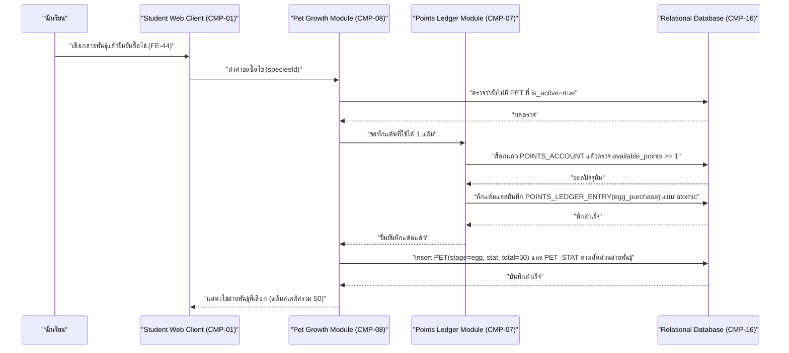
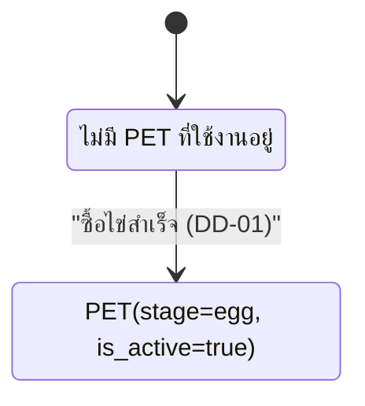

# DD-01 — ซื้อไข่และเลือกสายพันธุ์

- **Feature:** FE-44, FE-75, FE-76 | **Journey:** UJ-01 node L2/L3 | **Endpoint:** API-36 (`POST /api/v1/student/me/pet/egg`)
- **Acceptance Criteria ที่ต้องทำให้ผ่าน:** AC-FE-44-1, AC-FE-44-2, AC-FE-75-1, AC-FE-75-2, AC-FE-75-3, AC-FE-75-4, AC-FE-75-5, AC-FE-76-1, AC-FE-76-2, AC-FE-76-3

## 1. Sequence Diagram



## 2. เงื่อนไขก่อนเริ่ม (Precondition)

- มี session นักเรียนที่ valid และ `must_change_pin=false`
- นักเรียนยัง**ไม่มี** `PET` ที่ `is_active=true` อยู่ (ยังไม่เคยซื้อไข่ หรืออยู่ระหว่างรีเซ็ตหลังทำ DD-03 เสร็จแล้ว)
- ระบบมี `SPECIES` 3 แถวที่ `is_active=true` ให้เลือก (BR-06)

## 3. ขั้นตอนการทำงาน (Pseudo Code)

```
1. รับ studentId จาก session และรับ speciesId จาก body
   ตรวจสอบสิทธิ์: role ต้องเป็น student -> ไม่ใช่ คืน ERR-02

2. ตรวจว่า speciesId ถูกส่งมาและตรงกับ SPECIES ที่ is_active=true จริง
   ถ้าไม่ส่ง speciesId -> คืน ERR-07 (VALIDATION_ERROR "กรุณาเลือกสายพันธุ์ก่อน")
   ถ้า speciesId ไม่พบในรายการที่เปิดใช้งาน -> คืน ERR-03 (NOT_FOUND)

3. ตรวจว่านักเรียนยังไม่มี PET ที่ is_active=true
   ถ้ามีอยู่แล้ว -> คืน ERR-05 (ACTIVE_PET_EXISTS "มีสัตว์เลี้ยงที่ใช้งานอยู่แล้ว — ใช้เมนูรีเซ็ตถ้าต้องการเปลี่ยนสายพันธุ์")

4. เริ่ม transaction เดียว ครอบทุกขั้นตอนที่เหลือ — พลาดข้อใดให้ rollback ทั้งหมด:
   a. ล็อกแถว POINTS_ACCOUNT ของนักเรียนคนนี้ (กัน race condition จากหลายอุปกรณ์ตาม DF-01)
   b. ตรวจ available_points >= 1 (BR-03 ใช้ >= ไม่ใช่ >)
      ถ้าไม่พอ -> rollback แล้วคืน ERR-04 (INSUFFICIENT_POINTS "ยังสะสมแต้มที่ใช้ได้ไม่พอ ต้องมีอย่างน้อย 1 แต้ม (ตอนนี้มี {available} แต้ม)")
   c. หัก available_points -= 1 (ไม่แตะ total_earned_points ตาม BR-04/BR-05)
   d. insert แถวใหม่ PET(student_id, species_id=speciesId, stage='egg', stat_total=50, is_active=true)
      (unique partial index บน PET(student_id) ที่ is_active=true เป็นตัวกัน race condition ระดับฐานข้อมูลอีกชั้นตาม BR-07 —
       ถ้าคำขอซื้อไข่สองครั้งพร้อมกันหลุดผ่านขั้นตอนที่ 3 มาได้ทั้งคู่ ครั้งที่สองจะชนกับ constraint นี้ตอน insert)
   e. insert POINTS_LEDGER_ENTRY(entry_type='egg_purchase', points_delta_available=-1, points_delta_total=0,
      related_entity_type='pet', related_entity_id=<petId ที่เพิ่ง insert>)
   f. โหลด SPECIES_STAT_SPLIT ของ speciesId ที่เลือก แล้ว insert PET_STAT ต่อ stat_key ตาม points_per_stage ของสัดส่วนนั้น
      ตรวจว่าผลรวมของ PET_STAT ที่ insert ทั้งหมด = 50 พอดี (BR-02, AC-FE-77-2) — ถ้าผลรวมไม่เท่ากับ 50 ถือเป็นข้อผิดพลาดของ seed data ให้ rollback ทั้งหมดและแจ้ง error ภายใน ไม่ตอบสำเร็จบางส่วน
   g. commit transaction

5. คืนค่า { petId, stage: "egg", statTotal: 50, availablePoints: ยอดใหม่หลังหัก }
```

## 4. กฎธุรกิจและการตรวจสอบ (Business Rules & Validation)

| ID | กฎ | ค่าขอบเขต (ระบุ `<=` หรือ `<` ให้ชัด) | ถ้าละเมิด |
|---|---|---|---|
| BR-03 | ต้องมี `available_points >= 1` จึงซื้อไข่ได้ | `available_points >= 1` (ไม่ใช่ `> 1`) — มี 1 แต้มพอดีต้องซื้อได้ (AC-FE-75-3) | ERR-04 |
| BR-04 | ซื้อไข่ต้อง**ไม่ลด** `total_earned_points` | ค่าคงที่เสมอ | ถ้า implement ผิดจนแตะ `total_earned_points` ถือเป็นบั๊กร้ายแรง ต้อง rollback |
| BR-06 | `speciesId` ต้องเป็น 1 ใน 3 สายที่ `is_active=true` เท่านั้น | เท่ากับ 3 รายการพอดี | ERR-03/ERR-07 |
| BR-07 | ห้ามมี `PET` ที่ `is_active=true` เกิน 1 ตัวต่อนักเรียน | `= 1` ตัวพอดีหลังซื้อสำเร็จ | ERR-05 หรือ constraint violation ระดับ DB |
| BR-02 | แต้มสเตตัสตั้งต้นของไข่ = 50 พอดี ไม่ขาดไม่เกิน | `PET.stat_total = 50` และ `SUM(PET_STAT.value) = 50` พอดี | rollback ทั้ง transaction |

## 5. กรณีผิดพลาดและการรับมือ (Edge Case & Error Handling)

| ID | สถานการณ์ | ระบบต้องทำ | Status + ข้อความ |
|---|---|---|---|
| ERR-07 | ไม่ส่ง `speciesId` | ปฏิเสธก่อนแตะ transaction ใดๆ | 400 VALIDATION_ERROR — "กรุณาเลือกสายพันธุ์ก่อน" |
| ERR-01 | ไม่มี session / session หมดอายุ | ปฏิเสธทันที | 401 UNAUTHENTICATED |
| ERR-03 | `speciesId` ไม่ตรงกับสายที่เปิดใช้งานอยู่ | ปฏิเสธก่อนแตะ transaction | 404 NOT_FOUND |
| ERR-05 | นักเรียนมี `PET` ที่ `is_active=true` อยู่แล้ว (พยายามซื้อซ้ำ) | ไม่สร้าง PET ใหม่ ไม่หักแต้ม | 409 ACTIVE_PET_EXISTS |
| ERR-04 | `available_points < 1` | ไม่หักแต้ม ไม่สร้าง PET | 422 INSUFFICIENT_POINTS — ข้อความต้องเป็นกลาง ไม่ตำหนิผู้ใช้ (AC-FE-23-2) |
| กดซ้ำ/ยิงซ้ำ (idempotency) | นักเรียนกดปุ่ม "ซื้อไข่" ซ้ำเร็วๆ สองครั้งติดกันก่อนหน้าจอตอบกลับ | คำขอที่สองต้องชนกับ unique partial index ของ `PET(student_id)` ตอน insert (ถ้าคำขอแรกสำเร็จไปแล้ว) หรือถูกปฏิเสธด้วยเงื่อนไขข้อ 3 ถ้าคำขอแรก commit ไปก่อน — ต้องไม่หักแต้มซ้ำสองครั้งในสองคำขอ | คำขอที่สองได้ 409 ACTIVE_PET_EXISTS ไม่ใช่ 500 |
| แย่งกันแก้ข้อมูลพร้อมกัน (race condition) | นักเรียนเปิด session ค้างจากสองอุปกรณ์ (เช่น มือถือกับคอมที่โรงเรียน) กดซื้อไข่พร้อมกัน | ต้อง lock แถว `POINTS_ACCOUNT` ระหว่าง transaction (ขั้นตอนที่ 4.a) เพื่อให้คำขอที่สองเห็นยอดหลังหักของคำขอแรกก่อนตัดสินใจ ไม่ใช่อ่านยอดเก่าพร้อมกันแล้วหักซ้อนกันจนติดลบ | คำขอที่สองอาจได้ ERR-04 หรือ ERR-05 แล้วแต่ลำดับที่ transaction เข้าคิว แต่ผลลัพธ์สุดท้ายต้องไม่มีการหักแต้มเกิน 1 ครั้งต่อไข่ 1 ฟอง |
| ระบบภายนอกล่ม | - | flow นี้ไม่มี dependency ต่อระบบภายนอกใดๆ (ไม่เรียก AI Gateway หรือ Google Gateway) | ไม่มีสถานการณ์นี้ในเอกสารนี้ |

## 6. การเปลี่ยนสถานะ (State Transition)



| จาก | ไป | เงื่อนไข | เกิดที่ |
|---|---|---|---|
| ไม่มี `PET` ที่ `is_active=true` | มี `PET(stage='egg', is_active=true)` | `available_points >= 1` และยังไม่มี PET active | DD-01 (API-36) เท่านั้น |
