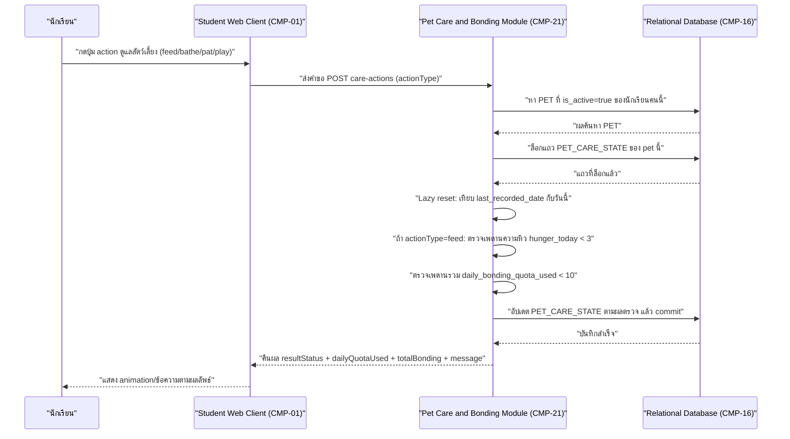
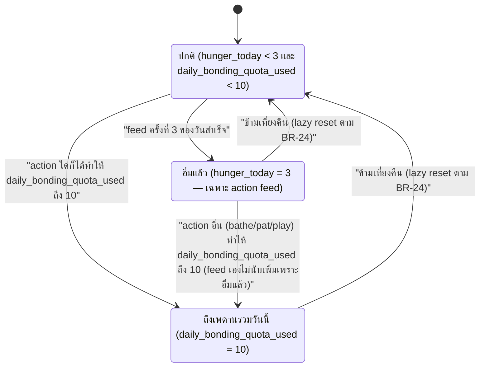

# DD-09 — ดูแลสัตว์เลี้ยงประจำวัน (ให้อาหาร/อาบน้ำ/ลูบหัว/เล่น) และค่าความผูกพัน

- **Feature:** FE-82, FE-83 | **Journey:** UJ-01 node PC1/PC2 | **Endpoint:** API-63 (`POST /api/v1/student/me/pet/care-actions`) — อ้างอิง API-62 (`GET /api/v1/student/me/pet/care-status`) ประกอบด้วยเพราะใช้ lazy-reset logic เดียวกันทุกประการ (database-schema.md ENT-27)
- **Acceptance Criteria ที่ต้องทำให้ผ่าน:** AC-FE-82-1, AC-FE-82-2, AC-FE-82-3, AC-FE-82-4, AC-FE-82-5, AC-FE-83-1, AC-FE-83-2, AC-FE-83-3, AC-FE-83-4, AC-FE-83-5

## 1. Sequence Diagram



## 2. เงื่อนไขก่อนเริ่ม (Precondition)

- มี session นักเรียนที่ valid (role ต้องเป็น `student`)
- นักเรียนมี `PET` ที่ `is_active=true` อยู่ (ถ้าไม่มี — ยังไม่เคยซื้อไข่ หรืออยู่ระหว่างรีเซ็ตที่ยังไม่ได้ซื้อไข่ใหม่ — ปฏิเสธด้วย ERR-03)
- มีแถว `PET_CARE_STATE` คู่กับ `PET` ที่ active นั้นอยู่แล้วเสมอ (สร้างมาจาก DD-01 ขั้นตอน f2 ตอนซื้อไข่ — ความสัมพันธ์ 1:1 บังคับด้วย unique `pet_id` ตาม database-schema.md ENT-27)

## 3. ขั้นตอนการทำงาน (Pseudo Code)

```
1. รับ studentId จาก session และรับ actionType จาก body
   ตรวจสอบสิทธิ์: role ต้องเป็น student -> ไม่ใช่ คืน ERR-02
   ตรวจ actionType ต้องเป็น 1 ใน "feed"/"bathe"/"pat"/"play" เท่านั้น
   ถ้าไม่ส่งหรือค่าไม่ตรงกับ 4 ค่านี้ -> คืน ERR-07 (400 VALIDATION_ERROR "กรุณาเลือก action ดูแลสัตว์เลี้ยงที่ถูกต้อง")

2. หา PET ที่ is_active=true ของ studentId
   ถ้าไม่พบ -> คืน ERR-03 (404 NO_ACTIVE_PET "ยังไม่มีสัตว์เลี้ยง — ไปซื้อไข่ตัวแรกกันเถอะ")

3. เริ่ม transaction เดียว ครอบทุกขั้นตอนที่เหลือ — พลาดข้อใดให้ rollback ทั้งหมด:
   a. ล็อกแถว PET_CARE_STATE ที่ pet_id = petId ของ PET ที่ active นี้ (กัน race condition กดพร้อมกันจากหลายอุปกรณ์ — แนวทางเดียวกับ DD-01 ข้อ 4.a)
      ถ้าไม่พบแถว PET_CARE_STATE เลย (ผิดจาก precondition ข้อ 2 ที่ควรมีเสมอ) -> ถือเป็นข้อผิดพลาดของข้อมูลภายใน (ดู ERR-17) rollback และไม่ตอบสำเร็จบางส่วน

   b. Lazy reset: ถ้า last_recorded_date ของแถวที่ล็อกไว้ ไม่ตรงกับวันที่ปัจจุบัน (เทียบเฉพาะวัน ไม่ใช่วัน-เวลา)
      -> ตั้ง hunger_today = 0, daily_bonding_quota_used = 0 (ไม่แตะ total_bonding_score เด็ดขาด)
      -> อัปเดต last_recorded_date เป็นวันนี้
      (ตรงกับ AC-FE-83-4 และ database-schema.md ENT-27 ข้อกฎ Lazy reset)

   c. ถ้า actionType == "feed":
      ตรวจ hunger_today < 3 (BR-20 — ใช้ `<` ไม่ใช่ `<=` เพราะเพดานคือ 3 ครั้งพอดี)
      ถ้าไม่ผ่าน (hunger_today = 3 แล้ว)
         -> ไม่แตะค่าใดๆ เลย (hunger_today, daily_bonding_quota_used, total_bonding_score คงเดิมทุกตัว)
         -> commit transaction ทันที แล้วคืนผลด้วย resultStatus="already_full" (AC-FE-82-2)
         -> ข้ามขั้นตอน d ไปเลย (ไม่ตรวจเพดานรวมต่อในรอบนี้ — ตามลำดับที่ api-spec.md API-63 เลือกไว้ ดู Gap G-API-12 ในหัวข้อ 5)
      ถ้าผ่าน -> hunger_today += 1 แล้วไปข้อ d ต่อ (AC-FE-82-1)

   d. ตรวจ daily_bonding_quota_used < 10 (BR-21 — ใช้ `<` ไม่ใช่ `<=`)
      (ขั้นตอนนี้ทำเมื่อ: actionType เป็น "bathe"/"pat"/"play" เสมอ — ไม่มีเพดานของตัวเอง AC-FE-82-3 — หรือ actionType="feed" ที่ผ่านข้อ c มาแล้ว)
      ถ้าไม่ผ่าน (daily_bonding_quota_used = 10 แล้ว)
         -> ไม่เพิ่ม daily_bonding_quota_used และไม่เพิ่ม total_bonding_score
         -> **แต่การเปลี่ยนแปลงจากข้อ c ที่ทำไปแล้ว (ถ้ามี เช่น hunger_today += 1 ตอน feed) ยังคง commit อยู่** — ไม่ rollback ส่วนนั้น
         -> คืนผลด้วย resultStatus="daily_cap_reached" (AC-FE-83-3)
      ถ้าผ่าน
         -> daily_bonding_quota_used += 1 และ total_bonding_score += 1 (BR-22 — ทุก action ที่ผ่าน +1 หน่วยเท่ากัน)
         -> คืนผลด้วย resultStatus="counted" (AC-FE-83-1, AC-FE-83-2 — รวมกรณีขอบที่ 9 -> 10 พอดี)

   e. commit transaction

4. คืนค่า { actionType, resultStatus, dailyQuotaUsed: daily_bonding_quota_used ปัจจุบัน, totalBonding: total_bonding_score ปัจจุบัน, message }
   โดย message = null เมื่อ resultStatus="counted", = "ตัวละครอิ่มแล้ว" เมื่อ resultStatus="already_full",
   = "วันนี้ดูแลเต็มที่แล้ว พรุ่งนี้ค่อยมาใหม่นะ" เมื่อ resultStatus="daily_cap_reached" (ตาม mapping ข้อความใน api-spec.md API-63)
```

**หมายเหตุสำคัญ (ต้องตรวจตอน implement):** ทั้ง flow นี้ **ไม่ query และไม่แก้ไข `POINTS_ACCOUNT`, `POINTS_LEDGER_ENTRY`, `PET_STAT` เลยไม่ว่าขั้นตอนใด** (AC-FE-82-4, AC-FE-82-5, BR-23) — ถ้า implement ผิดจนไปแตะ 3 ตารางนี้ (ไม่ว่าจะอ่านหรือเขียน) ถือเป็นบั๊กร้ายแรงของ flow นี้

## 4. กฎธุรกิจและการตรวจสอบ (Business Rules & Validation)

| ID | กฎ | ค่าขอบเขต (ระบุ `<=` หรือ `<` ให้ชัด) | ถ้าละเมิด |
|---|---|---|---|
| BR-20 | เพดานความหิวจาก action "ให้อาหาร" (`feed`) ทำสำเร็จได้สูงสุด 3 ครั้ง/วัน | อนุญาตเมื่อ `hunger_today < 3` (ไม่ใช่ `<= 3`) — `hunger_today = 3` แล้วปฏิเสธแบบ soft (AC-FE-82-1, AC-FE-82-2) | คืน `resultStatus="already_full"` ไม่แตะค่าใดๆ (ไม่ใช่ error, 200 OK) |
| BR-21 | เพดานรวมค่าความผูกพันต่อวัน (นับรวมทุก action) สูงสุด 10 หน่วย/วัน | อนุญาตให้เพิ่มเมื่อ `daily_bonding_quota_used < 10` (ไม่ใช่ `<= 10`) — `daily_bonding_quota_used = 10` แล้วปฏิเสธแบบ soft (AC-FE-83-2, AC-FE-83-3) | คืน `resultStatus="daily_cap_reached"` ไม่เพิ่ม `daily_bonding_quota_used`/`total_bonding_score` (ไม่ใช่ error, 200 OK) |
| BR-22 | Action ทั้ง 4 แบบที่ผ่านเงื่อนไข BR-20/BR-21 (แล้วแต่ประเภท) ได้ค่าความผูกพัน **+1 หน่วยเท่ากันทุกแบบ** ไม่มีน้ำหนักต่างกันตาม `actionType` | `+1` พอดีต่อครั้งที่ `resultStatus="counted"` (AC-FE-83-1) | ถ้า implement ให้ค่าไม่เท่ากันระหว่าง action ถือเป็นบั๊ก |
| BR-23 | Action ดูแลสัตว์เลี้ยงทั้ง 4 แบบต้องไม่มีผลใดๆ ต่อ `available_points`/`total_earned_points` (`POINTS_ACCOUNT`) และไม่มีผลใดๆ ต่อ `PET_STAT`/ค่าสเตตัสต่อสู้ ไม่ว่าจะสำเร็จ (`counted`) หรือติดเพดาน (`already_full`/`daily_cap_reached`) | ค่าคงที่เสมอไม่ว่ากรณีใด (AC-FE-82-4, AC-FE-82-5) | ถ้า implement ผิดจนแตะ 2 entity นี้ ถือเป็นบั๊กร้ายแรง ต้อง rollback |
| BR-24 | Lazy reset รายวัน: เมื่อ `last_recorded_date` ของ `PET_CARE_STATE` ไม่ตรงกับวันปัจจุบัน ให้ตั้ง `hunger_today=0` และ `daily_bonding_quota_used=0` ก่อนประมวลผลคำขอใดๆ ต่อ **โดยห้ามแตะ `total_bonding_score` เด็ดขาด** | เทียบเฉพาะ "วันเดียวกันหรือไม่" ไม่ใช่วัน-เวลา (AC-FE-83-4) | ถ้า reset ผิดจนไปลด `total_bonding_score` ถือเป็นบั๊กร้ายแรง (ยอดสะสมรวมต้องไม่ลดจากการผ่านวันใหม่) |

## 5. กรณีผิดพลาดและการรับมือ (Edge Case & Error Handling)

| ID | สถานการณ์ | ระบบต้องทำ | Status + ข้อความ |
|---|---|---|---|
| ERR-01 | ไม่มี session / session หมดอายุ | ปฏิเสธทันที ไม่แตะ transaction ใดๆ | 401 UNAUTHENTICATED — "กรุณาเข้าสู่ระบบใหม่อีกครั้ง" |
| ERR-02 | Role ของ session ไม่ใช่ `student` (เช่น ครูเรียก endpoint นี้) | ปฏิเสธก่อนแตะ business logic ใดๆ | 403 FORBIDDEN_ROLE — "ไม่มีสิทธิ์ทำรายการนี้" |
| ERR-07 | ไม่ส่ง `actionType` หรือค่าไม่ตรงกับ 4 ค่าที่กำหนด (`feed`/`bathe`/`pat`/`play`) | ปฏิเสธก่อนแตะ transaction ใดๆ | 400 VALIDATION_ERROR — "กรุณาเลือก action ดูแลสัตว์เลี้ยงที่ถูกต้อง" |
| ERR-03 | นักเรียนไม่มี `PET` ที่ `is_active=true` เลย (ยังไม่เคยซื้อไข่ หรือรีเซ็ตไปแล้วยังไม่ซื้อไข่ใหม่) | ไม่สร้าง/แก้ไขข้อมูลใดๆ | 404 NO_ACTIVE_PET — "ยังไม่มีสัตว์เลี้ยง — ไปซื้อไข่ตัวแรกกันเถอะ" |
| ERR-17 (ใหม่) | มี `PET` ที่ `is_active=true` แต่หาแถว `PET_CARE_STATE` คู่กันไม่เจอ (ผิดจาก precondition ที่ควรมีเสมอตาม DD-01 ขั้นตอน f2 — เป็นข้อผิดพลาดของข้อมูลภายใน ไม่ใช่ error ที่ผู้ใช้ทำให้เกิด) | rollback transaction ทันที ไม่ตอบสำเร็จบางส่วน บันทึก log ภายในเพื่อตรวจสอบ data integrity | 500 INTERNAL_DATA_ERROR — "เกิดข้อผิดพลาดภายใน กรุณาลองใหม่ภายหลัง" |
| กดซ้ำ/ยิงซ้ำ (idempotency) | นักเรียนกดปุ่ม action เดิมซ้ำเร็วๆ สองครั้งติดกันก่อนหน้าจอตอบกลับ | ทั้งสองคำขอต้องรอคิวที่ row lock ของ `PET_CARE_STATE` (ขั้นตอนที่ 3.a) เพื่อประมวลผลทีละคำขอตามลำดับจริง ไม่ใช่อ่านค่าพร้อมกันแล้วเขียนทับกัน — คำขอที่สองจะเห็นค่าที่อัปเดตจากคำขอแรกแล้วก่อนตัดสินใจ (เช่น ถ้าคำขอแรกทำให้ `hunger_today` ครบ 3 พอดี คำขอที่สองต้องได้ `resultStatus="already_full"` ไม่ใช่ `counted` ซ้ำ) | คำขอทั้งสองได้ 200 OK เสมอ (ไม่ใช่ error) แต่ผลลัพธ์ตัวเลขต้องสอดคล้องกับลำดับที่ประมวลผลจริง ไม่มีการนับซ้ำเกินจริง |
| แย่งกันแก้ข้อมูลพร้อมกัน (race condition) | นักเรียนเปิด session ค้างจากสองอุปกรณ์ (เช่น มือถือกับคอมที่โรงเรียน) กด action พร้อมกัน | ต้อง lock แถว `PET_CARE_STATE` ระหว่าง transaction (ขั้นตอนที่ 3.a) เพื่อให้คำขอที่สองเห็นยอดหลังอัปเดตของคำขอแรกก่อนตัดสินใจ ไม่ใช่อ่านยอดเก่าพร้อมกันแล้วเขียนทับจนเกินเพดาน | ผลลัพธ์สุดท้ายต้องไม่มี `hunger_today` เกิน 3 หรือ `daily_bonding_quota_used` เกิน 10 ไม่ว่าจะยิงพร้อมกันกี่คำขอ (บังคับด้วย CHECK constraint ของ database-schema.md ENT-27 เป็นชั้นป้องกันสุดท้าย) |
| ระบบภายนอกล่ม | - | flow นี้ไม่มี dependency ต่อระบบภายนอกใดๆ เลย (ไม่เรียก AI Gateway หรือ Google Gateway, ไม่แตะ CMP-14/CMP-19) | ไม่มีสถานการณ์นี้ในเอกสารนี้ |

**หมายเหตุอ้างอิง Gap G-API-12 (api-spec.md, พบ 2026-08-25):** ลำดับการตรวจ "เช็คความหิวเต็มก่อนสำหรับ `feed` เท่านั้น แล้วจึงเช็คเพดานรวมทีหลัง" ในขั้นตอนที่ 3.c/3.d ของหัวข้อ 3 เป็นการออกแบบตามที่ api-spec.md API-63 เลือกไว้แล้ว (การตีความที่สอดคล้องกับสเปกที่มีอยู่ ไม่ใช่ตัวเลขหรือกฎใหม่ที่เอกสารนี้คิดขึ้นเอง) กรณีที่ "ความหิวเต็มพอดี" (`hunger_today=3`) กับ "เพดานรวมเต็มพอดี" (`daily_bonding_quota_used=10`) ชนกันในการกด `feed` ครั้งเดียวกัน **ยังไม่มี AC ยืนยันอย่างเป็นทางการ** — เอกสารนี้เพียงกำกับอ้างอิงลำดับที่ api-spec.md เลือกไว้ ไม่ได้พยายามปิด gap นี้เอง ต้องรอ user/requirement ใหม่ยืนยันถ้าต้องการล็อกอย่างเป็นทางการ

## 6. การเปลี่ยนสถานะ (State Transition)



| จาก | ไป | เงื่อนไข | เกิดที่ |
|---|---|---|---|
| ปกติ | อิ่มแล้ว | กด `feed` สำเร็จจนครบ 3 ครั้งของวันนั้นพอดี | DD-09 (API-63) |
| ปกติ / อิ่มแล้ว | ถึงเพดานรวมวันนี้ | กด action ใดก็ได้จนทำให้ `daily_bonding_quota_used` ถึง 10 พอดี | DD-09 (API-63) |
| อิ่มแล้ว / ถึงเพดานรวมวันนี้ | ปกติ | ข้ามเที่ยงคืน (`last_recorded_date` ไม่ตรงกับวันปัจจุบัน) — lazy reset ที่ API-62 หรือ API-63 ครั้งถัดไป | DD-09 (API-62/63) |

**หมายเหตุ:** `total_bonding_score` ไม่มี state ของตัวเอง (ไม่มีเพดานบน ไม่ถูกรีเซ็ต) — เปลี่ยนเฉพาะตอน `PET` ตัวนั้นถูกรีเซ็ต (FE-26/DD-03) ซึ่งจะ insert แถว `PET_CARE_STATE` ใหม่เริ่มที่ 0 โดยอัตโนมัติ (AC-FE-83-5, database-schema.md ENT-27) ไม่ใช่เหตุการณ์ภายใน flow นี้
