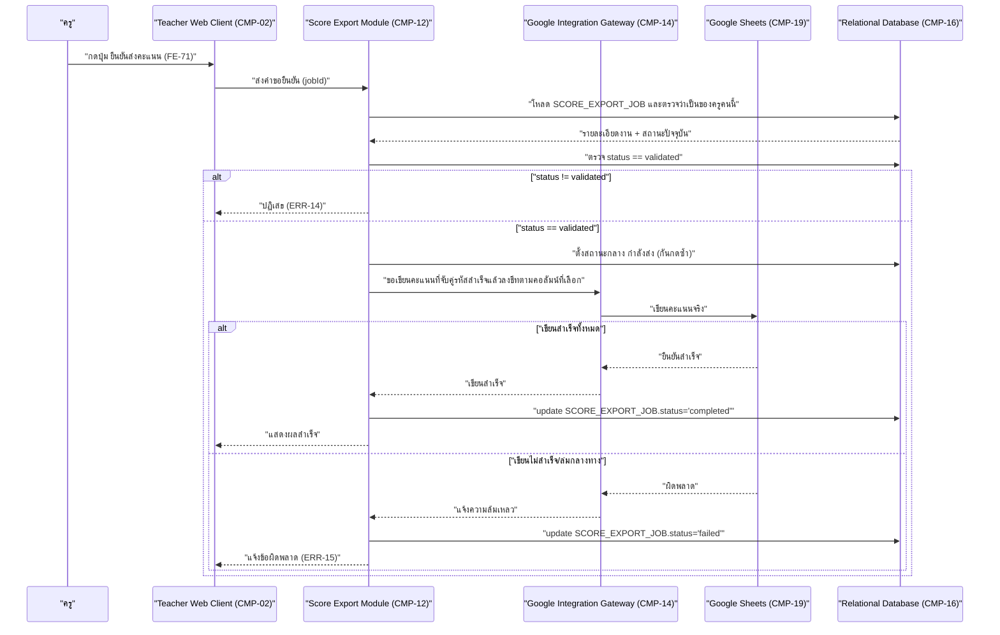

# DD-08 — ยืนยันส่งคะแนนเข้า Google Sheets

- **Feature:** FE-66, FE-69, FE-70, FE-71 | **Journey:** UJ-04 node K/L/M | **Endpoint:** API-60 (`POST /api/v1/teacher/score-export/jobs/{jobId}/confirm`)
- **Acceptance Criteria ที่ต้องทำให้ผ่าน:** AC-FE-66-1, AC-FE-66-2, AC-FE-69-1, AC-FE-69-2, AC-FE-70-1, AC-FE-70-2, AC-FE-71-1, AC-FE-71-2, AC-FE-71-3

## 1. Sequence Diagram



## 2. เงื่อนไขก่อนเริ่ม (Precondition)

- มี session ครูที่ valid และ `SCORE_EXPORT_JOB` นั้นเป็นของครูคนนี้ (`teacher_id` ตรงกับ session)
- `SCORE_EXPORT_JOB.status == 'validated'` (ผ่านขั้นตอน "ตรวจสอบข้อมูลก่อนส่ง" ของ API-59 มาแล้ว)
- `channel` และ `columns` ถูกเลือก/ผูกไว้ครบแล้วก่อนหน้านี้

## 3. ขั้นตอนการทำงาน (Pseudo Code)

```
1. รับ teacherId จาก session, jobId จาก path
   ตรวจสอบสิทธิ์: role ต้องเป็น teacher -> ไม่ใช่ คืน ERR-02

2. โหลด SCORE_EXPORT_JOB by jobId
   ถ้าไม่พบ หรือ teacher_id ไม่ตรงกับ session ปัจจุบัน -> คืน ERR-03 (NOT_FOUND)
   (ไม่บอกเหตุผลละเอียดว่า "มี job นี้อยู่แต่ไม่ใช่ของคุณ" เพื่อกันเดา jobId ของครูคนอื่น)

3. ตรวจ SCORE_EXPORT_JOB.status == 'validated'
   ถ้าไม่ใช่ (เช่นยังเป็น draft หรือเป็น completed/failed ไปแล้ว) -> คืน ERR-14 (NOT_VALIDATED_YET
   "กรุณาตรวจสอบข้อมูลก่อนส่งก่อนกดยืนยัน")
   [กันกดซ้ำ] ถ้า status เป็นสถานะกลาง "กำลังส่ง" อยู่แล้วจากคำขอก่อนหน้าที่ยังไม่จบ -> ปฏิเสธคำขอนี้ด้วยเหตุผลเดียวกัน
   (ไม่ปล่อยให้เขียนซ้ำสองรอบพร้อมกัน)

4. ตั้งสถานะกลาง (in-progress guard) เพื่อกันคำขอซ้ำระหว่างรอผลจากภายนอก (BR-19 ต้องไม่มีการเขียนซ้ำโดยไม่ตั้งใจ)

5. โหลดรายการคะแนนที่ผ่านการจับคู่รหัสประจำตัวสำเร็จแล้วเท่านั้น (BR-18) — **ไม่รวม**แถวใดที่อยู่ใน
   SCORE_EXPORT_SKIPPED_ROW ของ job นี้เด็ดขาด (AC-FE-70-2)

6. ถ้า channel == 'google_sheets':
   a. เรียก CMP-14 (Google Integration Gateway) ให้เขียนคะแนนลง destination_sheet_link
      ตามคอลัมน์ที่ผูกไว้ใน SCORE_EXPORT_JOB_ITEM.destination_column
   b. ถ้าเขียนสำเร็จทั้งหมด:
      - update SCORE_EXPORT_JOB: status='completed', completed_at=now
      - คืนค่า { jobId, status: 'completed' }
   c. ถ้าเขียนไม่สำเร็จ (ทั้งหมดหรือบางส่วน เนื่องจาก Google Sheets ล่ม/เครือข่ายขาดกลางทาง):
      - update SCORE_EXPORT_JOB: status='failed'
      - **ไม่ตั้งเป็น completed เด็ดขาด** แม้จะเขียนสำเร็จไปแล้วบางแถว (กันครูเข้าใจผิดว่าสำเร็จทั้งหมด)
      - คืน ERR-15 (UPSTREAM_WRITE_FAILED "ส่งคะแนนไม่สำเร็จบางส่วน กรุณาตรวจสอบและลองใหม่")
      - หมายเหตุ: ระบบยังไม่มีกลไกรายงานระดับรายแถวว่าแถวใดเขียนสำเร็จไปแล้วบ้างก่อนล่ม (ดู Gap G-DD-07)
        นโยบาย retry/ส่งซ้ำหลัง failed ยังไม่ล็อก ห้าม auto-retry เขียนซ้ำทับแถวที่อาจสำเร็จไปแล้วโดยไม่ตรวจสอบก่อน

7. ถ้า channel == 'file_download':
   a. เรียก CMP-15 (File Storage Gateway) สร้างไฟล์คะแนนไปเก็บที่ Object Storage (ไม่มีชื่อจริง/แต้ม/ขั้นการเติบโตปนอยู่)
   b. update SCORE_EXPORT_JOB: status='completed', completed_at=now
      (การดาวน์โหลดไฟล์จริงเกิดที่ endpoint แยกต่างหาก API-61 ไม่ใช่ flow นี้)
   c. คืนค่า { jobId, status: 'completed' }

8. คืนค่าสุดท้ายตามผลของขั้นตอนที่ 6 หรือ 7
```

**หมายเหตุขอบเขต transaction:** การเขียนไป Google Sheets เป็น external call ที่ไม่สามารถอยู่ใน database transaction เดียวกับการ update `SCORE_EXPORT_JOB.status` ได้แบบ atomic 100% (ไม่มี 2-phase commit ข้ามระบบ) — ลำดับที่ถูกต้องคือ **เขียนภายนอกให้เสร็จก่อน แล้วจึง commit สถานะ `completed` ในฐานข้อมูลทีหลัง** เพื่อไม่ให้ DB รายงานว่า "สำเร็จ" ทั้งที่ยังไม่ได้เขียนจริง หากเขียนสำเร็จแต่ระบบล่มก่อน commit สถานะ DB จะเหลือค้างที่ "กำลังส่ง" — กรณีนี้ต้องมีกลไกตรวจสอบภายหลังว่าจริง ๆ เขียนไปแล้วหรือยังก่อนให้ครู retry ได้ (รายละเอียดนี้เป็น Gap นโยบาย retry ที่ยังไม่ล็อก — ดู G-DD-07)

## 4. กฎธุรกิจและการตรวจสอบ (Business Rules & Validation)

| ID | กฎ | ค่าขอบเขต (ระบุ `<=` หรือ `<` ให้ชัด) | ถ้าละเมิด |
|---|---|---|---|
| BR-19 | ห้ามเขียน/ส่งข้อมูลจริงจนกว่า `status='validated'` และครูกดยืนยัน | เข้มงวด — ไม่มีทางเขียนได้จาก endpoint อื่นก่อนหน้านี้เลย | ผิด AC-FE-71-2 |
| BR-18 | จับคู่ด้วยรหัสประจำตัวเท่านั้น แถวไม่ตรงต้องถูกข้าม ไม่เขียนทับ | แถวใน `SCORE_EXPORT_SKIPPED_ROW` ต้องมี `0` การเขียนทับเสมอ | ผิด AC-FE-70-2 |
| - | ต้องไม่ตั้ง `status='completed'` ถ้าการเขียนภายนอกล้มเหลวแม้บางส่วน | ทั้งหมดสำเร็จ (`100%`) จึงตั้ง completed ได้ ไม่ใช่ "ส่วนใหญ่สำเร็จ" | ครูเข้าใจผิดว่าสำเร็จทั้งหมดทั้งที่ไม่ใช่ |

## 5. กรณีผิดพลาดและการรับมือ (Edge Case & Error Handling)

| ID | สถานการณ์ | ระบบต้องทำ | Status + ข้อความ |
|---|---|---|---|
| ERR-01 | ไม่มี session / session หมดอายุ | ปฏิเสธทันที | 401 UNAUTHENTICATED |
| ERR-02 | role ไม่ใช่ teacher | ปฏิเสธก่อนแตะ business logic | 403 FORBIDDEN_ROLE |
| ERR-03 | `jobId` ไม่พบ หรือไม่ใช่ของครูคนนี้ | ปฏิเสธก่อนแตะข้อมูลจริง ไม่เปิดเผยว่ามี job นี้อยู่ | 404 NOT_FOUND |
| ERR-14 | `status != 'validated'` (ยังไม่ตรวจสอบก่อนส่ง หรือส่งไปแล้ว) | ไม่เขียนอะไรเลย | 409 NOT_VALIDATED_YET |
| ERR-15 | Google Sheets เขียนไม่สำเร็จระหว่างทาง (ระบบภายนอกล่ม) | ตั้ง `status='failed'` ไม่ใช่ `completed` แจ้งครูให้ตรวจสอบก่อน retry | 502 UPSTREAM_WRITE_FAILED |
| กดซ้ำ/ยิงซ้ำ (idempotency) | ครูกดปุ่ม "ยืนยันส่งคะแนน" ซ้ำสองครั้งติดกันก่อนหน้าจอตอบกลับ | คำขอที่สองต้องเห็นสถานะกลาง "กำลังส่ง" จากคำขอแรก (ขั้นตอน 3–4) แล้วถูกปฏิเสธ ไม่เขียนซ้ำสองรอบไปยัง Google Sheets | คำขอที่สองได้ 409 (สถานะยังไม่ validated เพราะเปลี่ยนเป็นสถานะกลาง/completed/failed ไปแล้ว) |
| แย่งกันแก้ข้อมูลพร้อมกัน (race condition) | ครูเปิดสองแท็บแล้วกดยืนยันพร้อมกัน | ล็อกแถว `SCORE_EXPORT_JOB` ระหว่าง transaction เพื่อให้มีเพียงคำขอเดียวที่ผ่านเงื่อนไข `status='validated'` ไปเขียนจริง อีกคำขอต้องเห็นสถานะที่เปลี่ยนไปแล้วและถูกปฏิเสธ | ป้องกันเขียนคะแนนซ้ำสองรอบเข้าชีทเดียวกัน |
| ระบบภายนอกล่ม | Google Sheets (CMP-19) ล่ม/ตอบช้าเกินกำหนดระหว่างเขียน | ตั้ง `status='failed'`, คืน ERR-15, **ไม่ auto-retry เขียนซ้ำเอง** เพราะไม่ทราบว่าแถวใดสำเร็จไปแล้วบ้าง (Gap G-DD-07 — นโยบาย retry ยังไม่ล็อก) | 502 UPSTREAM_WRITE_FAILED |

## 6. การเปลี่ยนสถานะ (State Transition)

```mermaid
stateDiagram-v2
    "validated" --> "กำลังส่ง (in-progress)" : "ครูกดยืนยันส่ง (DD-08)"
    "กำลังส่ง (in-progress)" --> "completed" : "เขียนสำเร็จทั้งหมด"
    "กำลังส่ง (in-progress)" --> "failed" : "เขียนไม่สำเร็จ/ระบบภายนอกล่ม"
```

| จาก | ไป | เงื่อนไข | เกิดที่ |
|---|---|---|---|
| `validated` | สถานะกลาง "กำลังส่ง" | ครูกดยืนยัน (API-60) | DD-08 |
| สถานะกลาง "กำลังส่ง" | `completed` | เขียนภายนอกสำเร็จทั้งหมด | DD-08 |
| สถานะกลาง "กำลังส่ง" | `failed` | เขียนภายนอกไม่สำเร็จ (บางส่วนหรือทั้งหมด) | DD-08 |
| `failed` | (ต้องเริ่ม job ใหม่) | นโยบาย retry ยังไม่ล็อก — ไม่มีทางกลับไป `validated` ได้เองในเอกสารนี้ | นอกขอบเขต DD-08 (ดู Gap G-DD-07) |

## 7. ช่องว่างที่พบเฉพาะ flow นี้ (อ้างอิงจากหัวข้อ 5 ของ detailed-design.md)

- **G-DD-07:** นโยบายส่งคะแนนซ้ำรอบสองและกลไกรายงานว่าแถวใดเขียนสำเร็จไปแล้วบ้างเมื่อ Google Sheets ล่มกลางทาง ยังไม่ล็อกใน spec 05 — ต้องรอ user ตัดสินใจก่อนพัฒนากลไก retry จริง
