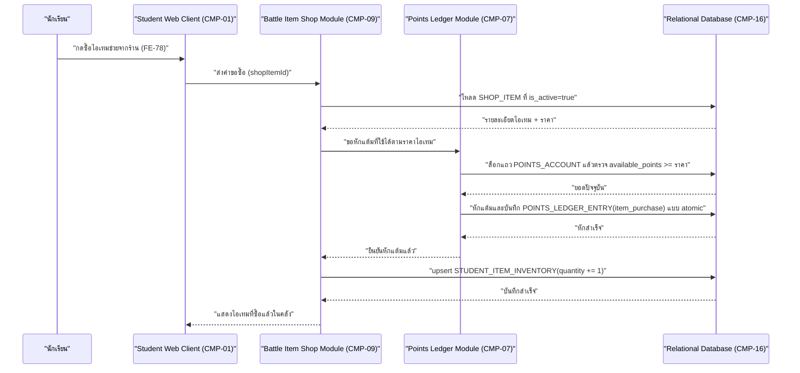

# DD-04 — ซื้อไอเทมช่วยในการต่อสู้

- **Feature:** FE-78 | **Journey:** UJ-01 node M/O | **Endpoint:** API-41 (`POST /api/v1/student/me/items/purchase`)
- **Acceptance Criteria ที่ต้องทำให้ผ่าน:** FE-78 **ไม่มีรหัส AC อย่างเป็นทางการ** ในรอบนี้ (acceptance-criteria.md ปิดเมื่อ 2026-08-22 ก่อน spec 06 เพิ่มเข้ามาวันถัดไป) เอกสารนี้จึงอ้างอิงตรงจาก [[../../../01-requirements/01-spec/20260823-06-battle-support-items|spec 06]] Acceptance Criteria checklist ข้อ "การซื้อไอเทมหักจากยอดแต้มที่ใช้ได้ ไม่กระทบยอดแต้มสะสมรวม" และ "ไอเทมช่วยไม่ทำให้ค่าสเตตัสของสัตว์เลี้ยงเปลี่ยนแปลง" รวมทั้ง AC-FE-22-2, AC-FE-23-1/2 ที่เกี่ยวข้องทางอ้อม

## 1. Sequence Diagram



## 2. เงื่อนไขก่อนเริ่ม (Precondition)

- มี session นักเรียนที่ valid และ `must_change_pin=false`
- `SHOP_ITEM` ที่ระบุต้องมีอยู่จริงและ `is_active=true`
- (ไม่บังคับว่าต้องมี `PET` — ซื้อไอเทมไม่เกี่ยวกับสถานะสัตว์เลี้ยง)

## 3. ขั้นตอนการทำงาน (Pseudo Code)

```
1. รับ studentId จาก session และ shopItemId จาก body
   ตรวจสอบสิทธิ์: role ต้องเป็น student -> ไม่ใช่ คืน ERR-02

2. โหลด SHOP_ITEM ที่ id=shopItemId และ is_active=true
   ถ้าไม่พบ -> คืน ERR-03 (NOT_FOUND "ไม่พบไอเทมนี้")

3. [มาตรการป้องกันที่เอกสารนี้เพิ่มเติม เนื่องจากราคาไอเทมยังไม่ล็อก — ดู Gap G-DD-05]
   ถ้า SHOP_ITEM.price_points ยังไม่ถูกกำหนดค่าจริง (เป็นค่าที่ยังไม่ผ่านการ seed ราคาแท้จริง)
   -> คืน ERR-16 (ITEM_NOT_PRICED "ไอเทมนี้ยังไม่เปิดให้ซื้อในตอนนี้") ก่อนแตะ transaction ใดๆ

4. เริ่ม transaction เดียว ครอบทุกขั้นตอนที่เหลือ — พลาดข้อใดให้ rollback ทั้งหมด:
   a. ล็อกแถว POINTS_ACCOUNT ของนักเรียนคนนี้ (กัน race condition)
   b. ตรวจ available_points >= SHOP_ITEM.price_points (BR-03 ใช้ >= ไม่ใช่ >)
      ถ้าไม่พอ -> rollback แล้วคืน ERR-04 (INSUFFICIENT_POINTS "ยังสะสมแต้มที่ใช้ได้ไม่พอสำหรับไอเทมนี้")
   c. หัก available_points -= SHOP_ITEM.price_points (ไม่แตะ total_earned_points ตาม BR-04/BR-05)
   d. insert POINTS_LEDGER_ENTRY(entry_type='item_purchase', points_delta_available=-price, points_delta_total=0,
      related_entity_type='shop_item', related_entity_id=shopItemId)
   e. [กฎการถือครองไอเทมยังไม่ล็อก — ดู Gap G-DD-04 — เอกสารนี้เลือกออกแบบเป็นค่าเริ่มต้นดังนี้ ต้องรอ user ยืนยัน]
      ถ้ามีแถว STUDENT_ITEM_INVENTORY(student_id, shop_item_id) อยู่แล้ว -> quantity += 1
      ถ้ายังไม่มี -> insert แถวใหม่ quantity = 1
      (ไม่มีการจำกัดเพดานจำนวนสูงสุดในเอกสารนี้ เพราะเพดานยังไม่ถูกล็อกจาก user)
   f. commit transaction

5. คืนค่า { shopItemId, quantity: จำนวนใหม่ในคลัง, availablePoints: ยอดใหม่หลังหัก }
```

## 4. กฎธุรกิจและการตรวจสอบ (Business Rules & Validation)

| ID | กฎ | ค่าขอบเขต (ระบุ `<=` หรือ `<` ให้ชัด) | ถ้าละเมิด |
|---|---|---|---|
| BR-03 | เงื่อนไขซื้อไอเทมใช้ `available_points >= ราคา` | เท่ากับราคาพอดีต้องซื้อได้ (`>=` ไม่ใช่ `>`) | ERR-04 |
| BR-04/BR-05 | ซื้อไอเทมหักเฉพาะ `available_points` ไม่แตะ `total_earned_points` | ค่าคงที่เสมอสำหรับ `total_earned_points` | ถือเป็นบั๊กร้ายแรง |
| BR-10 | ไอเทมที่ซื้อ**ไม่กระทบ** `PET.stat_total`/`PET_STAT` เลย | ไม่มีการเขียนแตะตาราง `PET`/`PET_STAT` ใน transaction นี้เลย | ผิด spec 06 ข้อ ค. โดยตรง |
| G-DD-04 (ยังไม่ล็อก) | จำนวนไอเทมที่ถือครองได้สูงสุด/ซื้อซ้ำได้ไหม | ยังไม่มีตัวเลข — เอกสารนี้ไม่ implement เพดานใดๆ | ต้องรอ requirement ใหม่ก่อนเพิ่มเพดาน |
| G-DD-05 (ยังไม่ล็อก) | ราคาไอเทม (`price_points`) | ยังไม่มีตัวเลขจริง | ปฏิเสธด้วย ERR-16 แทนการปล่อยให้ซื้อฟรี |

## 5. กรณีผิดพลาดและการรับมือ (Edge Case & Error Handling)

| ID | สถานการณ์ | ระบบต้องทำ | Status + ข้อความ |
|---|---|---|---|
| ERR-01 | ไม่มี session / session หมดอายุ | ปฏิเสธทันที | 401 UNAUTHENTICATED |
| ERR-03 | `shopItemId` ไม่พบหรือ `is_active=false` | ปฏิเสธก่อนแตะ transaction | 404 NOT_FOUND — "ไม่พบไอเทมนี้" |
| ERR-16 | ไอเทมยังไม่มีราคาจริงถูกกำหนด | ปฏิเสธก่อนแตะ transaction | 409 ITEM_NOT_PRICED |
| ERR-04 | `available_points` ไม่พอ | ไม่หักแต้ม ไม่เพิ่มคลัง | 422 INSUFFICIENT_POINTS |
| ไม่มีสิทธิ์ | role ไม่ใช่ student | ปฏิเสธก่อนแตะ business logic | ERR-02 |
| กดซ้ำ/ยิงซ้ำ (idempotency) | นักเรียนกดปุ่มซื้อไอเทมชิ้นเดียวกันซ้ำเร็วสองครั้งติดกัน | การซื้อไอเทมเป็นการกระทำที่**ตั้งใจให้ทำซ้ำได้** (ซื้อเพิ่มจำนวน) ต่างจาก DD-01 — จึงไม่ใช่ idempotency ในความหมายกันข้อผิดพลาด แต่ยังต้องล็อกแถว `POINTS_ACCOUNT` ระหว่าง transaction เพื่อไม่ให้สองคำขอหักแต้มพร้อมกันจนยอดติดลบ | แต่ละคำขอที่ผ่านเงื่อนไขแต้มพอจะสำเร็จเป็นการซื้อแยกกัน (quantity เพิ่มทีละ 1 ต่อคำขอ) ไม่ใช่บั๊ก |
| แย่งกันแก้ข้อมูลพร้อมกัน (race condition) | สองอุปกรณ์ซื้อไอเทมพร้อมกันขณะแต้มเหลือพอสำหรับซื้อได้เพียง 1 ครั้ง | ล็อกแถว `POINTS_ACCOUNT` ระหว่าง transaction (ขั้นตอน 4.a) เพื่อให้คำขอที่สองเห็นยอดหลังหักของคำขอแรกก่อนตัดสินใจ | คำขอที่สองได้ ERR-04 ถ้าแต้มไม่พอแล้ว |
| ระบบภายนอกล่ม | - | flow นี้ไม่มี dependency ต่อระบบภายนอกใดๆ | ไม่มีสถานการณ์นี้ในเอกสารนี้ |

## 6. การเปลี่ยนสถานะ (State Transition)

- ไม่มีการเปลี่ยนสถานะของ `PET`/`ARENA_MATCH` ใดๆ จากการซื้อไอเทม — มีเพียงการเพิ่มจำนวนใน `STUDENT_ITEM_INVENTORY.quantity` (ไม่ใช่ state machine แบบมีขั้นตอน เพียงตัวนับเพิ่มขึ้น) และการหักแต้มใน `POINTS_ACCOUNT.available_points`
