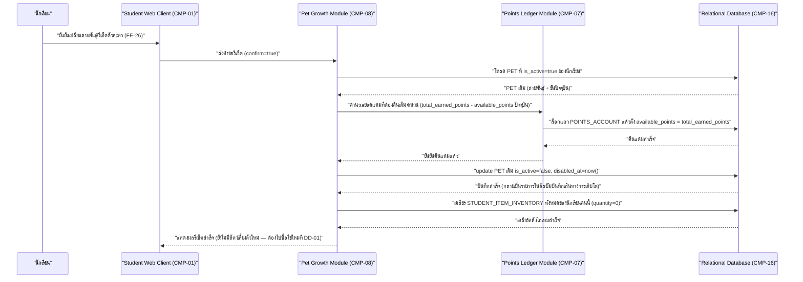

# DD-03 — เปลี่ยนสายพันธุ์/รีเซ็ตตัวละคร

- **Feature:** FE-26 | **Journey:** UJ-01 node M/N2/N3/N4 | **Endpoint:** API-38 (`POST /api/v1/student/me/pet/reset`)
- **Acceptance Criteria ที่ต้องทำให้ผ่าน:** FE-26 **ไม่มีรหัส AC อย่างเป็นทางการ** ในรอบนี้ (ระดับ Could ตาม feature-list.md — ดู Coverage Gap G-06/G-08 ของ acceptance-criteria.md) เอกสารนี้จึงอ้างอิงตรงจาก [[../../../01-requirements/01-spec/20260821-02-pet-points-and-weekly-arena|spec 02]] หัวข้อ ข.3, ค.๑, ซ.6, [[../../../01-requirements/01-spec/20260823-06-battle-support-items|spec 06]] Open Question ข้อ 6 (ปิดแล้ว 2026-08-23) และ [[../../../03-testing/01-test-plan/test-cases/pet-growth-economy|test-cases/pet-growth-economy.md]] รายการ `TC-FE-26-001` ถึง `TC-FE-26-004` โดยตรง รวมทั้ง AC-FE-22-2, AC-FE-73-1, AC-FE-73-2, AC-FE-74-1, AC-FE-74-2 ที่เกี่ยวข้องทางอ้อม

> **สถานะ:** BR-09 และช่องโหว่ "รีเซ็ตแล้วได้แต้มค่าไอเทมคืนวนซ้ำ" **ปิดแล้ว (2026-08-23)** — user ยืนยันกฎอย่างเป็นทางการแล้ว ไม่ใช่ Open Decision อีกต่อไป ดูรายละเอียดที่หัวข้อ 7 (ช่องว่างที่พบเฉพาะ flow นี้)

## 1. Sequence Diagram



## 2. เงื่อนไขก่อนเริ่ม (Precondition)

- มี session นักเรียนที่ valid และ `must_change_pin=false`
- นักเรียนมี `PET` ที่ `is_active=true` อยู่ (มิฉะนั้นไม่มีอะไรให้รีเซ็ต)
- request body ต้องส่ง `confirm: true` มาตรงตัว (ป้องกันกดพลาด เพราะย้อนกลับไม่ได้)

## 3. ขั้นตอนการทำงาน (Pseudo Code)

```
1. รับ studentId จาก session ตรวจสอบสิทธิ์: role ต้องเป็น student -> ไม่ใช่ คืน ERR-02

2. ตรวจ body.confirm === true (ต้องเป็นค่า boolean true ตรงตัว ไม่ใช่ truthy string เช่น "yes")
   ถ้าไม่ใช่ -> คืน ERR-07 (VALIDATION_ERROR "กรุณายืนยันการรีเซ็ต")

3. โหลด PET ที่ is_active=true ของนักเรียนคนนี้
   ถ้าไม่มี -> คืน ERR-03 (NO_ACTIVE_PET "ยังไม่มีสัตว์เลี้ยงให้รีเซ็ต")

4. เริ่ม transaction เดียว ครอบทุกขั้นตอนที่เหลือ — พลาดข้อใดให้ rollback ทั้งหมด:
   a. ล็อกแถว PET เดิม, แถว POINTS_ACCOUNT และแถว STUDENT_ITEM_INVENTORY ทั้งหมดของนักเรียนคนนี้

   b. คำนวณ refundAmount = total_earned_points - available_points (ยอดปัจจุบันของนักเรียนคนนี้)
      (ตาม BR-09: คืนแต้มทั้งหมดที่เคยใช้ไปกับสัตว์เลี้ยงตัวนี้เต็มจำนวน รวมแต้มที่เคยใช้ซื้อไอเทมด้วย
      ไม่ใช่คำนวณเฉพาะค่าไข่+ค่าขั้นตามตาราง BR-01 อีกต่อไป)

   c. ตั้ง available_points = total_earned_points (ไม่แตะ total_earned_points ตาม BR-04)
      ผลลัพธ์: available_points เท่ากับ total_earned_points พอดีเสมอหลังรีเซ็ต ไม่มีข้อยกเว้น

   d. insert POINTS_LEDGER_ENTRY(entry_type='pet_reset_refund', points_delta_available=+refundAmount,
      points_delta_total=0, related_entity_type='pet', related_entity_id=PET เดิม.id)

   e. update PET เดิม: is_active=false, disabled_at=now()
      (ไม่ลบแถว — กลายเป็นรายการในอัลบั้มบันทึกเส้นทางการเติบโตของ FE-72/FE-73 โดยอัตโนมัติ ตาม BR-08)

   f. เคลียร์ STUDENT_ITEM_INVENTORY ทั้งหมดของนักเรียนคนนี้ในทรานแซกชันเดียวกัน:
      update STUDENT_ITEM_INVENTORY set quantity=0 where student_id = นักเรียนคนนี้
      (soft-delete pattern — ไม่ลบแถวจริง ตาม ENT-18) เพื่อปิดช่องโหว่ "รีเซ็ตแล้วได้ทั้งไอเทมและแต้มคืนพร้อมกัน"
      นักเรียนไม่สามารถได้ทั้งไอเทมที่ถือครองอยู่และแต้มคืนพร้อมกัน — เลือกรีเซ็ตต้องแลกกับการเสียไอเทมทั้งหมด

   g. **ไม่ insert PET ใหม่ในขั้นตอนนี้** — ตาม api-spec.md API-38 (response มีเพียง previousPetId/availablePoints/totalEarnedPoints
      ไม่มี newPetId/stage) และ spec 02 ข้อ ซ.6 ("ต้องจ่าย 1 แต้มซื้อไข่ใหม่") นักเรียนต้องไปทำ DD-01 (ซื้อไข่) อีกครั้ง
      เพื่อเลือกสายพันธุ์ใหม่และจ่าย 1 แต้ม — database-schema.md ENT-15 แก้ให้ตรงกับข้อนี้แล้ว ไม่มีความขัดแย้งข้ามเอกสารอีกต่อไป

   h. commit transaction

5. คืนค่า { previousPetId, availablePoints: ยอดใหม่ (เท่ากับ totalEarnedPoints), totalEarnedPoints: ค่าเดิมไม่เปลี่ยน }
```

## 4. กฎธุรกิจและการตรวจสอบ (Business Rules & Validation)

| ID | กฎ | ค่าขอบเขต (ระบุ `<=` หรือ `<` ให้ชัด) | ถ้าละเมิด |
|---|---|---|---|
| BR-04 | `total_earned_points` ต้องไม่เปลี่ยนแปลงจากการรีเซ็ตเลย | ค่าคงที่เสมอ | ถือเป็นบั๊กร้ายแรง |
| BR-06/BR-07 | PET เดิมต้อง `is_active=false` เท่านั้น ไม่ใช่ถูกลบ และไม่มี PET ใหม่ถูกสร้างในขั้นตอนนี้ | มี PET ที่ `is_active=true` = 0 ตัวทันทีหลังรีเซ็ต จนกว่าจะทำ DD-01 | ผิดกฎ BR-07 ถ้ามี PET active มากกว่า 1 ตัวพร้อมกัน |
| BR-08 | จำนวนรายการในอัลบั้มบันทึกเส้นทางการเติบโตต้องเพิ่มขึ้นทีละ 1 ต่อการรีเซ็ต 1 ครั้งเท่านั้น ห้ามลด | `count(PET WHERE student_id=X) หลังรีเซ็ต = count ก่อนรีเซ็ต + 1` | ผิด AC-FE-73-2 |
| BR-09 | refundAmount = `total_earned_points - available_points` ปัจจุบัน (คืนเต็มจำนวน รวมแต้มที่เคยใช้ซื้อไอเทมด้วย) ทำให้ `available_points = total_earned_points` พอดีหลังรีเซ็ตเสมอ ไม่มีข้อยกเว้น | `available_points` หลังรีเซ็ต ต้อง `=` `total_earned_points` เป๊ะ (ไม่ใช่ `<=`) | ถ้า `available_points != total_earned_points` หลัง commit = บั๊กร้ายแรง (ผิดกฎเดิมข้อ ข.3) |
| BR-09 (ต่อเนื่อง) | ไอเทมทั้งหมดใน `STUDENT_ITEM_INVENTORY` ของนักเรียนคนนี้ต้องถูกตั้ง `quantity=0` ในธุรกรรมเดียวกับการคืนแต้ม ห้ามเหลือไอเทมที่ `quantity > 0` หลังรีเซ็ต | ทุกแถวของนักเรียนคนนี้ต้อง `quantity = 0` ทันทีหลัง commit | เปิดช่องโหว่ "ได้ทั้งไอเทมและแต้มคืนพร้อมกัน" ที่กฎนี้มีไว้ปิด |

## 5. กรณีผิดพลาดและการรับมือ (Edge Case & Error Handling)

| ID | สถานการณ์ | ระบบต้องทำ | Status + ข้อความ |
|---|---|---|---|
| ERR-01 | ไม่มี session / session หมดอายุ | ปฏิเสธทันที | 401 UNAUTHENTICATED |
| ERR-07 | `confirm` ไม่ใช่ `true` | ปฏิเสธก่อนแตะ transaction | 400 VALIDATION_ERROR — "กรุณายืนยันการรีเซ็ต" |
| ERR-03 | ไม่มี `PET` ที่ `is_active=true` ให้รีเซ็ต | ปฏิเสธก่อนแตะ transaction | 404 NO_ACTIVE_PET — "ยังไม่มีสัตว์เลี้ยงให้รีเซ็ต" |
| ไม่มีสิทธิ์ | role ไม่ใช่ student | ปฏิเสธก่อนแตะ business logic | ERR-02 |
| กดซ้ำ/ยิงซ้ำ (idempotency) | นักเรียนกดปุ่มรีเซ็ตซ้ำเร็วสองครั้งติดกัน | คำขอที่สองจะไม่พบ `PET` ที่ `is_active=true` อีกต่อไป (ถ้าคำขอแรก commit ไปแล้ว) เพราะ PET เดิมถูกตั้ง `is_active=false` ไปแล้ว และ `STUDENT_ITEM_INVENTORY` ถูกเคลียร์ไปแล้วในรอบแรก | คำขอที่สองได้ ERR-03 ไม่ใช่การคืนแต้มซ้ำสองรอบ และไม่มีไอเทมให้เคลียร์ซ้ำ |
| แย่งกันแก้ข้อมูลพร้อมกัน (race condition) | นักเรียนกดรีเซ็ตพร้อมกับกดปลดล็อกขั้น (DD-02) หรือซื้อไอเทม (DD-04) จากอีกอุปกรณ์ในเวลาไล่เลี่ยกัน | ต้องล็อกแถว `PET` เดิม, `POINTS_ACCOUNT` และ `STUDENT_ITEM_INVENTORY` ร่วมกันระหว่าง transaction ของ endpoint ที่เกี่ยวข้องทั้งหมด เพื่อให้ลำดับใดลำดับหนึ่งเกิดก่อนอีกอันเสมอ ไม่ใช่คำนวณ refund จากยอดเดิมพร้อมกับที่อีก transaction กำลังหักแต้ม/เพิ่มไอเทมในเวลาเดียวกันจนข้อมูลเพี้ยน | ธุรกรรมที่มาทีหลังต้องเห็นผลของธุรกรรมที่ commit ก่อนแล้วเสมอ |
| ระบบภายนอกล่ม | - | flow นี้ไม่มี dependency ต่อระบบภายนอกใดๆ | ไม่มีสถานการณ์นี้ในเอกสารนี้ |

## 6. การเปลี่ยนสถานะ (State Transition)

```mermaid
stateDiagram-v2
    "PET เดิม (is_active=true, stage ใดๆ)" --> "PET เดิม (is_active=false, disabled_at=now)" : "รีเซ็ตสำเร็จ (DD-03)"
    "PET เดิม (is_active=false, disabled_at=now)" --> "รายการในอัลบั้มบันทึกเส้นทางการเติบโต" : "ถาวร (BR-08)"
    "STUDENT_ITEM_INVENTORY (quantity ใดๆ)" --> "STUDENT_ITEM_INVENTORY (quantity=0 ทุกแถว)" : "รีเซ็ตสำเร็จ (DD-03, พร้อมกับ PET)"
    note right of "PET เดิม (is_active=false, disabled_at=now)"
        ไม่มี PET ที่ is_active=true อีกจนกว่าจะทำ DD-01 (ซื้อไข่) ใหม่
    end note
```

| จาก | ไป | เงื่อนไข | เกิดที่ |
|---|---|---|---|
| `PET.is_active=true` | `PET.is_active=false` | `confirm=true` และมี PET active อยู่ | DD-03 (API-38) |
| `STUDENT_ITEM_INVENTORY.quantity` ใดๆ | `STUDENT_ITEM_INVENTORY.quantity=0` (ทุกแถวของนักเรียนคนนี้) | เกิดพร้อมกันในธุรกรรมเดียวกับการปิด PET เดิม | DD-03 (API-38) |
| (ไม่มี PET active) | `PET.is_active=true` (ตัวใหม่, `stage='egg'`) | ต้องทำ DD-01 (API-36) แยกต่างหาก จ่าย 1 แต้มใหม่ | DD-01 เท่านั้น ไม่ใช่ DD-03 |

## 7. ช่องว่างที่พบเฉพาะ flow นี้ (อ้างอิงจากหัวข้อ 5 ของ detailed-design.md)

- ~~**G-DD-01:** กฎการคำนวณ refundAmount ในขั้นตอนที่ 4.b เป็น**สมมติฐานที่ผู้ช่วยเสนอ ยังไม่ผ่านการยืนยันจาก user อย่างเป็นทางการ** — ต้องเปิด requirement ใหม่ยืนยันก่อนพัฒนาโค้ดจริง~~ **ปิดแล้ว (2026-08-23):** user ปฏิเสธข้อเสนอเดิมและยืนยันกฎที่ถูกต้องแทน — คืนแต้มเต็มจำนวนรวมค่าไอเทม (BR-09 แก้ไขแล้ว) แลกกับการเคลียร์ `STUDENT_ITEM_INVENTORY` ทั้งหมดพร้อมกัน อ้างอิง spec 06 Open Question ข้อ 6 (ปิดแล้ว 2026-08-23)
- ~~**G-DD-02:** พบความขัดแย้งระหว่าง database-schema.md (ENT-15 บอกว่า reset ต้อง insert PET ใหม่ทันที) กับ api-spec.md/spec 02 (บอกว่าต้องจ่าย 1 แต้มซื้อไข่ใหม่แยกต่างหาก) — เอกสารนี้ยึดตาม api-spec.md/spec 02 และรายงานความขัดแย้งนี้ให้แก้ที่ database-schema.md ในรอบ `sync-api-db` ถัดไป~~ **ปิดแล้ว (2026-08-23):** database-schema.md ข้อ ENT-15 ถูกแก้ให้ตรงกับ api-spec.md/spec 02 แล้ว ยืนยันว่าการรีเซ็ตไม่ insert `PET` ใหม่ทันที — ไม่มีความขัดแย้งข้ามเอกสารอีกต่อไป
