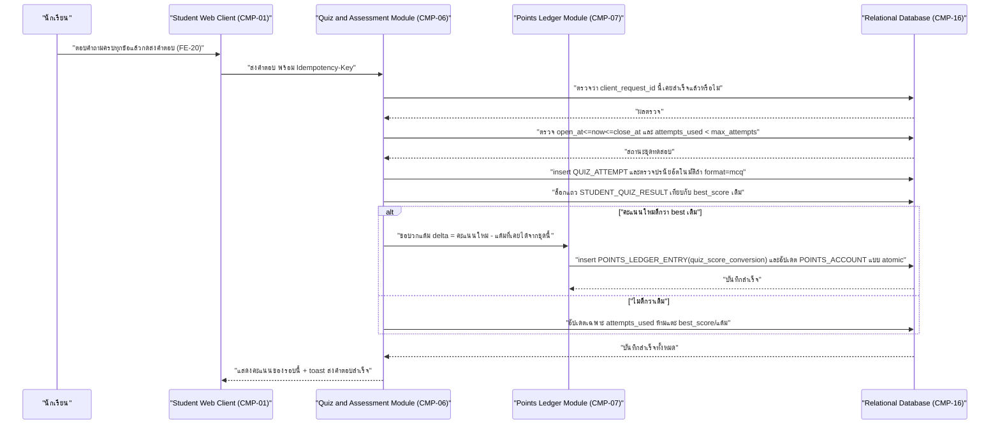
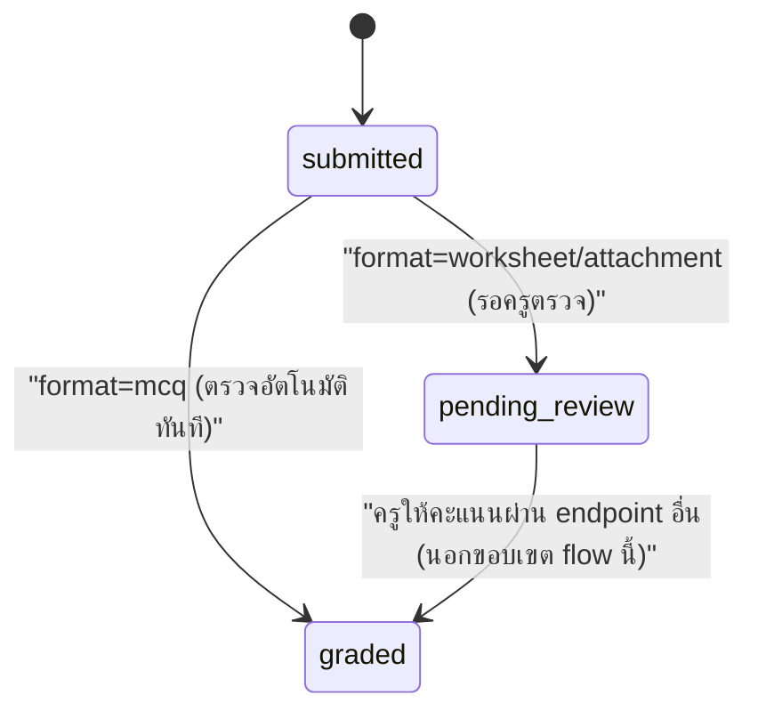

# DD-05 — ส่งคำตอบแบบทดสอบ / ยึดคะแนนรอบที่ดีที่สุด

- **Feature:** FE-16, FE-20, FE-41 | **Journey:** UJ-01 node G–L | **Endpoint:** API-31 (`POST /api/v1/student/quizzes/{quizId}/attempts`)
- **Acceptance Criteria ที่ต้องทำให้ผ่าน:** AC-FE-16-1, AC-FE-16-2, AC-FE-16-3, AC-FE-20-1, AC-FE-20-2, AC-FE-41-1, AC-FE-41-2, AC-FE-21-1, AC-FE-21-2, AC-FE-22-1, AC-FE-22-2

## 1. Sequence Diagram



## 2. เงื่อนไขก่อนเริ่ม (Precondition)

- มี session นักเรียนที่ valid และ `must_change_pin=false`
- `QUIZ_SET` ที่ระบุมีอยู่จริง และเวลาปัจจุบันอยู่ในช่วง `open_at <= now <= close_at`
- จำนวนรอบที่ทำไปแล้ว (`attempts_used`) ยังไม่ถึง `max_attempts`
- Request ต้องแนบ header `Idempotency-Key` เสมอ

## 3. ขั้นตอนการทำงาน (Pseudo Code)

```
1. รับ studentId จาก session, quizId จาก path, Idempotency-Key จาก header, body ตามชนิด format
   ตรวจสอบสิทธิ์: role ต้องเป็น student -> ไม่ใช่ คืน ERR-02

2. โหลด QUIZ_SET by quizId -> ถ้าไม่พบ คืน ERR-03 (NOT_FOUND)

3. ตรวจ open_at <= now <= close_at -> ถ้าไม่ใช่ คืน ERR-11 (QUIZ_NOT_OPEN)

4. ค้นหา QUIZ_ATTEMPT ที่ (quiz_set_id, student_id, client_request_id=Idempotency-Key) มีอยู่แล้วหรือไม่ (BR-17)
   ถ้ามี -> คืนผลลัพธ์เดิมของ attempt นั้นทันที (ERR-12, ไม่ใช่ error จริง) ไม่ทำขั้นตอนถัดไปซ้ำ

5. ตรวจ attempts_used < max_attempts -> ถ้าครบแล้ว คืน ERR-11 (ATTEMPT_LIMIT_REACHED)

6. ตรวจความครบถ้วนของ body ตามชนิด format:
   - format=mcq: answers ต้องตอบครบทุกข้อ -> ไม่ครบ คืน ERR-07 (VALIDATION_ERROR "กรุณาเลือกคำตอบให้ครบทุกข้อก่อนส่ง")
   - format=attachment: ต้องมี workAttachmentRef ที่อัปโหลดไว้ก่อนแล้ว

7. เริ่ม transaction เดียว ครอบทุกขั้นตอนที่เหลือ — พลาดข้อใดให้ rollback ทั้งหมด (ห้ามมี QUIZ_ATTEMPT ค้างโดยไม่มี ledger คู่กัน):
   a. ล็อกแถว STUDENT_QUIZ_RESULT ของ (student, quiz) ถ้ายังไม่มีให้เตรียมค่าเริ่มต้น best_score=0, points_awarded_total=0, attempts_used=0
      และล็อกแถว POINTS_ACCOUNT ของนักเรียนคนนี้ (กัน race condition ตาม DF-01)
   b. attemptNumber = attempts_used(เดิม) + 1
   c. insert QUIZ_ATTEMPT(client_request_id=Idempotency-Key, attempt_number=attemptNumber)
      ถ้า format=mcq: ตรวจปรนัยอัตโนมัติทันที
         scoreAwarded = (จำนวนข้อที่ตอบถูก / จำนวนข้อทั้งหมด) * QUIZ_SET.full_score  (สูตรสัดส่วนตาม AC-FE-21-1 — ไม่ปัดเศษจนเกิน/ขาดคะแนนเต็ม ตาม AC-FE-21-2)
         status = 'graded'
      ถ้า format=worksheet/attachment: status='pending_review', scoreAwarded=null (ครูให้คะแนนภายหลังผ่าน endpoint อื่น ไม่ใช่ flow นี้)

   d. ถ้า format=mcq (มีคะแนนทันที):
      ถ้า scoreAwarded > best_score เดิม (เท่ากันไม่ถือว่า "ดีกว่า" ตาม BR-16 — ยึดรอบแรกที่ทำได้คะแนนนั้น):
         newPointsForQuiz = แปลงคะแนนเป็นแต้มตามสัดส่วนคะแนนเต็มที่ครูตั้ง (อัตราแปลงยังไม่ล็อกตัวเลขตายตัว — ดู Gap G-DD-06)
         delta = newPointsForQuiz - points_awarded_total(เดิม)
         update STUDENT_QUIZ_RESULT: best_attempt_id=attempt ใหม่, best_score=scoreAwarded, points_awarded_total=newPointsForQuiz, attempts_used=attemptNumber
         insert POINTS_LEDGER_ENTRY(entry_type='quiz_score_conversion', points_delta_available=delta, points_delta_total=delta, related_entity_id=quizId)
         update POINTS_ACCOUNT: available_points += delta, total_earned_points += delta   (BR-04: total_earned_points เพิ่มได้จากจุดนี้เท่านั้นในบรรดา 8 flow นี้)
         isNewBest = true, pointsEarnedThisAttempt = delta
      ไม่ดีกว่าเดิม (BR-16 — AC-FE-41-2):
         update STUDENT_QUIZ_RESULT: attempts_used=attemptNumber เท่านั้น
         **ห้ามแก้ best_score / points_awarded_total / POINTS_ACCOUNT ใดๆ**
         isNewBest = false, pointsEarnedThisAttempt = 0
         ไม่ insert POINTS_LEDGER_ENTRY ใหม่

   e. ถ้า format=worksheet/attachment: update STUDENT_QUIZ_RESULT.attempts_used=attemptNumber เท่านั้น (แต้มคำนวณตอนครู grade)

   f. commit transaction

8. คืนค่า { attemptId, attemptNumber, status, scoreAwarded, isNewBest, pointsEarnedThisAttempt }
```

## 4. กฎธุรกิจและการตรวจสอบ (Business Rules & Validation)

| ID | กฎ | ค่าขอบเขต (ระบุ `<=` หรือ `<` ให้ชัด) | ถ้าละเมิด |
|---|---|---|---|
| BR-16 | ยึดคะแนนรอบที่ดีที่สุด — รอบใหม่ต้อง**มากกว่า** (`>` ไม่ใช่ `>=`) best เดิมจึงจะนับเป็น "ดีกว่า" | เท่ากันพอดี = ไม่อัปเดต (ยึดรอบแรกที่ทำได้คะแนนนั้นตาม ENT-09) | ถ้าอัปเดตทั้งที่เท่ากันหรือแย่กว่า ผิด AC-FE-41-2 |
| BR-17 | ต้องกันส่งซ้ำด้วย `Idempotency-Key` | คำขอ key ซ้ำ = คืนผลเดิม ไม่สร้าง attempt/ledger ใหม่ | เสี่ยงบวกแต้มซ้ำจาก retry เครือข่าย |
| - | จำนวนรอบที่ทำได้ `attempt_number <= max_attempts` | `<=` (เท่ากับ max_attempts ทำได้พอดี ทำรอบถัดไปไม่ได้) | ERR-11 |
| - | คะแนน mcq ตอบถูกครบทุกข้อ = คะแนนเต็มพอดี ไม่มากไม่น้อยกว่านั้น | `scoreAwarded = fullScore` พอดีเมื่อถูกครบ | ผิด AC-FE-16-2/AC-FE-21-2 |

## 5. กรณีผิดพลาดและการรับมือ (Edge Case & Error Handling)

| ID | สถานการณ์ | ระบบต้องทำ | Status + ข้อความ |
|---|---|---|---|
| ERR-01 | ไม่มี session / session หมดอายุ | ปฏิเสธทันที | 401 UNAUTHENTICATED |
| ERR-03 | ไม่พบ `quizId` | ปฏิเสธก่อนแตะ transaction | 404 NOT_FOUND |
| ERR-11 | ยังไม่เปิด/ปิดรับคำตอบแล้ว หรือทำครบจำนวนรอบแล้ว | ปฏิเสธก่อนแตะ transaction | 403 QUIZ_NOT_OPEN / ATTEMPT_LIMIT_REACHED |
| ERR-07 | ตอบไม่ครบทุกข้อ (format=mcq) | ปฏิเสธก่อนแตะ transaction ไม่บันทึกอะไรเลย | 400 VALIDATION_ERROR |
| ERR-12 | `Idempotency-Key` ซ้ำกับคำขอก่อนหน้าที่สำเร็จแล้ว (กดซ้ำ/ยิงซ้ำจากเครือข่ายหลุด) | คืนผลลัพธ์เดิมของ attempt นั้น ไม่สร้าง attempt ใหม่ ไม่บวกแต้มซ้ำ | 200 พร้อมผลเดิม (ไม่ใช่ error จริง ตาม BR-17) |
| แย่งกันแก้ข้อมูลพร้อมกัน (race condition) | นักเรียนเปิดสองแท็บแล้วส่งคำตอบชุดเดียวกันพร้อมกันด้วย `Idempotency-Key` คนละค่า | ล็อกแถว `STUDENT_QUIZ_RESULT` ระหว่าง transaction (ขั้นตอน 7.a) เพื่อให้คำขอที่สองเห็น `attempts_used`/`best_score` ล่าสุดก่อนตัดสินใจ ป้องกันทำเกิน `max_attempts` หรือคำนวณ delta แต้มผิดจากการอ่านค่าเก่าพร้อมกัน | คำขอที่มาทีหลังต้องเห็นผลของคำขอที่ commit ก่อนแล้วเสมอ อาจได้ ERR-11 ถ้าเกินโควตาแล้ว |
| ระบบภายนอกล่ม | - | flow นี้ตรวจปรนัยด้วย logic ภายในระบบเอง ไม่เรียก AI Gateway หรือระบบภายนอกใดๆ | ไม่มีสถานการณ์นี้ในเอกสารนี้ (ต่างจาก DF-01 ของ architecture.md ที่ AI TTS เป็นคนละ endpoint/คนละ flow) |

## 6. การเปลี่ยนสถานะ (State Transition)



| จาก | ไป | เงื่อนไข | เกิดที่ |
|---|---|---|---|
| (ไม่มี attempt) | `QUIZ_ATTEMPT.status='graded'` | `format='mcq'` | DD-05 (API-31) ทันที |
| (ไม่มี attempt) | `QUIZ_ATTEMPT.status='pending_review'` | `format IN ('worksheet','attachment')` | DD-05 (API-31) |
| `pending_review` | `graded` | ครูกรอกคะแนนผ่าน `API-28` | นอกขอบเขต DD-05 |
