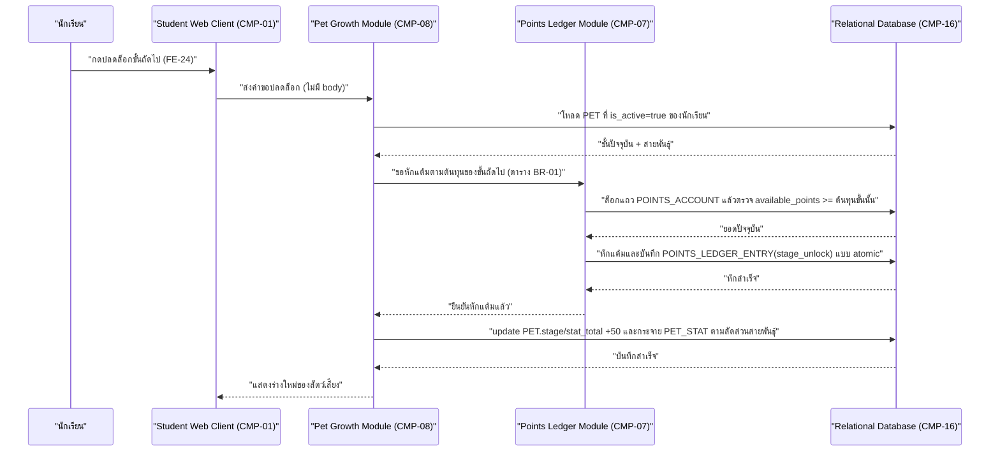
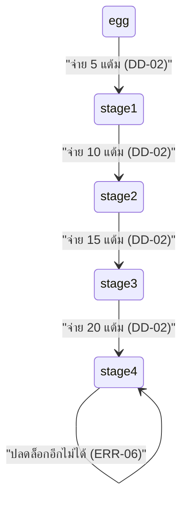

# DD-02 — ปลดล็อกขั้นการเติบโตถัดไป

- **Feature:** FE-24, FE-77 | **Journey:** UJ-01 node M/N/N5 | **Endpoint:** API-37 (`POST /api/v1/student/me/pet/unlock-next-stage`)
- **Acceptance Criteria ที่ต้องทำให้ผ่าน:** AC-FE-24-4, AC-FE-24-5, AC-FE-24-6, AC-FE-24-7, AC-FE-24-8, AC-FE-24-9, AC-FE-24-10, AC-FE-77-1, AC-FE-77-2, AC-FE-77-3, AC-FE-77-4, AC-FE-77-5

## 1. Sequence Diagram



## 2. เงื่อนไขก่อนเริ่ม (Precondition)

- มี session นักเรียนที่ valid และ `must_change_pin=false`
- นักเรียนมี `PET` ที่ `is_active=true` อยู่แล้ว (ผ่าน DD-01 มาก่อน)
- `PET.stage` ยังไม่ถึง `stage4` (ยังมีขั้นถัดไปให้ปลดล็อก)

## 3. ขั้นตอนการทำงาน (Pseudo Code)

```
1. รับ studentId จาก session ตรวจสอบสิทธิ์: role ต้องเป็น student -> ไม่ใช่ คืน ERR-02

2. โหลด PET ที่ is_active=true ของนักเรียนคนนี้
   ถ้าไม่มี -> คืน ERR-03 (NO_ACTIVE_PET "ยังไม่มีสัตว์เลี้ยง — ไปซื้อไข่ตัวแรกกันเถอะ")

3. ถ้า PET.stage == 'stage4' -> คืน ERR-06 (STAGE_ALREADY_MAX)

4. กำหนดขั้นถัดไปและต้นทุนแบบขั้นต่อขั้น (BR-01, ตัวเลขล็อกแล้วห้ามคิดใหม่):
   egg -> stage1 : ต้นทุน 5
   stage1 -> stage2 : ต้นทุน 10
   stage2 -> stage3 : ต้นทุน 15
   stage3 -> stage4 : ต้นทุน 20

5. เริ่ม transaction เดียว ครอบทุกขั้นตอนที่เหลือ — พลาดข้อใดให้ rollback ทั้งหมด:
   a. ล็อกแถว POINTS_ACCOUNT ของนักเรียนคนนี้ (กัน race condition)
   b. ตรวจ available_points >= ต้นทุนของขั้นถัดไป (BR-03 ใช้ >= ไม่ใช่ >)
      ถ้าไม่พอ -> rollback แล้วคืน ERR-04 (INSUFFICIENT_POINTS "ยังสะสมแต้มที่ใช้ได้ไม่พอ ต้องมีอย่างน้อย {required} แต้ม (ตอนนี้มี {available} แต้ม)")
   c. หัก available_points -= ต้นทุนของขั้นถัดไป (ไม่แตะ total_earned_points ตาม BR-04/BR-05)
   d. insert POINTS_LEDGER_ENTRY(entry_type='stage_unlock', points_delta_available=-ต้นทุน, points_delta_total=0,
      related_entity_type='pet', related_entity_id=PET.id)
   e. update PET: stage=ขั้นถัดไป, stat_total += 50, updated_at=now
   f. โหลด SPECIES_STAT_SPLIT ของสายพันธุ์ของ PET นี้ แล้วเพิ่มค่าใน PET_STAT แต่ละ stat_key ตาม points_per_stage
      ตรวจว่าผลรวมของค่าที่เพิ่มทั้งหมดในรอบนี้ = 50 พอดี (BR-02, AC-FE-77-2) — ถ้าไม่เท่ากับ 50 ให้ rollback ทั้งหมด
   g. commit transaction

6. คืนค่า { petId, stage: ขั้นใหม่, statTotal: ค่าใหม่, availablePoints: ยอดใหม่หลังหัก }
   (ถ้าขั้นใหม่เป็น stage4 ให้ระบุใน response ว่า nextStageCost=null ตาม AC-FE-24-7)
```

## 4. กฎธุรกิจและการตรวจสอบ (Business Rules & Validation)

| ID | กฎ | ค่าขอบเขต (ระบุ `<=` หรือ `<` ให้ชัด) | ถ้าละเมิด |
|---|---|---|---|
| BR-01 | ต้นทุนต่อขั้นจ่ายแบบขั้นต่อขั้น (incremental) ไม่ใช่ยอดสะสมที่ต้องมี | egg→stage1=5, stage1→stage2=10, stage2→stage3=15, stage3→stage4=20 (สะสมรวม 51 ที่ stage4 นับรวมค่าไข่) | ถ้า implement เป็นยอดสะสมที่ต้องมีครบก่อนขึ้น (เช่น ต้องมี 51 แต้มถึงจะขึ้น stage1 ได้) ถือว่าผิด AC-FE-24-9 |
| BR-03 | เงื่อนไขปลดล็อกใช้ `available_points >= ต้นทุนขั้นนั้น` | ตัวอย่างขอบ: มี 14 แต้มปลดร่างที่ 3 (ต้องการ 15) ไม่ได้ (AC-FE-24-8), มี 15 พอดีได้ (AC-FE-24-6) | ERR-04 |
| BR-02 | แต้มสเตตัสรวมเพิ่ม +50 ทุกขั้น ผลรวมที่เพิ่มต้อง = 50 พอดี | stage1=100, stage2=150, stage3=200, stage4=250 (สูงสุด) | rollback ทั้ง transaction |
| - | ไม่มีหน้าจอ/input ให้นักเรียนกำหนดเองว่าจะหารแต้มสเตตัสลงค่าใด (AC-FE-77-3) | ต้องเป็น `0` input ที่เกี่ยวข้องใน DOM เสมอ | ถือเป็นข้อบกพร่องด้าน UI ที่ต้องแก้ ไม่ใช่ endpoint นี้โดยตรง แต่ backend ต้องไม่มี field ให้ client ส่งค่าการหารมาเอง |

## 5. กรณีผิดพลาดและการรับมือ (Edge Case & Error Handling)

| ID | สถานการณ์ | ระบบต้องทำ | Status + ข้อความ |
|---|---|---|---|
| ERR-01 | ไม่มี session / session หมดอายุ | ปฏิเสธทันที | 401 UNAUTHENTICATED |
| ERR-03 | ไม่มี `PET` ที่ `is_active=true` | ปฏิเสธก่อนแตะ transaction | 404 NO_ACTIVE_PET |
| ERR-06 | `PET.stage == 'stage4'` แล้ว (สูงสุด) | ไม่หักแต้ม ไม่เปลี่ยนสถานะ | 409 STAGE_ALREADY_MAX |
| ERR-04 | `available_points` ไม่ถึงเกณฑ์ของขั้นถัดไป | ไม่หักแต้ม ไม่เปลี่ยนสถานะ | 422 INSUFFICIENT_POINTS — ข้อความต้องเป็นกลาง ไม่ตำหนิผู้ใช้ (AC-FE-23-2) |
| ข้อมูลนำเข้าไม่ถูกต้อง | endpoint นี้ไม่มี body ตาม api-spec.md — ถ้า client ส่ง field แปลกปลอมมา (เช่นพยายามระบุ `targetStage` เอง) | ต้อง**เพิกเฉยต่อ field ที่ไม่รู้จักทั้งหมด** และปลดล็อก "ขั้นถัดไปจากขั้นปัจจุบันเสมอ" เท่านั้น ห้ามให้ client กำหนดขั้นปลายทางเอง | ดำเนินการตามขั้นตอนปกติ ไม่ error |
| กดซ้ำ/ยิงซ้ำ (idempotency) | นักเรียนกดปุ่มปลดล็อกซ้ำเร็วสองครั้งติดกัน | คำขอที่สองต้องเห็นสถานะ `stage`/`available_points` ที่อัปเดตจากคำขอแรกแล้ว (ผ่าน row lock ในขั้นตอน 5.a) มิฉะนั้นเสี่ยงหักแต้ม 2 ครั้งสำหรับ 1 ขั้น หรือเลื่อน 2 ขั้นด้วยการหักครั้งเดียว | คำขอที่สองควรได้ผลลัพธ์ของขั้นถัดไปอีกขั้น (ถ้าแต้มพอ) หรือ ERR-04/ERR-06 ตามสถานะจริงหลังคำขอแรก ไม่ใช่ผลลัพธ์ซ้ำหรือข้อมูลเพี้ยน |
| แย่งกันแก้ข้อมูลพร้อมกัน (race condition) | สองอุปกรณ์กดปลดล็อกพร้อมกันขณะแต้มพอสำหรับปลดล็อกได้เพียง 1 ครั้ง | ล็อกแถว `POINTS_ACCOUNT` และ `PET` ระหว่าง transaction เพื่อให้คำขอที่สองเห็นยอด/ขั้นล่าสุดก่อนตัดสินใจ ป้องกันปลดล็อกซ้อนสองขั้นจากแต้มก้อนเดียว | คำขอที่สองได้ ERR-04 ถ้าแต้มไม่พอสำหรับขั้นถัดไปอีกขั้นแล้ว |
| ระบบภายนอกล่ม | - | flow นี้ไม่มี dependency ต่อระบบภายนอกใดๆ | ไม่มีสถานการณ์นี้ในเอกสารนี้ |

## 6. การเปลี่ยนสถานะ (State Transition)



| จาก | ไป | เงื่อนไข | เกิดที่ |
|---|---|---|---|
| `egg` | `stage1` | `available_points >= 5` | DD-02 (API-37) |
| `stage1` | `stage2` | `available_points >= 10` | DD-02 (API-37) |
| `stage2` | `stage3` | `available_points >= 15` | DD-02 (API-37) |
| `stage3` | `stage4` | `available_points >= 20` | DD-02 (API-37) |
| `stage4` | (ไม่มีขั้นถัดไป) | - | ปฏิเสธด้วย ERR-06 เสมอ |
