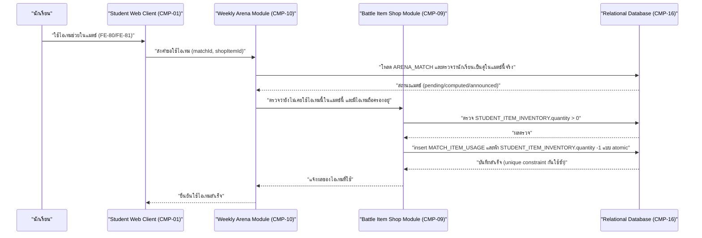

# DD-06 — ใช้ไอเทมในแมตช์

- **Feature:** FE-80, FE-81 | **Journey:** UJ-03 node P1 | **Endpoint:** API-45 (`POST /api/v1/student/arena/matches/{matchId}/use-item`)
- **Acceptance Criteria ที่ต้องทำให้ผ่าน:** FE-80/FE-81 **ไม่มีรหัส AC อย่างเป็นทางการ** ในรอบนี้ (acceptance-criteria.md ปิดเมื่อ 2026-08-22 ก่อน spec 06 เพิ่มเข้ามาวันถัดไป — ดู architecture.md ข้อ 9) เอกสารนี้จึงอ้างอิงตรงจาก [[../../../01-requirements/01-spec/20260823-06-battle-support-items|spec 06]] Acceptance Criteria checklist ("ไอเทม ล้างสถานะ ใช้ได้ 1 ครั้งต่อแมตช์แล้วหมดไป", "ไอเทม ป้องกันการโจมตีถึงตาย กันไม่ให้ HP ถึง 0 ได้ 1 ครั้งต่อแมตช์", "ไอเทมช่วยไม่ทำให้ค่าสเตตัสของสัตว์เลี้ยงเปลี่ยนแปลง") และ AC-FE-27-2 (การแพ้ไม่มีผลเสีย)

## 1. Sequence Diagram



## 2. เงื่อนไขก่อนเริ่ม (Precondition)

- มี session นักเรียนที่ valid และ `must_change_pin=false`
- `ARENA_MATCH` ที่ระบุมีอยู่จริง และนักเรียนคนนี้เป็นหนึ่งในสองฝ่ายของแมตช์นั้น
- `ARENA_MATCH.status != 'announced'` (แมตช์ยังไม่จบ)
- นักเรียนถือครองไอเทมนี้อยู่ (`STUDENT_ITEM_INVENTORY.quantity > 0`)

## 3. ขั้นตอนการทำงาน (Pseudo Code)

```
1. รับ studentId จาก session, matchId จาก path, shopItemId จาก body
   ตรวจสอบสิทธิ์: role ต้องเป็น student -> ไม่ใช่ คืน ERR-02

2. โหลด ARENA_MATCH by matchId
   ถ้าไม่พบ หรือ studentId ไม่ใช่ฝ่ายใดฝ่ายหนึ่งของแมตช์นี้ -> คืน ERR-03 (NOT_FOUND "ไม่พบแมตช์นี้")
   (ไม่บอกเหตุผลละเอียดว่า "มีแมตช์นี้แต่ไม่ใช่ของคุณ" เพื่อกันเดา matchId ของคนอื่น)

3. ตรวจ ARENA_MATCH.status != 'announced'
   ถ้าประกาศผลไปแล้ว -> คืน ERR-09 (MATCH_ALREADY_ANNOUNCED "แมตช์นี้จบไปแล้ว ใช้ไอเทมไม่ได้อีก")

4. ตรวจ STUDENT_ITEM_INVENTORY(student_id, shop_item_id).quantity > 0
   ถ้าไม่มีถือครองอยู่ -> คืน ERR-10 (ITEM_NOT_OWNED "ไม่มีไอเทมนี้ในคลังของคุณ")

5. เริ่ม transaction เดียว ครอบทุกขั้นตอนที่เหลือ — พลาดข้อใดให้ rollback ทั้งหมด:
   a. ตรวจว่ายังไม่มีแถว MATCH_ITEM_USAGE ที่ (arena_match_id, student_id, shop_item_id) นี้อยู่ก่อน
      (การ insert ในขั้นถัดไปจะถูกกันซ้ำจริงด้วย unique constraint ระดับฐานข้อมูลตาม BR-11 อีกชั้นหนึ่ง)
      ถ้าพบว่ามีอยู่แล้ว -> rollback แล้วคืน ERR-08 (ITEM_ALREADY_USED)
   b. insert MATCH_ITEM_USAGE(arena_match_id=matchId, student_id, shop_item_id, used_at=now)
      ถ้า insert ชนกับ unique constraint (arena_match_id, student_id, shop_item_id) เพราะมีคำขอคู่ขนานแทรกมาก่อน
      -> rollback แล้วคืน ERR-08 (ITEM_ALREADY_USED) แทนที่จะปล่อยเป็น 500
   c. [กฎการถือครองไอเทมยังไม่ล็อกอย่างเป็นทางการ — ดู Gap G-DD-04 — เอกสารนี้เลือกพฤติกรรม "ใช้แล้วหมดไป" เป็นค่าเริ่มต้น]
      หัก STUDENT_ITEM_INVENTORY.quantity -= 1 (ต้องรอ user ยืนยันก่อนพัฒนาจริงว่าเลือกพฤติกรรมนี้ถูกต้อง)
   d. บันทึกผลของไอเทมไว้ให้ CMP-10 ใช้ตอนคำนวณ/ประกาศผลแมตช์ (ดู DD-07):
      - shopItem.code='cleanse_status' -> ล้างผลของพลังพิเศษที่กำลังติดอยู่กับฝ่ายนักเรียนคนนี้ในแมตช์นี้ (BR-10: ไม่กระทบค่าสเตตัสถาวร)
      - shopItem.code='prevent_death' -> ตั้ง flag "กันตาย 1 ครั้ง" ให้ฝ่ายนักเรียนคนนี้ในแมตช์นี้ (ใช้ตอนคำนวณผลใน DD-07 เพื่อไม่ให้ HP ถึง 0 ในรอบที่ควรจะตาย)
      (การคำนวณผลจริงของไอเทมเหล่านี้เกิดตอนคำนวณผลแมตช์ใน DD-07 ไม่ใช่ตอนนี้ — endpoint นี้เพียงบันทึกว่า "ใช้แล้ว" และผลที่จะมีผล)
   e. commit transaction

6. คืนค่า { matchId, shopItemId, used: true }
```

## 4. กฎธุรกิจและการตรวจสอบ (Business Rules & Validation)

| ID | กฎ | ค่าขอบเขต (ระบุ `<=` หรือ `<` ให้ชัด) | ถ้าละเมิด |
|---|---|---|---|
| BR-11 | ไอเทมหนึ่งชนิดใช้ได้อย่างมาก **1 ครั้ง** ต่อฝ่ายต่อแมตช์ | `count(MATCH_ITEM_USAGE WHERE match, student, item) <= 1` เสมอ | ERR-08 |
| BR-10 | ไอเทมไม่กระทบ `PET.stat_total`/`PET_STAT` เลย | ไม่มีการเขียนแตะตาราง `PET`/`PET_STAT` ใน transaction นี้เลย | ผิด spec 06 ข้อ ค. |
| - | ใช้ไอเทมได้เฉพาะก่อนแมตช์ประกาศผล | `ARENA_MATCH.status != 'announced'` | ERR-09 |
| G-DD-04 (ยังไม่ล็อก) | หักจำนวนไอเทมในคลังเมื่อใช้หรือไม่ | เอกสารนี้เลือก "หัก 1" เป็นค่าเริ่มต้น — ยังไม่ยืนยันจาก user | ต้องรอ requirement ใหม่ก่อนพัฒนาจริง |

## 5. กรณีผิดพลาดและการรับมือ (Edge Case & Error Handling)

| ID | สถานการณ์ | ระบบต้องทำ | Status + ข้อความ |
|---|---|---|---|
| ERR-01 | ไม่มี session / session หมดอายุ | ปฏิเสธทันที | 401 UNAUTHENTICATED |
| ERR-07 | ไม่ส่ง `shopItemId` หรือรูปแบบไม่ถูกต้อง (ตาม API-45) | ปฏิเสธก่อนแตะ transaction ใดๆ | 400 VALIDATION_ERROR — "กรุณาเลือกไอเทมที่ต้องการใช้" |
| ERR-03 | ไม่พบ `matchId` หรือไม่ใช่คู่ของตนเอง | ปฏิเสธก่อนแตะ transaction ไม่เปิดเผยว่ามีแมตช์นี้อยู่จริงหรือไม่ | 404 NOT_FOUND |
| ERR-09 | แมตช์ประกาศผลแล้ว | ปฏิเสธก่อนแตะ transaction | 409 MATCH_ALREADY_ANNOUNCED |
| ERR-10 | ไม่มีไอเทมนี้ถือครองอยู่ | ปฏิเสธก่อนแตะ transaction | 422 ITEM_NOT_OWNED |
| ERR-08 (กดซ้ำ/ยิงซ้ำ) | นักเรียนกดใช้ไอเทมเดียวกันซ้ำเร็วสองครั้งติดกัน (double-click) ก่อน response แรกกลับมา | unique constraint `(arena_match_id, student_id, shop_item_id)` ระดับฐานข้อมูลเป็นตัวกันจริง คำขอที่สองจะชนกับ constraint นี้ตอน insert แล้ว rollback | คำขอที่สองได้ 409 ITEM_ALREADY_USED ไม่ใช่ 500 หรือหักคลังไอเทม 2 ครั้ง |
| แย่งกันแก้ข้อมูลพร้อมกัน (race condition) | นักเรียนใช้ไอเทมพร้อมกับที่ครูกำลังกดประกาศผล (DD-07) ในเวลาไล่เลี่ยกัน | ต้องล็อกแถว `ARENA_MATCH` ระหว่าง transaction ทั้งสอง endpoint เพื่อให้ลำดับใดลำดับหนึ่งเกิดก่อนเสมอ — ถ้าประกาศผล commit ไปก่อนแล้ว คำขอใช้ไอเทมที่มาทีหลังต้องเห็นสถานะ `announced` แล้วถูกปฏิเสธด้วย ERR-09 ไม่ใช่ใช้ไอเทมสำเร็จหลังประกาศผลไปแล้ว | ป้องกันไอเทมมีผลย้อนหลังหลังประกาศผลแล้ว |
| ระบบภายนอกล่ม | - | flow นี้ไม่มี dependency ต่อระบบภายนอกใดๆ | ไม่มีสถานการณ์นี้ในเอกสารนี้ |

## 6. การเปลี่ยนสถานะ (State Transition)

- ไม่มีการเปลี่ยนสถานะของ `ARENA_MATCH`/`PET` จากการใช้ไอเทม (การใช้ไอเทมเพียงเพิ่มแถวใน `MATCH_ITEM_USAGE` และลด `STUDENT_ITEM_INVENTORY.quantity`) — ผลของไอเทมต่อผลแพ้-ชนะจริงจะถูกนำไปคำนวณตอนประกาศผลใน [[announce-weekly-arena-result|DD-07]] เท่านั้น

| จาก | ไป | เงื่อนไข | เกิดที่ |
|---|---|---|---|
| (ยังไม่เคยใช้ไอเทมนี้ในแมตช์นี้) | มีแถว `MATCH_ITEM_USAGE` 1 แถว | ยังไม่ `announced` และมีไอเทมถือครองอยู่ | DD-06 (API-45) เท่านั้น |
